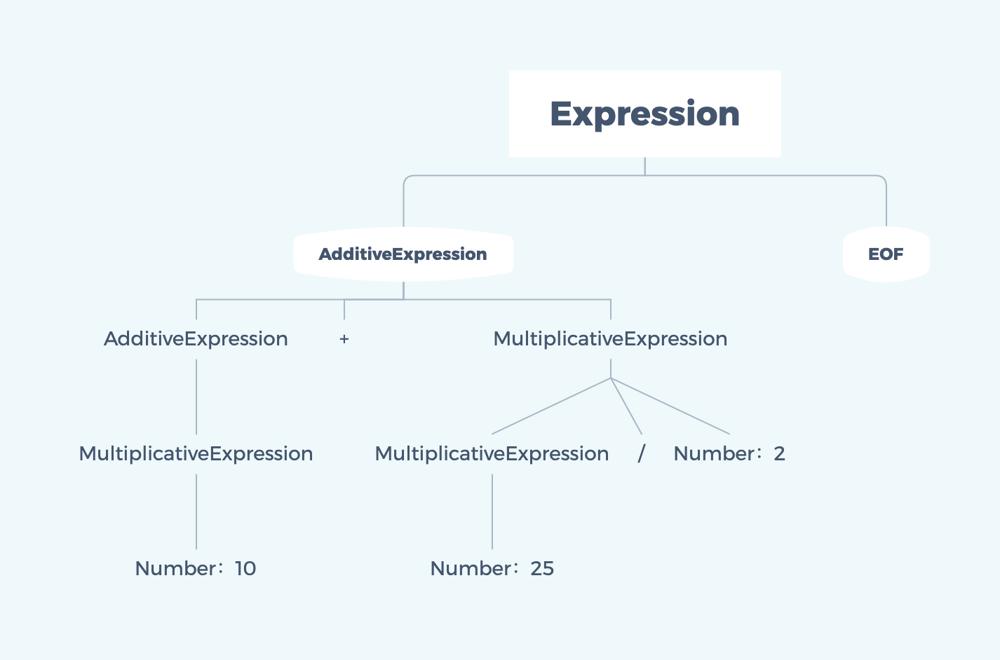

# 使用LL算法构建AST 

## 关于AST

### AST抽象语法树

AST(**A**bstract **S**yntax **T**ree)，意为抽象语法树，是一种源代码、表达式的一种抽象数据结构的表示形式。构建AST的过程，通常叫做语法分析。

语法分析的形式一般分为两种（两种算法）：

* LL算法：从输入源左端(始端)向右端(末端)扫描，规约输入源。
* LR算法：从输入源右端(末端)向左端(始端)扫描，规约输入源。

### AST的用途

对于前端来说AST不仅仅只是使用在Javascript的引擎编译上，实际开发中我们也会用到它：
* babel插件将 ES6转化成ES5
* 使用 UglifyJS来压缩代码
* css预处理器
* 开发WebPack插件
* Vue-cli前端自动化工具

以上等一些例子的底层原理都是基于AST来实现的，所以学习AST有助于帮助我们更好的理解和巩固前端方面的知识。

## 使用LL算法构建简单四则运算的AST

### 实现步骤

- 根据词法规则，进行词法分析
将输入源字符组成的字符串分解成有意义的代码块,这些代码块统称为词法单元(token)。
- 根据语法规则，进行语法分析
将词法单元（token）流转换成一个由元素嵌套所组成的，符合一定语法规则结构的树（AST）。

在这里这个树（AST）的数据结构我们使用一个json对象去描述。

### 四则运算分析实现

##### 词法规则

* tokenNumber（有意义的数字字符）：0、1、2、3、4、5、6....的组合
* operator（运算符）：+、-、*、/
* Terminalsymbol（终结符）
* NoneTerminalsymbol（非终结符）

##### 词法分析

使用正则表达式对输入源进行词法分析，得到一组sources。

```js
// 分词的正则
var reg = /([0-9\.]+)|([ \t]+)|([\r\n]+)|(\*)|(\/)|(\+)|(\-)/g
// 词法规则字典
var dictionary = ["Number", "Whiterspace", "LineTerminator", "*", "/", "+", "-"]

    function* tokenize (source) {
      var result = null
      var lastIndex = 0
      do {
        lastIndex = reg.lastIndex
        result = reg.exec(source)
        if (!result)
          break
        if (reg.lastIndex - lastIndex > result[0].length)
          break
        let token = {
          type: null,
          value: null
        }
        for (let i = 0; i <= dictionary.length; i++) {
          if (result[i])
            token.type = dictionary[i - 1]
        }
        token.value = result[0]
        yield token
      } while(result)
      yield { type: 'EOF' }
    }
```

输入源('1024 + 10 * 25')的分词结果

```json
[
  {"type":"Number","value":"1024"},
  {"type":"Whiterspace","value":" "},
  {"type":"+","value":"+"},
  {"type":"Whiterspace","value":" "},
  {"type":"Number","value":"10"},
  {"type":"Whiterspace","value":" "},
  {"type":"*","value":"*"},
  {"type":"Whiterspace","value":" "},
  {"type":"Number","value":"25"},
  {"type":"EOF"}
]
```

##### 语法规则

* Expression表达式

​      表达式 = 加法表达式<EOF>(终结符)

* AdditiveExpression 加法

  加法 = 乘法表达式|加法表达式<+>乘法表达式|加法表达式<->乘法表达式

* MultiplicativeExpression 乘法

  乘法 = tokenNumber|乘法表达式<*>tokenNumber|乘法表达式<->tokenNumber

##### 语法分析

因为采用的是LL算法从顶端开始往顶端规约，所以语法分析为每次对source[0]进行合乎语法规则的递归分析。

- MultiplicativeExpression 乘法

  每次乘法递归包含以下的规则分支：

  - source[0] = number

    节点为数字，符合乘法语法规则第一项。则此时AST-node节点的type = MultiplicativeExpression，children包含数字source[0] 。

  - source[0] = MultiplicativeExpression && source[1] = * 

    节点为数字，符合乘法语法规则第二项。则此时AST-node节点的type = MultiplicativeExpression。children包含数字source[0] 、source[1]、source[3]。

  - source[0] =  MultiplicativeExpression&& source[1] = /

    节点为数字，符合乘法语法规则第三项。则此时AST-node节点的type = MultiplicativeExpression，children包含数字source[0] 、source[1]、source[3]。

```js
    function MultiplicativeExpression (source) {
      if (source[0].type === 'Number') {
        // 如果这个表达式token是Number类型
        let node = {
          type: 'MultiplicativeExpression',
          children: [source[0]]
        }
        source[0] = node
        return MultiplicativeExpression(source)
      }
      if (source[0].type === 'MultiplicativeExpression' && source[1] && source[1].type === '*') {
        // 如果MultiplicativeExpression,且下一项是*号
        let node = {
          type: 'MultiplicativeExpression',
          operator: '*',
          children: []
        }
        node.children.push(source.shift())
        node.children.push(source.shift())
        node.children.push(source.shift())
        source.unshift(node)
        return MultiplicativeExpression(source)
      }
      if (source[0].type === 'MultiplicativeExpression' && source[1] && source[1].type === '/') {
        // 如果MultiplicativeExpression,且下一项是/号
        let node = {
          type: 'MultiplicativeExpression',
          operator: '/',
          children: []
        }
        node.children.push(source.shift())
        node.children.push(source.shift())
        node.children.push(source.shift())
        source.unshift(node)
        return MultiplicativeExpression(source)
      }
      if (source[0].type === 'MultiplicativeExpression') {
        return source [0]
      }
      return MultiplicativeExpression(source)
    }
```

('10 * 25 / 2')乘法分析结果：

```json
{
	"type": "MultiplicativeExpression",
	"operator": "/",
	"children": [{
		"type": "MultiplicativeExpression",
		"operator": "*",
		"children": [{
			"type": "MultiplicativeExpression",
			"children": [{
				"type": "Number",
				"value": "10"
			}]
		}, {
			"type": "*",
			"value": "*"
		}, {
			"type": "Number",
			"value": "25"
		}]
	}, {
		"type": "/",
		"value": "/"
	}, {
		"type": "Number",
		"value": "2"
	}]
}
```

- AdditiveExpression 加法

  - 每次乘法递归包含以下的规则分支：

    - source[0] = MultiplicativeExpression

      节点为数字，符合乘法语法规则第一项。则此时AST-node节点的type = AdditiveExpression，children包含数字source[0] 。

    - source[0] = MultiplicativeExpression && source[1] = * 

      节点为数字，符合乘法语法规则第二项。则此时AST-node节点的type = AdditiveExpression。children包含数字source[0] 、source[1], 第三项则为再次调用MultiplicativeExpression(source)之后的source[0]。

    - source[0] =  MultiplicativeExpression&& source[1] = /

      节点为数字，符合乘法语法规则第三项。则此时AST-node节点的type = AdditiveExpression。children包含数字source[0] 、source[1], 第三项则为再次调用MultiplicativeExpression(source)之后的source[0]。

```js
    function AdditiveExpression (source) {
      if (source[0].type === 'MultiplicativeExpression') {
        // 如果这个表达式token是MultiplicativeExpression类型
        let node = {
          type: 'AdditiveExpression',
          children: [source[0]]
        }
        source[0] = node
        return AdditiveExpression(source)
      }
      if (source[0].type === 'AdditiveExpression' && source[1] && source[1].type === '+') {
        // 如果AdditiveExpression,且下一项是+号
        let node = {
          type: 'AdditiveExpression',
          operator: '+',
          children: []
        }
        node.children.push(source.shift())
        node.children.push(source.shift())
        MultiplicativeExpression(source)
        node.children.push(source.shift())
        source.unshift(node)
        return AdditiveExpression(source)
      }
      if (source[0].type === 'AdditiveExpression' && source[1] && source[1].type === '-') {
        // 如果AdditiveExpression,且下一项是-号
        let node = {
          type: 'AdditiveExpression',
          operator: '-',
          children: []
        }
        node.children.push(source.shift())
        node.children.push(source.shift())
        MultiplicativeExpression(source)
        node.children.push(source.shift())
        source.unshift(node)
        return MultiplicativeExpression(source)
      }
      if (source[0].type === 'AdditiveExpression') {
        return source [0]
      }
      MultiplicativeExpression(source)
      return AdditiveExpression(source)
    }
```

('10 + 25 / 2')加法分析结果：

```json
{
	"type": "AdditiveExpression",
	"operator": "+",
	"children": [{
		"type": "AdditiveExpression",
		"children": [{
			"type": "MultiplicativeExpression",
			"children": [{
				"type": "Number",
				"value": "10"
			}]
		}]
	}, {
		"type": "+",
		"value": "+"
	}, {
		"type": "MultiplicativeExpression",
		"operator": "/",
		"children": [{
			"type": "MultiplicativeExpression",
			"children": [{
				"type": "Number",
				"value": "25"
			}]
		}, {
			"type": "/",
			"value": "/"
		}, {
			"type": "Number",
			"value": "2"
		}]
	}]
}
```


- Expression

  - 将EOF继续向左规约，成为1个四则运算表达式

(10+25/2)的四则运算AST树形标示图：




