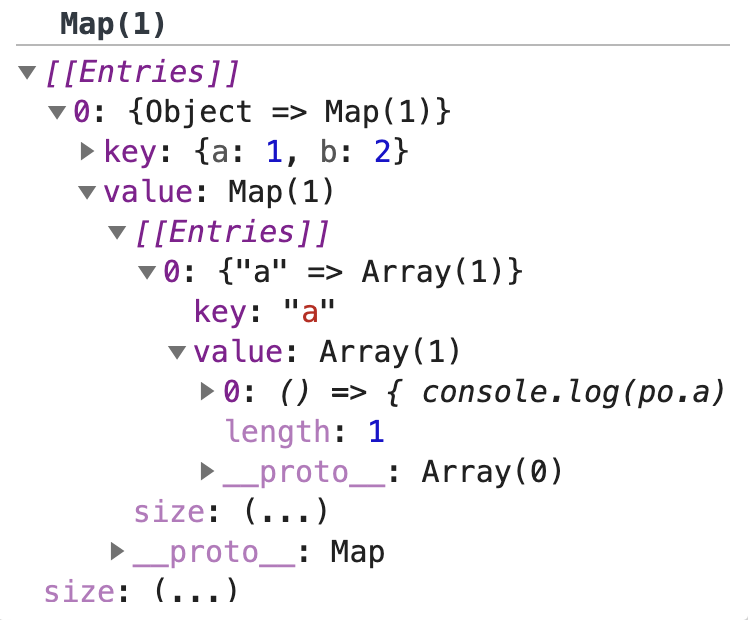
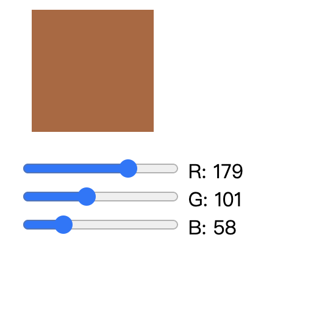

# proxy与双向绑定

## 关于proxy
### 概念
Proxy 对象用于定义基本操作的自定义行为（如属性查找、赋值、枚举、函数调用等）。

> const p = new Proxy(target, handler)
* 参数
  * target
  要使用 Proxy 包装的目标对象（可以是任何类型的对象，包括原生数组，函数，甚至另一个代理）。
  * handler
  handler 对象是一个容纳一批特定属性的占位符对象。它包含有 Proxy 的各个捕获器（trap）。
  所有的捕捉器是可选的。如果没有定义某个捕捉器，那么就会保留源对象的默认行为。

在以下简单的例子中，当对象中不存在属性名时，默认返回值为 37。
```js
  let object = {
    a: 1,
    b: 2
  }
  let po = reactive(object)
  function reactive (object) {
    return new Proxy(object, {
      set (obj, prop, val) {
        obj[prop] = val
        return obj[prop]
      },
      get (obj, prop) {
        console.log(obj, prop)
        return prop in obj ? obj[prop] : 37;
      }
    })
  }
  console.log(po.c) // 37
```
从概念上来讲proxy对象可以重新定义传入对象的一些handler行为，这可以使我们对对象进行一些行为的监听以及修改它的某些行为和属性，这是一个很强大的功能，但同时也会使对象行为的可预测性降低，所以我们平时使用它还是要谨慎的些。

### 模仿reactive实现原理
#### 1. 基础代理
在Vue3.0 中将Vue原本的能力进行了拆解，形成了reactive这样的一个包，这里我们尝试模仿实现一下Vue的reactive原理实现。

```js
  let object = {
    a: 1,
    b: 2
  }
  let po = reactive(object)
  // 我们首先会把Proxy包进一个函数中，然后return一个新的Proxy对象
  function reactive (object) {
    return new Proxy(object, {
      set (obj, prop, val) {
        obj[prop] = val
        return obj[prop]
      },
      get (obj, prop) {
        console.log(obj, prop)
        return obj[prop]
      }
    })
  }
  po.b = 33
  console.log(obj.b) // 33
```
通过上面的代码我们会发现，当我们改变po的属性值是，同时也会改变原始对象的属性值，这样我们似乎已经初步的实现了po对象到object对象代理。
如果我们想要实现完全代理，我们就要仔细考虑[handler提供的hook](https://developer.mozilla.org/zh-CN/docs/Web/JavaScript/Reference/Global_Objects/Proxy/handler)，因为有时我们访问或者改变一个对象，并不仅仅是通过表面上的set或者get的方式去访问，我们还可以通过一些内置方法，比如defineProperty对它会不会产生效果，这个时候就需要我们根据具体需求去将这hook都补全。

#### 2. 监听初步实现

当我们想要考虑如果去监听这个功能的时候，vue用了一个effect方案去实现监听。
```js
  let callbacks = []
  let object = {
    a: 1,
    b: 2
  }
  let po = reactive(object)

  effect(() => {
    console.log(po.a)
  })

  function effect (callback) {
    callbacks.push(callback)
  }

  function reactive (object) {
    return new Proxy(object, {
      set (obj, prop, val) {
        obj[prop] = val
        for (const callback of callbacks) {
          callback()
        }
        return obj[prop]
      },
      get (obj, prop) {
        console.log(obj, prop)
        return obj[prop]
      }
    })
  }
```
这里我们初步的实现方式是：
* 构建一个effect方法，它有一个参数为一个函数。
* 用一个全局的数组callbacks来存储每次传入的函数。
* 在po对象的set属性里，我们遍历执行callbacks中所有存储的函数。

上述的方法实现了一个简单初步的监听，但是这中方式会带来很大的性能问题，比如如果我们有100个对象属性，需要监听，我们就要绑定存储100个函数对象到callbacks中，而在每次set po的其中一个属性时就会执行callbacks里所有的函数，这无疑是消耗十分巨大的。

#### 3. 监听完善实现
上述实现方法有性能方面的问题，这里我们来完善这个问题，实现一个初步完善的reactive监听功能。
```js
  let callbacks = new Map()

  let usedReactivtives = []

  let object = {
    a: 1,
    b: 2
  }
  let po = reactive(object)

  effect(() => {
    console.log(po.a)
  })

  function effect (callback) {
    usedReactivtives = []
    callback()
    console.log(usedReactivtives)
    for (const reactivity of usedReactivtives) {
      if (!callbacks.has(reactivity[0])) {
        callbacks.set(reactivity[0], new Map()) 
      }
      if (!callbacks.get(reactivity[0]).has(reactivity[1])) {
        callbacks.get(reactivity[0]).set(reactivity[1], [])
      }
      callbacks.get(reactivity[0]).get(reactivity[1]).push(callback)
    }
    
  }

  function reactive (object) {
    return new Proxy(object, {
      set (obj, prop, val) {
        obj[prop] = val
        if (callbacks.get(obj)) {
          if (callbacks.get(obj).get(prop)) {
            for (const callback of callbacks.get(obj).get(prop)) {
              callback()
            }
          }
        }
        return obj[prop]
      },
      get (obj, prop) {
        usedReactivtives.push([obj, prop])
        return obj[prop]
      }
    })
  }
```
我们可以采取以上代码的实现方式：
* 使用一个Map类型的数据结构callbacks作为监听函数以及与之相关的对象属性。
* 用数组usedReactivtives，暂时存储每一个传入effect函数的callback方法中使用到的对象以及其关联的属性。
* 在po的get中将每次关联的对象与属性传入usedReactivtives。
* 在每次我们更改po，即调用执行了po的set时，则会在callbacks中找寻与对象的属性相关的方法对应执行。
这里我们采取上面方法所存储好的callbacks的结构如下图所示

由此可见，这中结构清晰的描述了方法与po对象属性一一对应的完美关系，这也是的reactive的监听在性能和功能上得到了初步的完善。
#### 4. reactive的层级绑定优化

在上述实例代码中我们只实现了对象的但层级的双向绑定，但如果对象的属性是级联对象的情况，似乎就不能满足绑定响应的需求了。
于是我们接下来要对reactive的层级绑定优化：
```js
  let callbacks = new Map()
  let reactivties = new Map()

  let usedReactivtives = []

  let object = {
    a: {c: 'd'},
    b: 2
  }
  let po = reactive(object)

  effect(() => {
    console.log(po.a.c)
  })

  function effect (callback) {
    // callbacks.push(callback)
    usedReactivtives = []
    callback()
    console.log(usedReactivtives)
    for (const reactivity of usedReactivtives) {
      if (!callbacks.has(reactivity[0])) {
        callbacks.set(reactivity[0], new Map()) 
      }
      if (!callbacks.get(reactivity[0]).has(reactivity[1])) {
        callbacks.get(reactivity[0]).set(reactivity[1], [])
      }
      callbacks.get(reactivity[0]).get(reactivity[1]).push(callback)
    }
  }

  function reactive (object) {
    if (reactivties.has(object))
      return reactivties.get(object)
    let proxy = new Proxy(object, {
      set (obj, prop, val) {
        obj[prop] = val
        if (callbacks.get(obj)) {
          if (callbacks.get(obj).get(prop)) {
            for (const callback of callbacks.get(obj).get(prop)) {
              callback()
            }
          }
        }
        return obj[prop]
      },
      get (obj, prop) {
        usedReactivtives.push([obj, prop])
        if (typeof obj[prop] === 'object')
          return reactive(obj[prop])
        return obj[prop]
      }
    })
    reactivties.set(object, proxy)
    return proxy
  }
```
* 这里reactivties的Map类型的对象存储全局的Proxy对象
* 在reactive中我们对传入的object进行判断，如果在reactivties中存在则直接返回
* 在proxy的get中我们要对传入的obj[prop]进行判断，如果其也为object类型则要嵌套调用reactive


#### 5. reactivity响应式对象的实例实现

这里我们实现了一个reactivity响应式对象的实例。
```js
    let object = {
      r: 1,
      g: 1,
      b: 1
    }
    let po = reactive(object)
  
    effect(() => {
      document.getElementById('r').value = po.r
      document.getElementById('r').nextElementSibling.innerText = `R: ${po.r}`
    })
    effect(() => {
      document.getElementById('g').value = po.g
      document.getElementById('g').nextElementSibling.innerText = `G: ${po.g}`
    })    
    effect(() => {
      document.getElementById('b').value = po.b
      document.getElementById('b').nextElementSibling.innerText = `B: ${po.b}`
    })
    document.getElementById('r').addEventListener('input', e => po.r = e.target.value)
    document.getElementById('g').addEventListener('input', e => po.g = e.target.value)
    document.getElementById('b').addEventListener('input', e => po.b = e.target.value)
        
    effect(() => {
      document.getElementById('color').style.backgroundColor = `rgb(${po.r}, ${po.g}, ${po.b})`
    })

```
具体实现效果

方形的颜色随着rgb的滑块变化而变化，这里我们就实现了一个利用Proxy的双向绑定的功能。

# 使用Range实现DOM精确操作

## 概念
[Range](https://developer.mozilla.org/zh-CN/docs/Web/API/Range) 接口表示一个包含节点与文本节点的一部分的文档片段。

可以用 Document 对象的 Document.createRange 方法创建 Range，也可以用 Selection 对象的 getRangeAt 方法获取 Range。另外，还可以通过 Document 对象的构造函数 Range() 来得到 Range。

## 基本拖拽的实现
在这里拖拽的实现利用了元素本身的mousedown事件以及document的mousemove、mouseup事件进行监听，并且利用transform的css属性实现元素拖拽的位置变化效果。
```js
    let dragable = document.getElementById('dragable')
    let baseX = 0, baseY = 0
    dragable.addEventListener('mousedown',function (event) {
      let startX = event.clientX, startY = event.clientY
      let up = (e) => {
        baseX = baseX + e.clientX - startX
        baseY = baseY + e.clientY - startY
        document.removeEventListener('mousemove', move)
        document.removeEventListener('mouseup', up)
      }
      let move = (e) => {
        dragable.style.transform = `translate(${baseX + e.clientX - startX}px, ${baseY + e.clientY - startY}px)`
      }
      document.addEventListener('mousemove', move)
      document.addEventListener('mouseup', up)
    })
```

## 正常流里的拖拽
接下来我们利用range的功能实现了在正常流里拖拽目标元素。
```js
    let dragable = document.getElementById('dragable')
    let baseX = 0, baseY = 0
    let ranges = []
    dragable.addEventListener('mousedown',function (event) {
      let startX = event.clientX, startY = event.clientY
      let up = (e) => {
        baseX = baseX + e.clientX - startX
        baseY = baseY + e.clientY - startY
        document.removeEventListener('mousemove', move)
        document.removeEventListener('mouseup', up)
      }
      let move = (e) => {
        let range = getNearest(e.clientX, e.clientY)
        range.insertNode(dragable)
      }
      document.addEventListener('mousemove', move)
      document.addEventListener('mouseup', up)
    })
    let container = document.getElementById('container')
    for (let i = 0; i < container.childNodes[0].textContent.length; i++) {
      let range = document.createRange()
      range.setStart(container.childNodes[0], i)
      range.setEnd(container.childNodes[0], i)
      console.log(range.getBoundingClientRect())
      ranges.push(range)
    }
    function getNearest (x, y) {
      let min = Infinity
      let nearest = null
      for (const range of ranges) {
        let rect = range.getBoundingClientRect()
        let distance = (rect.x - x) ** 2 + (rect.y - y) ** 2
        if (distance < min) {
          nearest = range
          min = distance
        }
      }
      return nearest
    }
    document.addEventListener('selectstart', e => e.preventDefault())
```
* 这里为我们container中元素构建一个单独的range。
* 当元素拖动的时候，我们调用getNearest，计算ranges中与当前元素拖拽点最近的range。
* 然后调用range.insertNode，将元素插入流中。
