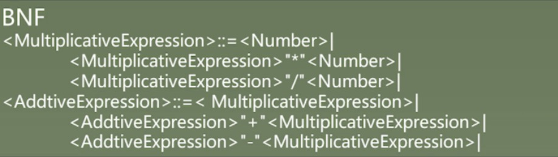
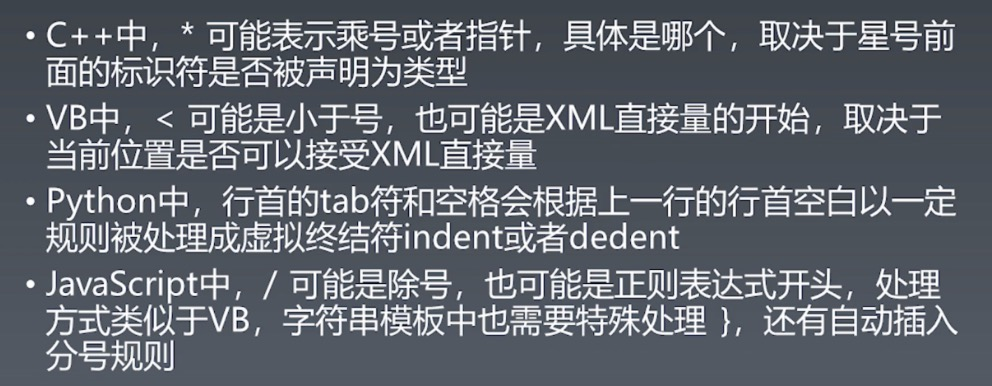
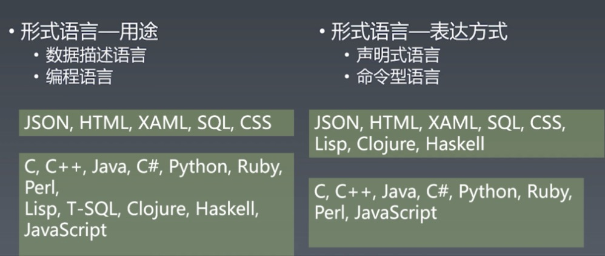
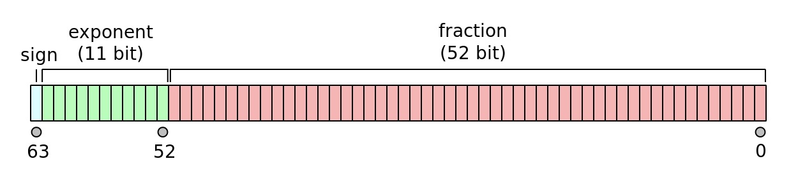

# 重学JavaScript

## JS语言通识

### 泛用语言分类方法

- 语言按语法分类

  - 非形式化语言

    - 中文、英文
    - 语言相对自由，意在传达意思，不一定要采用固定的形式（语法）。例如：long time no see

  - 形式化语言

    - 严谨、严格

- 乔姆斯基谱系（形式化语言分类）

  - 0- 型文法（无限制文法或短语结构文法）包括所有的文法。
  - 1- 型文法（上下文相关文法）生成上下文相关语言。
  - 2- 型文法（上下文无关文法）生成上下文无关语言。
  - 3- 型文法（正规文法）生成正则语言。

### 产生式

- 概念

  - 在计算机中指 Tiger 编译器将源程序经过词法分析（Lexical Analysis）和语法分析（Syntax Analysis）后得到的一系列符合文法规则（Backus-Naur Form，BNF）的语句

- BNF（巴科斯诺尔范式）

  - 即巴科斯范式（英语：Backus Normal Form，缩写为 BNF）是一种用于表示上下文无关文法的语言，上下文无关文法描述了一类形式语言。它是由约翰·巴科斯（John Backus）和彼得·诺尔（Peter Naur）首先引入的用来描述计算机语言语法的符号集。

    - 用尖括号括起来的名称表示语法结构名
    - 语法结构分成基础结构和需要用其他语法结构定义的复合结构

      - 基础结构成为终结符
      - 复合结构称为非终结符

    - 引号和中间的字符表示终结符
    - 可以有括号
    - *表示重复多次 
    - |表示或
    - +表示至少一次

  - 终结符不是终结的意思而是代表叶子节点的意思

  - 一个语言会有许多的终结符，然后在通过这些终结符的组合、关系形成许多的结构，产生非终结符

  - 一般来说语言都有一个最上层的非终结符来代表整个语言的整体

  - 四则运算（产生式BNF）

    

  - 带括号的四则运算

    ```html
    ArithmeticAtomExpression ::= "("<ArithmeticExpression>")" |
                                 <Number>|
    MultiplicativeExpression ::= <ArithmeticAtomExpression>|
                                 <MultiplicativeExpression> "*" <ArithmeticAtomExpression>|
                                 <MultiplicativeExpression> "/" <ArithmeticAtomExpression>|
    AdditiveExpression ::= <MultiplicativeExpression>|
                           <AdditiveExpression> "+" <MultiplicativeExpression>|
                           <AdditiveExpression> "-" <MultiplicativeExpression>|
    ArithmeticExpression :: = <AdditiveExpression>"EOF"
    
    运算原子式 ::= "("<四则运算式>")" |
                  <数字>|
    乘法 ::= <运算原子式>|
            <乘法> "*" <运算原子式>|
            <乘法> "/" <运算原子式>|
    加法 ::= <乘法>|
            <加法> "+" <乘法>|
            <加法> "-" <乘法>|
    四则运算式 :: = <加法>"EOF"
    ```

- 乔姆斯基谱系

  - 0型 无限制文法 

    - ?::=?

    - 1型 上下文相关文法
      - ?<A>?::=?<B>

    - 2型 上下文无关文法

      - <A>::=?

    - 3型 正则文法

      - <A>::=<A>?

  - Javascript是一个总体上的上下文无关文法，表达式是一种正则文法。
  - 带括号的四则运算BNF

### 现代语言的分类

- 现代语言的特例

  

- 语言的分类

  

## JS类型

### 原子（Atom）

- 语法
  - Literal (字面值)
  - Variable (变量)
  - Keywords(关键字)
  - Whitespace(空格)
  - Line Terminator(换行终结符)

- 运行时

  - Types(类型)

    - Number
    - String
    - Boolean
    - Object
    - Null

      - 有值但是为空

    - Undefined

      - 没有被定义过值

    - Symbol

  - Execution Context(执行上下文)

### Number

- 概念
  - JavaScript 的 Number 对象是经过封装的能让你处理数字值的对象。Number 对象由 Number() 构造器创建。
  - JavaScript的Number类型为双精度IEEE 754 64位浮点类型。
  - Number从概念上说是有限位数的一个小数，用来表示有理数。

- IEEE 754 Double Float([双精度浮点数](https://en.wikipedia.org/wiki/Double-precision_floating-point_format))

  - 概念：**双精度浮点格式**（有时称为**FP64**或**float64**）是一种[计算机数字格式](https://en.wikipedia.org/wiki/Computer_number_format)，通常在计算机内存中占据64[位](https://en.wikipedia.org/wiki/Bit)；它代表了一个宽[的动态范围](https://en.wikipedia.org/wiki/Dynamic_range)，通过使用浮动的数值的[小数点](https://en.wikipedia.org/wiki/Radix_point)。浮点数用于表示小数值，或者当需要的范围比[固定点](https://en.wikipedia.org/wiki/Fixed-point_arithmetic)（相同的位宽）提供的范围宽时，即使以精度为代价。当[单精度](https://en.wikipedia.org/wiki/Single-precision_floating-point_format)的范围或精度不足时，可以选择双精度。

  - 格式：

    - Sign(1)符号位：符号位确定数字的符号。

    - Exponent(11)指数位：指数字段是0到2047之间的11位无符号整数（带[偏倚形式）](https://en.wikipedia.org/wiki/Exponent_bias)：指数值1023表示实际零。指数的范围是−1022到+1023，因为−1023（全0）和+1024（全1）的指数是保留给特殊数字的。

    - Fraction(52)精度位：53位有效位数精度为15到17个[有效十进制数字](https://en.wikipedia.org/wiki/Significant_figures)精度（2 -53≈1.11 ×10 -16）。如果将最多具有15个有效数字的十进制字符串转换为IEEE 754双精度表示形式，然后再转换回具有相同位数的十进制字符串，则最终结果应与原始字符串匹配。如果将IEEE 754双精度数字转换为具有至少17个有效数字的十进制字符串，然后再转换回双精度表示形式，则最终结果必须与原始数字匹配。格式使用具有1的隐式整数位的[有效数字](https://en.wikipedia.org/wiki/Significand)写入（特殊数据除外，请参见下面的指数编码）

    - 由于52位有效分数（F）以内存格式出现，因此总精度为53位（大约16个十进制数字，53 log 10（2）≈15.955）

    - 这些位的布局如下：

      

    

- 语法

  - 十进制

    - 允许有小数
    - 小数点前后一边有数字就是有效的表示
    - 支持科学计数法

  - 二进制

    - 0b开头

  - 八进制

    - 0o开头

  - 十六进制

    - 0X开头

### String

- 概念

  - character(字符) ：是一个[信息](https://zh.wikipedia.org/wiki/資訊)单位。对使用[字母系统](https://zh.wikipedia.org/wiki/字母系統)或[音节文字](https://zh.wikipedia.org/wiki/音節文字)等[自然语言](https://zh.wikipedia.org/wiki/自然語言)，它大约对应为一个[音位](https://zh.wikipedia.org/wiki/音位)、类音位的单位或符号。简单来讲就是一个汉字、假名、韩文字……，或是一个英文、其他西方语言的字母。
  - Code point(码点) ：是组成[码空间](https://zh.wikipedia.org/wiki/码空间)（或[代码页](https://zh.wikipedia.org/wiki/代码页)）的数值。 例如，[ASCII码](https://zh.wikipedia.org/wiki/ASCII码)包含128个码位，范围是0[16进制](https://zh.wikipedia.org/wiki/16進位)到7F16进制。
  - Encoding(编码方式)：这里指的是字符编码，为指定[集合](https://zh.wikipedia.org/wiki/集合)中某一[对象](https://zh.wikipedia.org/wiki/对象)（例如：[比特](https://zh.wikipedia.org/wiki/比特)模式、[自然数](https://zh.wikipedia.org/wiki/自然数)[序列](https://zh.wikipedia.org/wiki/序列)、[8位组](https://zh.wikipedia.org/w/index.php?title=8位元组&action=edit&redlink=1)或者[电脉冲](https://zh.wikipedia.org/wiki/電磁波)），以便[文本](https://zh.wikipedia.org/wiki/文本)在[计算机](https://zh.wikipedia.org/wiki/计算机)中存储和通过[通信](https://zh.wikipedia.org/wiki/通信)[网络](https://zh.wikipedia.org/wiki/网络)的传递。

- 字符集

  - [ASCII](https://zh.wikipedia.org/wiki/ASCII)：**美国信息交换标准代码**，是基于[拉丁字母](https://zh.wikipedia.org/wiki/拉丁字母)的一套[电脑](https://zh.wikipedia.org/wiki/电脑)[编码](https://zh.wikipedia.org/wiki/编码)系统。
  - [Unicode](https://zh.wikipedia.org/wiki/Unicode):中文又称**万国码**、**国际码**、**统一码**、**单一码**，是计算机科学领域里的一项业界标准。它对世界上大部分的文字系统进行了整理、编码，使得电脑可以用更为简单的方式来呈现和处理文字.
  - [UCS](https://zh.wikipedia.org/w/index.php?title=UCS&redirect=no):是由[ISO](https://zh.wikipedia.org/wiki/國際標準化組織)制定的**ISO 10646**（或称**ISO/IEC 10646**）标准所定义的标准字符集。
  - GB

    - [GB2312](https://zh.wikipedia.org/wiki/GB_2312):是中华人民共和国国家标准简体中文字符集,全称《**信息交换用汉字编码字符集·基本集**》，通常简称**GB**（“国标”汉语拼音字母）
    - [GBK(GB13000)](https://zh.wikipedia.org/wiki/%E6%B1%89%E5%AD%97%E5%86%85%E7%A0%81%E6%89%A9%E5%B1%95%E8%A7%84%E8%8C%83):**汉字内码扩展规范**，称**GBK**，全名为**《汉字内码扩展规范(GBK)》1.0版**，由中华人民共和国,全国信息技术标准化技术委员会1995年12月1日制订
    - [GB18030](https://zh.wikipedia.org/wiki/GB_18030):**GB 18030**，全称《信息技术　中文编码字符集》，是中华人民共和国国家标准所规定的变长多字节字符集。

  - [ISO-8859](https://zh.wikipedia.org/wiki/ISO/IEC_8859):**ISO 8859**，全称**ISO/IEC 8859**，是国际标准化组织(ISO）及国际电工委员会（IEC）联合制定的一系列8位元字符集的标准，现时定义了15个字符集。
  - [BIG5](https://zh.wikipedia.org/wiki/%E5%A4%A7%E4%BA%94%E7%A2%BC): **大五码**（英语：Big5，又称为**五大码**）是使用繁体中文（正体中文）社区中最常用的电脑汉字字符集标准，共收录13,060个汉字。

- Encoding

  - [UTF8](https://zh.wikipedia.org/wiki/UTF-8):**UTF-8**（**8-bit Unicode Transformation Format**）是一种针对[Unicode](https://zh.wikipedia.org/wiki/Unicode)的可变长度[字符编码](https://zh.wikipedia.org/wiki/字元編碼)，也是一种[前缀码](https://zh.wikipedia.org/wiki/前缀码)。
  - [UTF16](https://zh.wikipedia.org/wiki/UTF-16):**UTF-16**是[Unicode](https://zh.wikipedia.org/wiki/Unicode)[字符编码五层次模型](https://zh.wikipedia.org/wiki/字符编码#现代编码模型)的第三层：字符编码表（Character Encoding Form，也称为"storage format"）的一种实现方式。

- 语法

  - 单引号‘’
  - 双引号“”
  - 反引号``

    - 造就了4中token，与中间的表达式形成了一个语法上的模板(Grammar Template)

      - 开始：`abc${
      - 中间：}abc${
      - 结束：}abc`
      - 前后都为反引号：`dfsaf`
  - 转义字符

  | 转义字符 | 意义                                | ASCII码值（十进制） |
  | -------- | ----------------------------------- | ------------------- |
  | \a       | 响铃(BEL)                           | 007                 |
  | \b       | 退格(BS) ，将当前位置移到前一列     | 008                 |
  | \f       | 换页(FF)，将当前位置移到下页开头    | 012                 |
  | \n       | 换行(LF) ，将当前位置移到下一行开头 | 010                 |
  | \r       | 回车(CR) ，将当前位置移到本行开头   | 013                 |
  | \t       | 水平制表(HT) （跳到下一个TAB位置）  | 009                 |
  | \v       | 垂直制表(VT)                        | 011                 |
  | \\       | 代表一个反斜线字符''\'              | 092                 |
  | \'       | 代表一个单引号（撇号）字符          | 039                 |
  | \"       | 代表一个双引号字符                  | 034                 |
  | \?       | 代表一个问号                        | 063                 |
  | \0       | 空字符(NUL)                         | 000                 |
  | \ddd     | 1到3位八进制数所代表的任意字符      | 三位八进制          |
  | \xhh     | 十六进制所代表的任意字符            | 十六进制            |

### Boolean

- Boolean对象是一个布尔值的对象包装器
- 值为true和false，都是一个关键字，表示真或假

### null

- 表示值为空，关键字

### undefined

- 表示没有被定义过，全局变量不是关键字
- 可以void 0,来得到undefined

## JS对象

### Object

- 概念：

  - 什么是对象？事实上，Object（对象）在英文中，是一切事物的总称，这和面向对象编程的抽象思维有互通之处。（面向对象编程也被认为是：更接近人类思维模式的一种编程范式）
  - 对象应该是下列事物之一：一个可以触摸或者可以看见的东西；人的智力可以理解的东西；可以指导思考或行动（进行想象或施加动作）的东西。
  - 任何对象都是唯一的，与本身的状态无关。
  - 我们用状态来描述对象
  - 行为可以改变对象状态

- 描述

  - 唯一标识（identifier）
  - 状态（state）
  - 行为（behavior）

- 分类（class）

  - 类是一种常见的描述对象的方式
  - 方式一为“归类”，研究单个对象提取其共性。多继承，如C++
  - 方式二为“分类”，单继承结构，总体之上有一个基类Object，一层层继承的一个关系。如C#,Java

- 原型（prototype）

  - 原型是一种更接近人类原始认知的描述对象的方式。它不尝试用严谨的分类，而是采用“相似”的这样的方式去描述对象。任何对象仅仅只需要描述它和原型之间的区别就可以了。
  - 比如说我们要研究鱼，我们找了一只鲫鱼，把它所有的特征提取加入鱼这个对象上，其他的鱼我们就可以根据这个去进行修改。提取出不一样的地方即可。

- 狗咬人实例

  - 不要受到自然语言的干预。
  - 在设计对象状态改变行为时，我们总是遵循“行为改变状态”的原则。

  ```js
    class Gog {
    beAngry (human) {
      this.mood = 'angry'
      human.hurt('dog bite')
    }
  }
  
  class Human {
    hurt (damage) {
      this.feelHurt = damage
      this.feelHappy = false
    }
    tease (thing) {
      this.feelHappy = true
      thing.beAngry(this)
    }
  }
  ```

  

- Javascript中的对象

  - property属性

    - Javacript的属性是一种kv对，可以通过key找到value。key的类型可以为String和Symbol。
    - 由于Symbol具有唯一性，如果不能获得用Symbol作为属性key的Symbol，就无法获取到那个属性值。所以说Symbol很好的实现了权限访问控制功能。
    - 属性值:

      - 数据属性(描述状态，如果存储函数，也可以用来描述行为)

        - [[value]]
        - writable
        - enumerable
        - configurable

      - 访问器属性(描述行为)

        - get
        - set
        - enumerable
        - configurable

  - prototype

    - 原型链

      - 当我们访问属性时，如果当前对象没有，则会沿着原型找原型对象是否有此名称的属性，而原型对象还可能有原型，而这一层一层链接查询的方式，就形成了原型链这一说法。这一算法保证了，每个对象只需要描述自己和原型的区别即可。

  - Object API

    - {} . [] Object.defineProperty

      - 提供一个基本面向对象的机制，通过语法去创建对象，访问属性，创建和定义新的属性，以及改变属性的特征值。

    - Object.create 、 Object.setPrototypeOf、Object.getPrototypeOf

      - 基于原型的描述对象的方法，可以基于一个原型创建对象、修改、获取一个对象原型。

    - new、class、extends

      - 用基于分类的方式去描述对象

    - new、function、prototype

      - 历史包袱

  - 特殊的行为对象

    ```js
    Array: 自动计算长度且可索引的集合对象。
    Date: 表示时间相关信息的对象。
    Math: 存储了一些数学常数属性和数学函数方法。
    Function: 具有方法和执行能力的对象。
    Map: key值唯一的有序迭代的集合对象。
    Set: 对象元素值唯一的有序迭代的集合对象。
    Error：表示错误且运行时异常时会抛出错误的基本对象。
    Promise：可以描述异步操作最终状态以及其结果的控制抽象对象。
    Proxy：可以创建对象代理，实现对对象的基本操作的拦截和自定义（如属性查找、赋值、枚举、函数调用等）。
    ```

    

