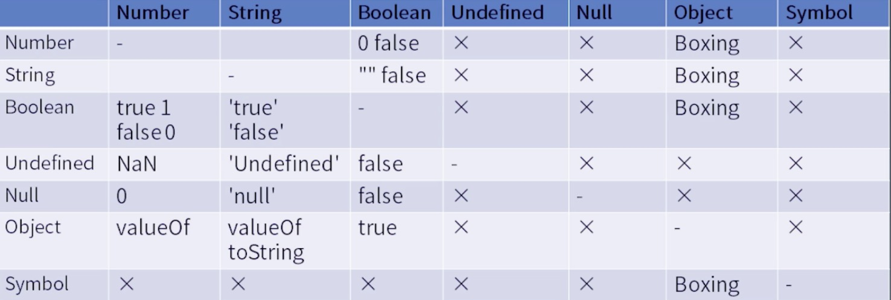
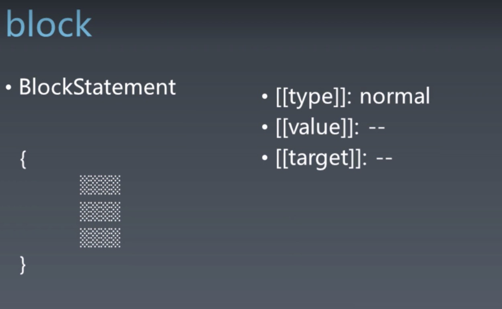
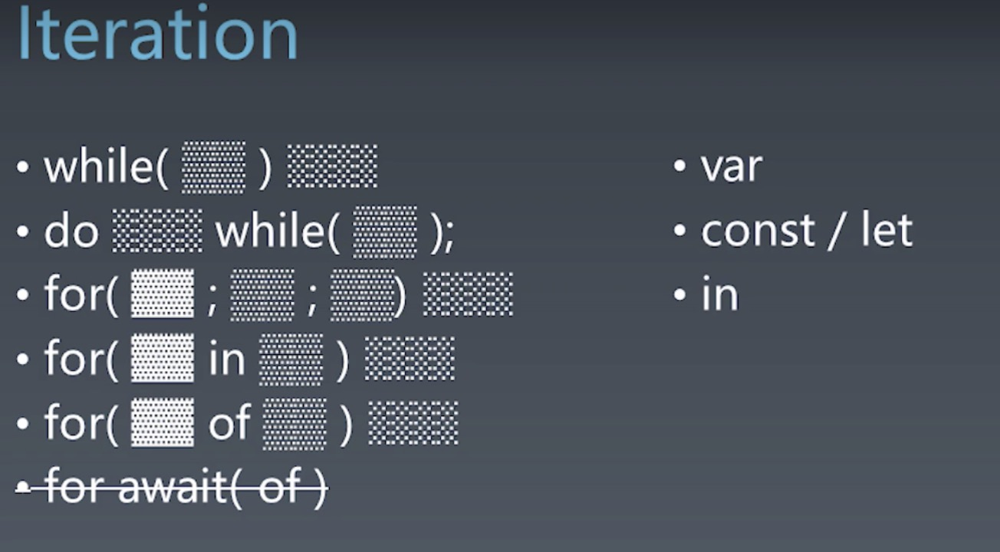
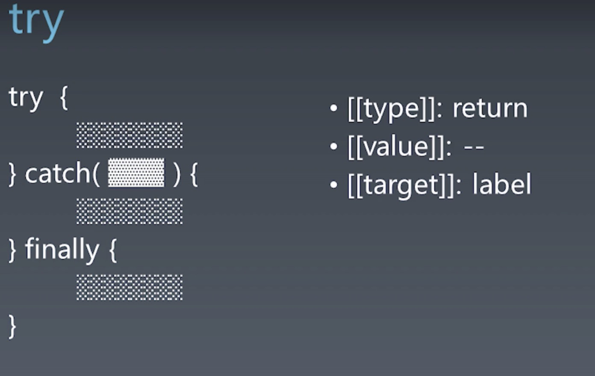
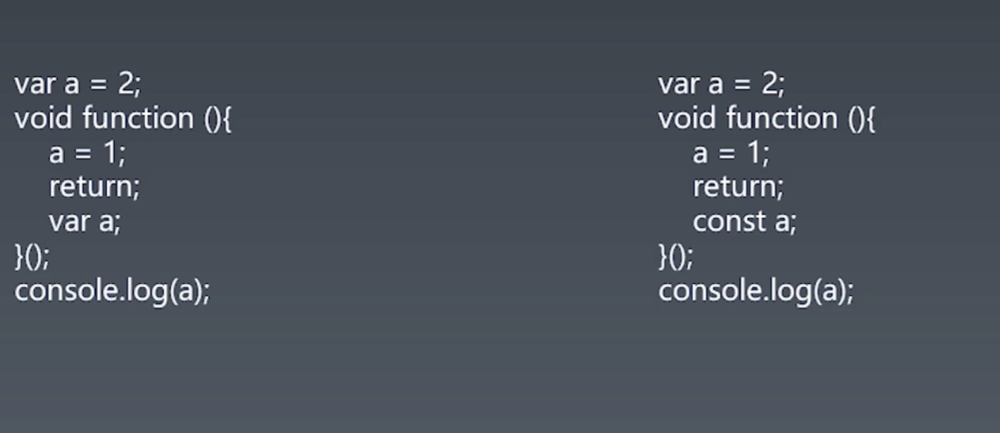
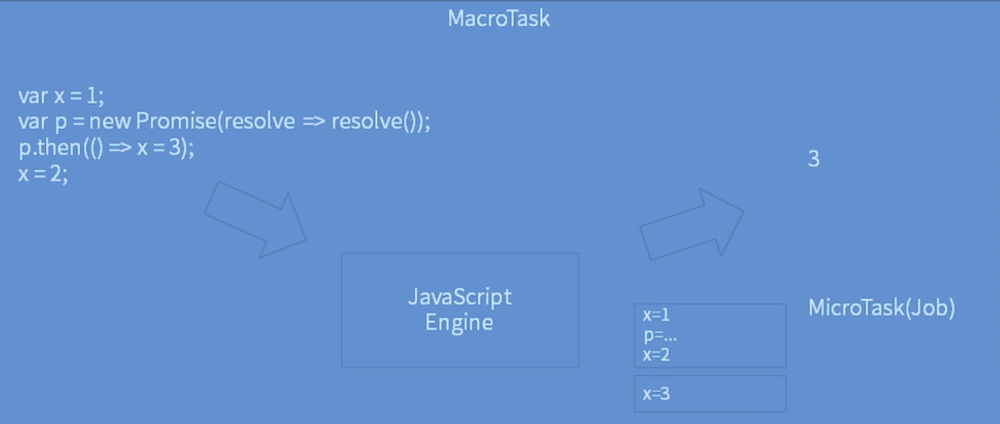
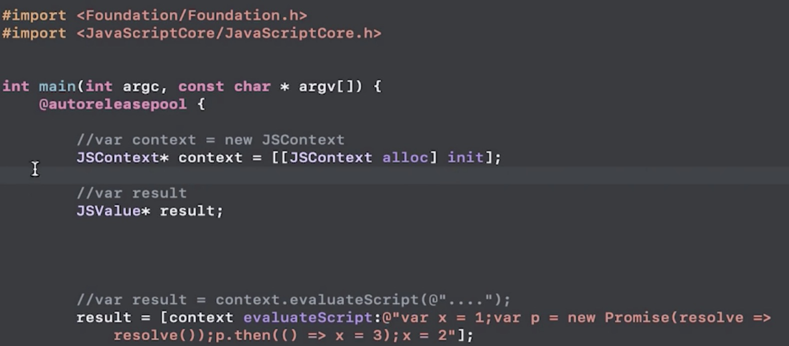
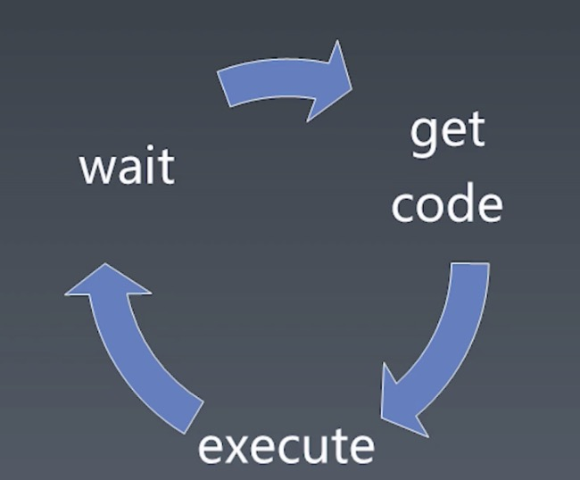
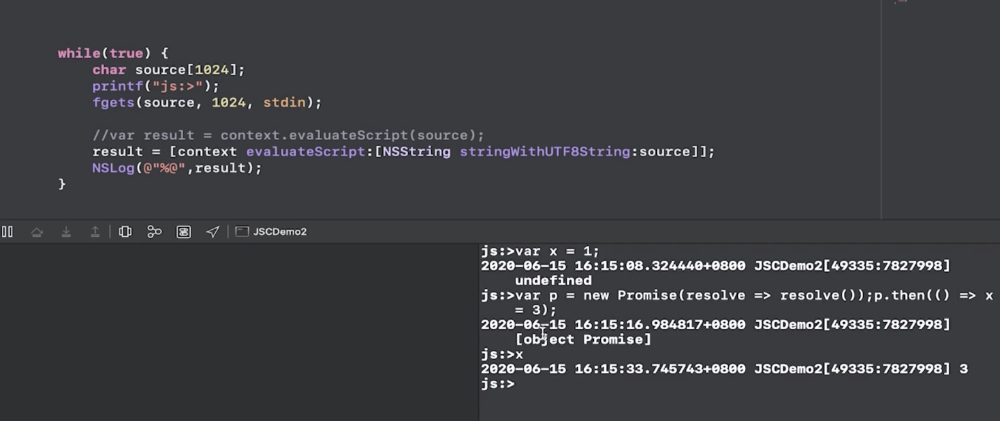

# 重学Javacript(二)

## Javascript表达式

### 语法（Grammar）

- 语法树和运算符优先级

	- 在运算式中，乘除的优先级高于加减，另外括号的优先级比乘除更高。
	- 所以在构造语法树的时候，我们要考虑到上述的情况，乘除法在语法树种会形成更小一级的语法结构，加减会形成更高一级的语法结构。
	- 综上，运算符优先级会影响到语法树的构成。

### Left  handside; right handside;(左手运算、右手运算)

- 我们可以使用a.b = c,但是不能使用a + b = c。
- 因为a.b是一个Left handside expression，a + b 是一个right handside expression。
- 只有Left handside expression 才能放到等号的左边。

### 表达式（Expressions）运算符优先级

- 1. Member

  ```
  a.b
  a[b]
  foo`string`
  super.b
  super['b']
  new.target
  new Foo()
  ```

- 2. New

  - new Foo

  ```
  new Foo
  ```

- 3. Call

  ```
  foo()
  super()
  foo()['b']
  foo().b 
  foo`abc`
  new a()['b']
  ```

  - 在括号之后加上取属性之类的运算，会让表达式直接降级为Call Expression
  - 语法结构能够表达的内容，是要多于运算符优先级所表达的。比如，.运算的优先级，是由它前部分的结构来决定它本身的优先级的。

- 4. Update (right handside expression)

  ```
  a ++
  a --
  -- a
  ++ a
  ++ a ++这个式子是不合法的
  ```

- 5. Unary 单目运算符

  ```
  delete a.b :后面要接一个Reference类型才能生效
  void foo() :void 可以将后面的结构都变成undefined
  typeof a
  + a
  - a
  ~ a:位运算，整数按位取反
  ! a
  await a
  ```

- 6. Exponental (右结合运算符)

  ```
  **
  ```

- 7. 四则运算

  ```
  Multiplicative: * / %
  Additive: + -
  Shift： << ,>>, >>>
  Relationship: < , > , <= ,>=,instanceof in
  ```

- 8. 等号按位

  ```
  - Equality
  
    ==,!=,===,!==
  
  - Bitwise
  
    & ^ |
  ```

- 9.逻辑运算 [短路逻辑]

  ```
  - Logical
  
    && ，||
  
  - Conditional
  
    ？：
  ```

### Reference

- a.b访问的是一个属性，而这个表达式取出来的不是这个属性的值，而是一个引用，这个引用不是JS7种基本类型之一。它是一个存在于JS运行时的基本类型之一，是一个标准中的类型。
- 一个Reference是由两部分组成的，一个对象和一个key，完整的记录了member运算的前半部分和后半部分。
- 结构

	- Object
	- key

- 像delete和assign这样的基础设施就会使用到Reference类型。
- 如果们做加法或者减法这种运算，我们会直接将Reference解引用当做普通变量去用。但是如果Member表达式是放在delete之后使用，那我们就需要用到这个引用特性，因为我们需要知道删除的是哪一个object的key。
- 同理，assign也是一样。当我们将member运算放到一个等号的左边，进行赋值运算的时候，我们也要用到Reference的特性，找到是对哪一个对象的哪个key进行操作。
- Javascript就是用引用类型，在运行时来处理，删除或者赋值这样的写相关的操作。

### 类型转换

类型转换时我们做表达式运算经常会做的一个步骤，总体可以总结为以下表格



- 拆箱转换

	- 概念：拆箱转换就是我们将一个Object转换成基本类型。主要的一个过程是toPremitive
	- toPremitive

		- 发生在表达式的方方面面，比如在加法中，遇到Object + Object，或者Object参与运算的过程，都会调用toPremitive的过程。
		- 一个对象的身上有三个方法定义会影响到ToPremitive

			- toString
			- valueOf
			- Symbol.toPrimitive

		- 如果定义了[Symbol.toPrimitive]，就会自动忽略toString和valueOf,执行自定义拆箱转换的过程。
		- 否则，在进行不同的转换时，它会根据提示来决定调用toString和valueOf的先后。
		- 比如加法，它会优先调用valueOf(即使是调用一个字符串参与的加法也会优先调用，valueOf)

			- valueOf()
			- toString()

		- 当对象作为属性名的时候则会优先调用toString方法。

			- toString()
			- valueOf()

		- 关于Date类型的会先调用toString后调用valueOf
		- 这就是为什么+[] 表达式的值竟然是0。原因就是由于[]经历了拆箱操作，[].valueOf().toString()之后得到空字符串，而+空字符串根据上面的类型转换自然就变成 0 了。

- 装箱转换

	- Object可以有类的概念，对于除了undefined和null以外的基础类型，Object都提供了一个基础包装类。
	- 包装类

		- Number

			- 本身可以之间调用，也可以使用new去调用。本身直接调用会返回一个值，使用new去调用可以返回一个Object。这个时候我们就可以表示Number对象和值1存在一个装箱关系。

		- String

			- 本身可以之间调用，也可以使用new去调用。本身直接调用会返回一个值，使用new去调用可以返回一个Object。这个时候我们就可以表示String对象和值‘a’存在一个装箱关系。

		- Boolean

			- 本身可以之间调用，也可以使用new去调用。本身直接调用会返回一个值，使用new去调用可以返回一个Object。这个时候我们就可以表示String对象和值true存在一个装箱关系。

		- Symbol

			- 要注意Symbol对象是不可以被new直接调用的，它需要Object构造器再包一层，才能被new调用。

	- 当我们使用Member，也就是说使用.或者[]去访问属性的时候，如果.或者[]之前的变量或者表达式得到的是一个基础类型，那么就会自动调用装箱的过程。不需要我们再去调用标准里面规定的,Number、String、Boolean这些构造器。
	- 这也是为什么，我们在比如Number类型的Class上定义了什么属性，而正常Number值也是可以用.或者[]运算符去访问的。
	- 这是JS设计中一个比较巧妙的特性，但是我们也要分清楚，Number类型和Number类的区别。我们可以通过typeOf去区分，它到底是包装后的对象还是包装前的值。

- StringToNumber

  - 在之前学习Javascript类型中，我们知道了数字直接量(NumberLiteral)有以下几个类型：

  	- 十进制
  	- 科学计数法
  	- 二进制
  	- 八进制
  	- 十六进制

  - 要实现 StringToNumber，我们就要根据不同的 String 输入进行识别，最终统一转化为十进制。

  - 这里我们采取以下的算法思路：

    - 首先用正则表达式进行识别Number字符串
    - 然后运用，按位累加的方法进行转换。如：```123 = 1*10**2 + 2*10**1 + 3*10**0```

  - 这里有一段StringToNumber的实现代码：

    ```js
    function stringToNumber (string) {
      let number
      number = NaN
      // 十进制
      if ((new RegExp(/([\+|-]?[1-9]+[0-9]*)+(.[0-9]{n})?|([\+|-]?)0(.[0-9]+)/)).test(string)) {
        number = 0
        let symbol = 1
        if(string[0] === '+' || string[0] === '-') {
          symbol = string[0] === '+' ? 1 : 0
          string = string.substring(1, string.length)
        }
        let strArr = string.split('.')
        for (let i = 0; i < strArr[0].length; i++) {
          number +=( + strArr[0].charAt((strArr[0].length - 1) - i)) * 10 ** i
        }
        if (strArr.length === 2) {
          for (let i = 0; i < strArr[1].length; i++) {
            number +=( + strArr[1].charAt(i)) * 10** ( - (i + 1))
          }
        }
        number = symbol ? number : (- number)
      }
      // 科学计数法
      if ((new RegExp(/(([\+|-]?[1-9]+[0-9]*)+(.[0-9]{n})?|([\+|-]?)0(.[0-9]+))([Ee]{1}([\+|-]?\d+)$)/)).test(string)) {
        number = 0
        let strArr = string.split('e')
        number = stringToNumber(strArr[0])
        let symbol = 1
        if(strArr[1][0] === '+' || strArr[1][0] === '-') {
          symbol = strArr[1][0] === '+' ? 1 : 0
          strArr[1] = strArr[1].substring(1, strArr[1].length)
        }
        number = number * (10 ** (+ strArr[1]))
      }  
      // 二进制
      if ((new RegExp(/^(0[bB])[0-1]/)).test(string)) {
        number = 0
        for (let i = string.length - 1; i > 1; i--) {
          number +=( + string[i]) * 2 ** ((string.length - 1) - i)
        }
      }
      // 八进制
      if ((new RegExp(/^(0[oO])[0-7]/)).test(string)) {
        number = 0
        for (let i = string.length - 1; i > 1; i--) {
          number +=( + string[i]) * 8 ** ((string.length - 1) - i)
        }
      }
      // 十六进制
      if ((new RegExp(/^(0[xX])[0-9a-fA-F]/)).test(string)) {
        number = 0
        for (let i = string.length - 1; i > 1; i--) {
          let char = string[i]
          let index = ((string.length - 1) - i)
          if ((new RegExp(/[a-fA-F]/).test(char))) {
            let baseCode = 'a'.charCodeAt(0)
            let code = string.charCodeAt(i)
            let cha = (10 + (baseCode - code))
            number += cha * 16 ** index
          } else {
            number +=( + char) * 16 ** index
          }
        }
      }
      return number
    }
    
    ```

    

- NumberToString

	- NumberToString转换可以看做是StringToNumber的逆向。这个相对于StringToNumber相对而言要简单一点，我们可以根据传入的进制对Number进行转换。
	
- 这里我们采取以下的算法思路：
	
	- 1.整数部分我们采取，除N(进制)取余，逆序排列。
	
		- 用N整除十进制整数，可以得到一个商和余数；再用N去除商，又会得到一个商和余数，如此进行，直到商为小于N - 1时为止，然后把先得到的余数作为二进制数的低位有效位，后得到的余数作为二进制数的高位有效位，依次排列起来。
	
	- 2. 小数部分我们采取，乘N(进制)取整，顺序排列。
	
			- 用N乘十进制小数，可以得到积，将积的整数部分取出，再用N乘余下的小数部分，又得到一个积，再将积的整数部分取出，如此进行，直到积中的小数部分为零，或者达到所要求的精度为止。
		
	- 这里有一段NumberToString的实现代码：
	
	```js
	function numberToString (digital, base) {
	  let string = ''
	  let number = parseInt(digital)
	  let decimal = digital - number
	  if (base === '10') {
	    string = digital + string
	  }
	
	  if (base === '2') {
	    // 整数部分
	    let yu = []
	    while(number > 1){
	      yu.unshift(number % 2) 
	      number = parseInt(number / 2)
	    }
	    yu.unshift(number)
	    string = yu.join('')
	    // 小数部分
	    if (decimal > 0) {
	      let zheng = []
	      let cheng = 0
	      do {
	        cheng = decimal * 2
	        zheng.push(parseInt(cheng))
	        decimal = cheng - parseInt(cheng)
	      } while (parseInt(decimal) === 0 && zheng.length <= 10)
	      string += '.'
	      string += zheng.join('')
	    }
	  }
	  if (base === '8') {
	    // 整数部分
	    let yu = []
	    while(number > 7){
	      yu.unshift(number % 8) 
	      number = parseInt(number / 8)
	    }
	    yu.unshift(number)
	    string = yu.join('')
	    // 小数部分
	    if (decimal > 0) {
	      let zheng = []
	      let cheng = 0
	      do {
	        cheng = decimal * 8
	        zheng.push(parseInt(cheng))
	        decimal = cheng - parseInt(cheng)
	      } while (parseInt(decimal) === 0 && zheng.length <= 10)
	      string += '.'
	      string += zheng.join('')
	    }
	  }
	  if (base === '16') {
	    // 整数部分
	    let yu = []
	    let str = 'ABCDEF'
	    while(number > 15){
	      if (number % 16 > 9) {
	        yu.unshift(str[(number % 16) - 10])
	      } else {
	        yu.unshift(number % 16)
	      }
	      number = parseInt(number / 16)
	    }
	    yu.unshift(number)
	    string = yu.join('')
	    // 小数部分
	    if (decimal > 0) {
	      let zheng = []
	      let cheng = 0
	      do {
	        cheng = decimal * 16
	        if (cheng > 9) {
	          zheng.push(str[cheng - 10])
	        } else {
	          zheng.push(parseInt(cheng))
	        }
	        decimal = cheng - parseInt(cheng)
	      } while (parseInt(decimal) === 0 && zheng.length <= 10)
	      string += '.'
	      string += zheng.join('')
	    }
	  }
	  return string
	}
	
	```
	
	

## Javascript语句

Javascript是在表达式的基础上，用语句完成控制流程。

### 语法（Grammer）

- 简单语句：内部不会再容纳其他语句的语句

	- ExpressionStatement
	- EmptyStatement
	- DebuggerStatement
	- ThrowStatement
	- ContinueStatement
	- BreakStatement

		- break后面可以跟一个标识符的名字，这个就是Label。多层嵌套循环的时候，可以借助带label的break跳出多重循环。

	- ReturnStatement

- 复合语句：多用于控制简单语句的执行顺序或者次数。每种语句都会有一定规则关系。

  - BlockStatement

    

  - IfStatement

  - SwitchStatement

  - IterationStatement

    

  - WithStatement

  - LabelledStatement

  	- 在简单或者复合语句前加一个Label，组合一些复合语句使用才会有意义。

  - TryStatement

  	- 包括了try、catch、finally三个结构。try的结构不是BlockStatement,它的花括号是由try语句定义的。所以，try不能和其它语句一样省略花括号。
  	- 在try-catch-finally的结构中，即使我们在try中return了，finally的代码还是会继续执行的。
  	- 

### 运行时（Runtime）

- Completion Record

	- Completion Record一种记录，是一种语句完成状态的记录，用于解释值和控制流的运行时传播，例如执行非本地控制转移的语句（中断，继续，返回和抛出）的行为。
	- 比如，if(x===10) return 10;就需要一个Completion Record的数据结构来存储语句完成的结果。包括了是否返回，返回值是啥，等一系列信息。Completion Record决定了语句是继续向下执行，还是停止执行。
	- 它无法在Javascript直接去访问和使用到它，但他却是确确实实的存在的一种结构。执行语句的结果都会自动存储在一个Completion Record结构里。
	- 组成

		- [[type]]

			- normal、break、continue、return、or throw

		- [[value]]

			- 基本类型

		- [[target]]

			- label

### 声明

- 对后续的语句发生作用的语句，视为声明
- 分类

	- FunctionDelaration
	- GeneratorDeclaration
	- AsyncFunctionDeclaration
	- AsyncGeneratorDeclaration
	- VariableStatement

		- 有声明的作用，又有实际执行计算的能力。在Javascript标准中，把它在语法上划归为了语句。
		- ES标准笔记：

			- var语句声明范围为运行中的执行上下文的VariableEnvironment的变量。 Var变量在实例化其包含的环境记录时创建，并在创建时初始化为undefined。在任何VariableEnvironment范围内，一个公共BindingIdentifier可能会出现在多个VariableDeclaration中，但这些声明仅共同定义一个变量。由VariableDeclaration与Initializer定义的变量在执行VariableDeclaration时（而不是在创建变量时）被分配其Initializer的AssignmentExpression的值。

	- ClassDeclaration
	- LexicalDeclaration

		- ES标准笔记：

			- let和const声明定义范围为运行中执行上下文的LexicalEnvironment的变量。实例化包含其的环境记录时将创建变量，但是在评估变量的LexicalBinding之前，不能以任何方式对其进行访问。由带有初始化程序的LexicalBinding定义的变量在评估LexicalBinding时（而不是在创建变量时）被分配其初始化程序的AssignmentExpression的值。如果let声明中的LexicalBinding没有初始化程序，则在评估LexicalBinding时会为变量分配未定义的值。
- 有的声明作用范围只与function body有关，并且无关代码写入的先后顺序。如：function、funtion*、async function、async function*、var。对于var 却比较特殊，它的声明作用相当与出现在函数头部，但比如var a = 1，a已经被声明成了一个函数级别的局部变量，但是后面的赋值并没有发生。
- 有的声明像class、const、let 在声明之前调用就会报错。
- 预处理机制（pre-process）

  - 在一段代码执行之前，Javascript引擎会对代码预先做一次处理的机制。
  - 
  - var 在预处理之前就会被找到，并且声明成一个函数级别的变量。同理，像const也是有预处理机制的。左边，不会影响外面的a，并且function中a已经被声明成了一个函数级别的局部变量。右边，不会影响到外面的a，会执行报错。
  - 所有的声明都是有预处理机制，都可以将变量变为局部变量。
- 作用域

	- var的作用域就在它所处的最近的函数体。
	- const这种的作用域就在离它最近的block花括号。

## Javascript结构化

### JS执行粒度（运行时）

- 宏任务

- 微任务（Promise）

- 函数调用（Execution context）
- 语句/声明（Completion Record）
- 表达式(Reference)
- 直接量/变量/this...

### 宏任务与微任务

- JS引擎其实是一个静态的库的形式

- 宏任务可以理解为传给Javascript引擎的任务，微任务可以理解为Javascript引擎内部执行的任务，在Javascript中只有Promise会产生微任务。

  - 
  - 从上面的例子我们可以看出，Js引擎接收了一个段代码，产生了两个异步任务:```x=1;p=...;x=2```和```x=3```，这两个任务我们称为MicroTask(Job),最后得到了其中一个微任务的结果x=3。
  - 而将代码传达给Js引擎并且执行的整个过程就称为MacroTask(宏任务)。
  - 下面有段OC的模拟执行的代码截图，最终得到的结果也是3：

  

- 事件循环（Event loop）

  

  - 事件循环代表的是我们如何去使用JavaScript引擎的这样一个过程。它包含三个部分：获取代码->执行代码->等待->获取代码

  - 下面有段OC的模拟执行的代码截图:

  - 

  - 这里是模拟了一个在控制台输入代码，然后传给Js引擎执行并返回打印结果的过程。

  - 由此，我们可以知道，等待用户控制台输入的过程就类似于一个事件循环中的等待锁的一个过程。在浏览器环境中我们会等待用户的一些输入和点击事件，在node环境中我们可能就要等待一些IO操作或者一些网卡来的新的请求。

    

### 函数调用

- 函数调用的过程是呈现一个调用栈一样的结构，如下面的例子

  ```js
  // index.js
  import {foo} from 'foo.js'
  var i = 1
  console.log(i)
  foo()
  console.log(i)
  i++
  ```

  ```js
  // foo.js
  function foo () {
    console.log(i)
  }
  export foo
  ```

  上述代码一共访问了五次i，但这五次i访问的却不是同一个。foo中访问的i是foo环境中的i，在其中并没定义所以最终会报错。

- 同理，下面有一个更为复杂的例子：

```js
// index.js
import {foo} from 'foo.js'
var i = 1
console.log(i)
foo()
console.log(i)
i++
```

```js
// foo.js
import {foo2} from 'foo2.js'
var x = 2
function foo () {
  console.log(x)
  foo2()
  console.log(x)
}
export foo
```

```js
// foo2.js
var y = 3
function foo2 () {
  console.log(y)
}
export foo2	
```

​	由此可见在程序执行的过程中，环境中可访问的变量和函数的调用是成一个栈式结构。层层递进，最上层的栈顶的函数就叫做running Execution context。每一个函数就是一个Execution context，被放进了Execution context statck中。

- [**Execution contexts（执行上下文 ）**](https://tc39.es/ecma262/#sec-execution-contexts)

  - ES概念：
    - 执行上下文是一种规范设备，用于跟踪ECMAScript实现对代码的运行时评估。在任何时间点，每个实际执行代码的代理程序最多有一个执行上下文。这称为代理程序的运行执行上下文。ES规范中对运行中执行上下文的所有引用，均表示周围代理的运行中执行上下文。
    - 执行上下文堆栈用于跟踪执行上下文。运行中的执行上下文始终是此堆栈的顶部元素。每当控制权从与当前运行的执行上下文关联的可执行代码转移到与该执行上下文不关联的可执行代码时，都会创建一个新的执行上下文。新创建的执行上下文被压入堆栈，并成为正在运行的执行上下文。
  - 状态组件：
    - **code evaluation state**：执行，暂停和恢复与此执行上下文关联的代码的评估所需的任何状态。
    - **Function**：如果此执行上下文正在评估功能对象的代码，则此组件的值就是该功能对象。如果上下文正在评估脚本或模块的代码，则该值为null。
    - [Realm](https://tc39.es/ecma262/#realm)：关联记录从中访问ECMAScript资源的Realm（领域）记录。
    - **ScriptOrModule**：关联代码源自的模块记录或脚本记录。如果没有原始脚本或模块（如InitializeHostDefinedRealm中创建的原始执行上下文的情况），则该值为null。
    - **LexicalEnvironment**：标识用于解析此执行上下文中的代码进行的标识符引用的环境记录。
    - **VariableEnvironment**：标识在此执行上下文中保存由VariableStatements创建的绑定的环境记录。
    - **Generator**（Generator Execution Contexts）：该执行上下文正在评估的生成器对象。

- [**Environment Record**](https://tc39.es/ecma262/#sec-environment-records)

	- **Declarative Environment Records**：声明性环境记录用于定义ECMAScript语言语法元素（例如FunctionDeclarations，VariableDeclarations和Catch子句）的效果，这些元素直接将标识符绑定与ECMAScript语言值相关联。
- **Function Environment Records**：函数环境记录对应于ECMAScript函数对象的调用，并且包含该函数内顶级声明的绑定。它可以建立一个新的this绑定。它还捕获支持超级方法调用所需的状态。
		- **Module Environment Records**：模块环境记录包含模块顶级声明的绑定。它还包含模块显式导入的绑定。其[[OuterEnv]]是全球环境记录。
		
- **Global Environment Records**：全局环境记录用于脚本全局声明。它没有外部环境。其[[OuterEnv]]为空。它可能预装了标识符绑定，并且包括一个关联的全局对象，该对象的属性提供了某些全局环境的标识符绑定。在执行ECMAScript代码时，可以将其他属性添加到全局对象，并且可以修改初始属性。
	- **Object Environment Records**：对象环境记录用于定义ECMAScript元素（例如WithStatement）的效果，这些元素将标识符绑定与某些对象的属性相关联。
	
- Function-Closure(闭包)

  - 在Javascript里面每一个函数都会生成一个闭包。闭包分为两个部分，一个是代码部分，一个是环境部分。

  - 环境部分，由一个Object和一个变量的序列来组成。

  - 在Javascript中，每一个函数都会带一个它定义时所在的Environment Records。它会将这个Environment Records保存到自己这个函数对象上身上，变成一个属性。

  - code就代表每个函数的代码部分。

    ```js
    var y = 2
    function foo2 () {
      console.log(y)
    }
    export foo2
    ```

    从以上例子来说，函数foo2在定义的时候，它的外层有一个y=2，所以它的Environment Records中就带有一个y=2的环境变量。以至于不管这个函数foo2 之后被通过参数、export、import带到任何地方它都会带一个y=2的变量。

    ```js
    var y = 2
    function foo2 () {
      var z = 3
      return () => {
      	console.log(y,z)
      }
    }
    var foo3 = foo2()
    export foo3
    ```

    从上面这个更复杂的例子来说，foo2的Environment Records就会被作为foo3的Environment Records的上级被保存下来。形成了一个链式的结构。在ES2018之前的版本中，将这种链式结构称为 Scope chain。

    同时我们也要注意，因为有箭头函数的作用，不仅z=3被保留了下来，同时z=3执行时所用的this也被保存了下来。所以，在return的箭头函数的执行代码中我们就可以同时访问到y、z、this。

- Realm

	- 在JS中,函数表达式和对象直接量均会创建对象。使用、做隐式转换也会创建对象，这些对象也是有原型的，如果我们没有Realm，就不知道它们的原型是什么。
	- 在对其进行评估之前，所有ECMAScript代码都必须与一个领域相关联。从概念上讲，领域由一组内部对象，一个ECMAScript全局环境，在该全局环境范围内加载的所有ECMAScript代码以及其他关联的状态和资源组成。
	- [Realm API](https://github.com/tc39/proposal-realms) 提供沙箱功能（sandbox），允许隔离代码，防止那些被隔离的代码拿到全局对象。
	- 具体可以参考：
	  - [realm 相关文档](https://tc39.es/ecma262/#sec-code-realms)
	  - [Realm API](https://www.bookstack.cn/read/es6-3rd/spilt.8.docs-proposals.md)
	  - [ECMAScript spec proposal for Realms API](https://github.com/tc39/proposal-realms)
