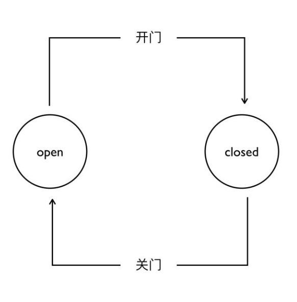

# **浏览器的工作原理**（一）

## 浏览器原理总论

浏览器在前端中是很重要的，因此了解浏览器的工作原理是很有必要的。总的来说，我们打开浏览器，最终经过一系列步骤我们会看到一张图片，专业点的说法叫做Bitmap（位图），然后经过显卡转换为我们可以识别的光信号。

而这些转换步骤为：

* 输入url，发送HTTP请求，解析HTTP回应，得到Html文本
* 获取Html，对文本Html进行parse（文本分析，编译初级技术），得到DOM树结构
* 获取DOM树结构，进行css  computing(dom上对应了哪些css规则，哪些css会叠加，哪些会覆盖，将最终结构计算出来)，最后得到了，带css属性的DOM树（带样式的DOM）
* layout（布局、排版），通过这个步骤将DOM树上所有元素产生的盒的位置给计算出来。（获得位置的不是DOM元素本身而是css最后生成的盒）
* render（渲染），将元素画到一个图片上，最后根据操作系统和硬件驱动提供的API接口，最终展示给用户。

了解了以上步骤之后，我们接下来就跟着这样的步骤，做一个微型模拟浏览器——Toy - Broswer，来帮助我们更好的理解浏览器的工作原理。

## 状态机

这里所说的状态机，指的是有限状态机，我们实现微型模拟浏览器——Toy - Broswer的过程中，需要使用到有限状态机去处理字符串，所以在实现Toy - Broswer之前，我们要先搞清楚与有限状态机相关的概念。

### 概念

有限状态机简称状态机，是表示有限个状态以及在这些状态之间的转移和动作等行为的数学计算模型。

先来解释什么是“状态”（ State ）。现实事物是有不同状态的，例如一个自动门，就有 open 和 closed 两种状态。我们通常所说的状态机是有限状态机，也就是被描述的事物的状态的数量是有限个，例如自动门的状态就是两个 open 和 closed 。

状态机，也就是 State Machine ，不是指一台实际机器，而是指一个数学模型。说白了，一般就是指一张状态转换图。例如，根据自动门的运行规则，我们可以抽象出下面这么一个图。



自动门有两个状态，open 和 closed ，closed 状态下，如果读取开门信号，那么状态就会切换为 open 。open 状态下如果读取关门信号，状态就会切换为 closed 。

状态机的全称是有限状态自动机，自动两个字也是包含重要含义的。给定一个状态机，同时给定它的当前状态以及输入，那么输出状态时可以明确的运算出来的。例如对于自动门，给定初始状态 closed ，给定输入“开门”，那么下一个状态时可以运算出来的。

这样状态机的基本定义我们就介绍完毕了。重复一下：状态机是有限状态自动机的简称，是现实事物运行规则抽象而成的一个数学模型。

具体参考：[状态机](HTTPs://zhuanlan.zhihu.com/p/47434856)，[有限状态机](https://zh.wikipedia.org/wiki/%E6%9C%89%E9%99%90%E7%8A%B6%E6%80%81%E6%9C%BA)

### 例子

#### 1. 不使用状态机处理字符串

```js
// 在字符串中找到a
function findA (str) {
  for (const c of str) {
    if (c === 'a')
      return true
  }
  return false
}
console.log(findA('This'))
console.log(findA('This is an apple'))

```

```js
// 在字符串中找到ab
function findAB (str) {
  for (let i = 0; i < str.length; i++) {
    if (str[i] === 'a' && i < str.length - 1 && str[i + 1] === 'b')
      return true
  }
  return false
}
console.log(findAB('This ac'))
console.log(findAB('This ab'))
```

```js
// 在字符串中找到abcdef
function findStr (string) {
  let flag = ''
  for (const char of string) {
    if (char === 'a')
      flag = 'a'
    else if (char === 'b' && flag === 'a')
      flag = 'ab'
    else if (char === 'c' && flag === 'ab')
      flag = 'abc'
    else if (char === 'd' && flag === 'abc')
      flag = 'abcd'
    else if (char === 'e' && flag === 'abcd')
      flag = 'abcde'
    else if (char === 'f' && flag === 'abcde') {
      flag = 'abcdef'
      break
    }
    else
      flag = ''
  }
  return flag === 'abcdef'
}
console.log(findStr('This is abcdef ab'))
console.log(findStr('This is abcaef'))
```

#### 2. 使用状态机处理字符串

```js
// 用状态机实现：字符串“abcabx”的解析
function match (string) {
  let state = start
  for (const c of string) {
    state = state(c)
  }
  return state === end
}

function start (c) {
  if (c === 'a')
    return state1
  else
    return start
}

function end (c) {
  return end
}

function state1 (c) {
  if (c === 'b')
    return state2
  else
    return start(c)
}

function state2 (c) {
  if (c === 'c')
    return state3
  else
    return start(c)
}

function state3 (c) {
  if (c === 'a')
    return state4
  else
    return start(c)
}
function state4 (c) {
  if (c === 'b')
    return state5
  else
    return start(c)
}

function state5 (c) {
  if (c === 'x')
    return end
  else
    return state2(c)
}
console.log(match('abcabxabca'))
console.log(match('abcabcabx'))

```

```js
// 使用状态机完成”abababx”的处理
function match (string) {
  let state = start
  for (const c of string) {
    state = state(c)
  }
  return state === end
}

function start (c) {
  if (c === 'a')
    return state1
  else
    return start
}

function end (c) {
  return end
}

function state1 (c) {
  if (c === 'b')
    return state2
  else
    return start(c)
}

function state2 (c) {
  if (c === 'a')
    return state3
  else
    return start(c)
}

function state3 (c) {
  if (c === 'b')
    return state4
  else
    return start(c)
}
function state4 (c) {
  if (c === 'a')
    return state5
  else
    return start(c)
}

function state5 (c) {
  if (c === 'x')
    return end
  else
    return state3(c)
}

console.log(match('ababax'))
console.log(match('abababax'))
console.log(match('ababababax'))
console.log(match('ababababac'))
```

通过上面的两个例子对比我们知道了，关于有限状态机：

* 每一个状态都是一个机器
  * 在每一个机器里，我们可以做计算、存储、输出
  * 所有这些机器接受的输入都是一致的
  * 状态机的每一个机器本身没有状态，如果我们用函数来表示的话，他应该是纯函数（无副作用）
* 每一个机器知道下一个状态
  * 每个机器都有确定的下一个状态（Moore）
  * 每个机器根据输入决定下一个状态（Mealy）

#### 3.使用状态机处理不确定的字符串

这里我们要使用到[**kmp算法**](https://en.wikipedia.org/wiki/Knuth%E2%80%93Morris%E2%80%93Pratt_algorithm),简单来说我们需要建立一个未知字符串pattern的table，看它是不是自重复，以减低我们重复对比查询的次数。

我们构建一个changeState的函数，对比pattern的当前索引字符和source的当前索引字符是否一致。

*  如果一致则返回下一个状态（pattern的下一个索引）
* 如果不一致则在table找寻之前记录好的当前索引所记录的可返回的索引返回到那个状态。
* 当pattern对比到最后一个字符成功（进入end状态），则返回-1，表示查询字符串成功。

具体代码实现如下：

```js
function makeState (pattern) {
  let table = new Array(pattern.length).fill(0)
  {
    let i = 1, j = 0
    // 从头开始搜索，i记录源pattrn搜寻的索引
    // j记录当前匹配到的pattrn下标索引
    while(i < pattern.length) {
      if (pattern[i] === pattern[j]) {
        // 如果相等，则将j索引匹配给tabel[i],以记录源字符串i - 1位置与j - 1位置相同
        i++, j++
        table[i] = j
      } else {
        // 如果不相等
        if (j > 0) 
        // j > 0，只需要让j回到 table[j]索引，继续下一轮匹配
          j = table[j]
        else
        // 如果j = 0，即之前没有移动多j指针，还没有遇到pattern字符源自重复的相等字符，于是i++，继续下一轮匹配
          i++
      }
    }
  }
  return table
}
function match (pattern, source) {
  let stateTable = makeState(pattern)
  let state = 0
  for (const c of source) {
    state = changeState(c, state, stateTable, pattern)
  }
  return state === -1
}
function changeState (c, state, stateTable, pattern) {
  if (state === -1) return state
  if (c === pattern[state]) {
    // 结束
    if (pattern.length - 1 === state)
      return -1
    // 下一个状态
    state++
    return state
  } else {
    if (state === 0)
      return 0
    return changeState(c, stateTable[state], stateTable, pattern)
  }
}
console.log(match('ababax', 'abababaxyyy'));


```


## Toy - Broswer——HTTP请求

### ISO-OSI七层网络模型

| OSI七层网络模型 |             |
| :-------------: | :---------: |
|     应用层      |    HTTP     |
|     表示层      |    HTTP     |
|     回话层      |    HTTP     |
|     传输层      |     TCP     |
|     网络层      |  Internet   |
|   数据链路层    | 4G/5G/WI-FI |
|     物理层      | 4G/5G/WI-FI |

### TCP-IP的基础知识

* 在TCP层传输数据的概念是流，没有明显的分割单位，只保证前后顺序正确。
* TCP对应一个重要的概念为端口，因为TCP协议是被计算机里面的软件所使用的，每一个软件都会从网卡去拿数据，而具体哪一个数据是分配给哪一个软件的，这里就需要用到端口这个概念。一个数据包是根据端口，把接到的各个数据分给各个软件的。对于到node中的库就是```require('net')```这个包。
* TCP传输的概念是一个一个数据包的概念，每一个数据包可大可小，取决于整个网络中间设备的传输能力。
* 而IP是根据地址，去找到这个包应该从哪到哪。
* 整个Internet上的连接关系非常复杂，中间会有一些大型的路由节点。比如我们在家里上网，一般会先连入小区的路由节点，然后在上连到电信的骨干网络上去，然后再接着逐级连接，比如我们如果需要到国际某个地址就会去到国际主干线上，国内地址可能直接就将网络转入连接进去了。
* IP地址唯一的标识了，连入Internet的每一个设备。所以IP包一定是以IP地址来寻找自己要传输到哪里的。
* IP协议的底层库在node里面没有对应的库，不过node的底层却调用了 C++的两个库：libnet、libpcap。
* libnet负责构造IP包并且发送。
* labpcap负责从网卡抓取所有的流经网卡的IP包。
* 如果我们用交换机，而不用路由器去组网，会有一些奇异的现象。如果我们用底层的labpcap这个包，就可以抓到很多本来不是发给我们的IP地址的IP包，而一般而言网卡会将这些包给丢弃，但是如果用的IP层的基础库就可以将它全部抓出来。

### 关于HTTP

**超文本传输协议（HTTP）**是一个用于传输超媒体文档（例如 HTML）的[应用层](https://en.wikipedia.org/wiki/Application_Layer)协议。它是为 Web 浏览器与 Web 服务器之间的通信而设计的，但也可以用于其他目的。HTTP 遵循经典的[客户端-服务端模型](https://en.wikipedia.org/wiki/Client–server_model)，客户端打开一个连接以发出请求，然后等待直到收到服务器端响应。HTTP 是[无状态协议](http://en.wikipedia.org/wiki/Stateless_protocol)，这意味着服务器不会在两个请求之间保留任何数据（状态）。尽管通常基于 TCP/IP 层，但它可以在任何可靠的[传输层](https://zh.wikipedia.org/wiki/传输层)上使用，也就是说，该协议不会像 UDP 那样静默的丢失消息。[RUDP](https://en.wikipedia.org/wiki/Reliable_User_Datagram_Protocol)——作为 UDP 的可靠化升级版本——是一种合适的替代选择。

HTTP是一种能够获取如 HTML 这样的网络资源的 [protocol](https://developer.mozilla.org/zh-CN/docs/Glossary/Protocol)(通讯协议)。它是在 Web 上进行数据交换的基础，是一种 client-server 协议，也就是说，请求通常是由像浏览器这样的接受方发起的。一个完整的Web文档通常是由不同的子文档拼接而成的，像是文本、布局描述、图片、视频、脚本等等。


客户端和服务端通过交换各自的消息（与数据流正好相反）进行交互。由像浏览器这样的客户端发出的消息叫做**requests**，被服务端响应的消息叫做 **responses**。

HTTP被设计于20世纪90年代初期，是一种可扩展的协议。它是应用层的协议，通过[TCP](https://developer.mozilla.org/zh-CN/docs/Glossary/TCP)，或者是[TLS](https://developer.mozilla.org/zh-CN/docs/Glossary/TLS)－加密的TCP连接来发送，理论上任何可靠的传输协议都可以使用。因为其良好的扩展性，时至今日，它不仅被用来传输超文本文档，还用来传输图片、视频或者向服务器发送如HTML表单这样的信息。HTTP还可以根据网页需求，仅获取部分Web文档内容更新网页。

在像 HTTP 这样的Client-Server（客户端-服务器）协议中，会话分为三个阶段：

1. 客户端建立一条 TCP 连接（如果传输层不是 TCP，也可以是其他适合的连接）。
2. 客户端发送请求并等待应答。
3. 服务器处理请求并送回应答，回应包括一个状态码和对应的数据。

从 HTTP/1.1 开始，连接在完成第三阶段后不再关闭，客户端可以再次发起新的请求。这意味着第二步和第三步可以连续进行数次。

具体参考:[HTTP](https://developer.mozilla.org/zh-CN/docs/Web/HTTP)

### 请求(requests)

HTTP请求的一个例子：


如上图所示：

* 请求的第一行是Request line
  * 一个HTTP的[method](HTTPs://developer.mozilla.org/en-US/docs/Web/HTTP/Methods)如```POST```;
  * ```/```是要获取的资源的路径;
  * ```HTTP/1.1```则代表的是HTTP协议版本号。
* 绿色框框表示的则是为服务端表达其他信息的可选头部[headers](HTTPs://developer.mozilla.org/en-US/docs/Web/HTTP/Headers)
* 接着是一个空行，对于POST这样的方法，报文的body就包含了发送的资源，如上图紫色框框所标注的内容。

### 响应( responses)

HTTP响应的一个例子：


如上图所示：

* 请求的第一行是status line
  * HTTP/1.1```则代表的是HTTP协议版本号;
  * 200是一个状态码（[status code](HTTPs://developer.mozilla.org/en-US/docs/Web/HTTP/Status)），来告知对应请求执行成功或失败，以及失败的原因；
  * ```OK```一个状态信息，这个信息是非权威的状态码描述信息，可以由服务端自行设定。
* 绿色框框表示的则是为服务端表达其他信息的可选头部[headers](HTTPs://developer.mozilla.org/en-US/docs/Web/HTTP/Headers)
* 接着是一个空行，下面则是资源body,比起请求报文，响应报文中更常见地包含获取的资源body，如上图紫色框框所标注的内容。

### 实现步骤

在此之前我们要用node构造一个服务器的环境，以便接收我们的Toy - Broswer发送的请求

```js
const http = require('http')

http.createServer((request, response) => {
  let body = []
  request.on('error', (err) => {
    console.log(err)
  }).on('data', (chuck) => {
    body.push(chuck)
  }).on('end', () => {
    body = Buffer.concat(body).toString()
    console.log('body', body)
    response.writeHead(200, {'Content-Type': 'text/html'})
    response.end('Hellow world!\n')
  })
}).listen(8080, function () {
  console.log("server start 8080");
})

```

#### 1.HTTP请求

* 设计一个HTTP请求的类
* content type是一个必要字段，要有默认值
* body是key-value形式

```js
class Request {
  constructor (options) {
    this.method = options.method || 'GET'
    this.host = options.host
    this.port = options.port || 80
    this.path = options.path || '/'
    this.body = options.body || {}
    this.headers = options.headers || {}
    if (!this.headers['Content-Type']) {
      this.headers['Content-Type'] = 'application/x-www-form-urlencoded'
    }
    if (this.headers['Content-Type'] === 'application/json')
      this.bodyText = JSON.stringify(this.body)
    else if (this.headers['Content-Type'] === 'application/x-www-form-urlencoded')
      this.bodyText = Object.keys(this.body).map(key => `${key}=${encodeURIComponent(this.body[key])}`).join('&')
    this.headers['Content-Length'] = this.bodyText.length
  }
}

void async function () {
  let request = new Request({
    method: 'POST',// http
    host: '127.0.0.1',// ip
    port: '8080',// tcp
    path: '/',// http
    headers: {// http
      ['x-Foo2']: 'customed'
    },
    body: {
      name: 'redlove'
    }
  })
  let response = await request.send()
  console.log(response)
}()
```

#### 2.send函数

* 在Request HTTP请求类的构造器中收集必要的信息
* 设计一个send函数，把请求真实的发送到服务器
* send函数应该是异步的，所以返回Promise

#### 3.发送请求

* 设计支持已有的connection，以及创建新的connection
* 收到数据传给parser
* 根据parser状态，resolve promise

```js
const net = require('net')

class Request {
  constructor (options) {
    this.method = options.method || 'GET'
    this.host = options.host
    this.port = options.port || 80
    this.path = options.path || '/'
    this.body = options.body || {}
    this.headers = options.headers || {}
    if (!this.headers['Content-Type']) {
      this.headers['Content-Type'] = 'application/x-www-form-urlencoded'
    }
    if (this.headers['Content-Type'] === 'application/json')
      this.bodyText = JSON.stringify(this.body)
    else if (this.headers['Content-Type'] === 'application/x-www-form-urlencoded')
      this.bodyText = Object.keys(this.body).map(key => `${key}=${encodeURIComponent(this.body[key])}`).join('&')
    this.headers['Content-Length'] = this.bodyText.length
  }
  send (connection) {
    return new Promise((resolve, reject) => {
      const parser = new ResponseParser
      if (connection) {
        connection.write(this.toString())
      } else {
        connection = net.createConnection({
          host: this.host,
          port: this.port
        }, () => {
          connection.write(this.toString())
        })
      }
      connection.on('connect', function(){
        console.log('客户端：已经与服务端建立连接')
      })
      
      connection.on('data', (data) => {
        console.log(data.toString())
        let parser = new ResponseParser()
        parser.receive(data.toString())
        if (parser.isFinished) {
          resolve(parser.response)
          connection.end()
        }
      })
      connection.on('error', (err) => {
        reject(err)
        connection.end()
      })
    })
  }
  toString () {
    return `${this.method} ${this.path} HTTP/1.1\r
${Object.keys(this.headers).map(key => `${key}: ${this.headers[key]}`).join('\r\n')}\r
\r
${this.bodyText}`
  }
}
```

#### 4. ResponseParser类

* Response必须分段构造，我们用一个ResponseParser类来“装配”
* ResponseParser分段处理 Response Text，我们用状态机来分析文本结构

```js
class ResponseParser {
  constructor () {
    this.WAITING_STATUS_LINE = 0
    this.WAITING_STATUS_LINE_END = 1
    this.WAITING_HEADER_NAME = 2
    this.WAITING_HEADER_SPACE = 3
    this.WAITING_HEADER_VALUE = 4
    this.WAITING_HEADER_LINE_END = 5
    this.WAITING_HEADER_BLOCK_END = 6
    this.WAITING_BODY = 7

    this.current = this.WAITING_STATUS_LINE
    this.statusLine = ''
    this.headers = {}
    this.headerName = ''
    this.headerValue = ''
    this.bodyParser = null
  }
  get isFinished () {
    return this.bodyParser && this.bodyParser.isFinished
  }
  get response () {
    this.statusLine.match(/HTTP\/1.1 ([0-9]+) ([\s\S]+)/)
    return {
      statusCode: RegExp.$1,
      statesText: RegExp.$2,
      headers: this.headers,
      body: this.bodyParser.content.join('')
    }
  }
  receive (string) {
    for (let i = 0; i < string.length; i++) {
      this.receiveChar(string.charAt(i))
    }
  }
  receiveChar (char) {
    if (this.current === this.WAITING_STATUS_LINE) {
      if (char === '\r') {
        this.current = this.WAITING_STATUS_LINE_END
      } else {
        this.statusLine += char
      }
    } else if (this.current === this.WAITING_STATUS_LINE_END) {
      if (char === '\n') {
        this.current = this.WAITING_HEADER_NAME
      }
    } else if (this.current === this.WAITING_HEADER_NAME) {
      if (char === ':') {
        this.current = this.WAITING_HEADER_SPACE
      } else if (char === '\r') {
        this.current = this.WAITING_HEADER_BLOCK_END
        if (this.headers['Transfer-Encoding'] === 'chunked')
          this.bodyParser = new TrunckedBodyParser()
      } else {
        this.headerName += char
      }

    } else if (this.current === this.WAITING_HEADER_SPACE) {
      if (char === ' ') {
        this.current = this.WAITING_HEADER_VALUE
      }
    } else if (this.current === this.WAITING_HEADER_VALUE) {
      if (char === '\r') {
        this.current = this.WAITING_HEADER_LINE_END
        this.headers[this.headerName] = this.headerValue
        this.headerValue = ''
        this.headerName = ''
      } else {
        this.headerValue += char
      }
    } else if (this.current === this.WAITING_HEADER_LINE_END) {
      if (char === '\n') {
        this.current = this.WAITING_HEADER_NAME
      }
    } else if (this.current === this.WAITING_HEADER_BLOCK_END) {
      if (char === '\n') {
        this.current = this.WAITING_BODY
      }
    } else if (this.current === this.WAITING_BODY) {
      // console.log(char)
      this.bodyParser.receiveChar(char)
    }
  }
}
```

#### 5.BodyParser类

* Response的body可能根据Content-Type有不同的结构，因此我们会采取子Parser的结构来解决问题
* 以TrunkedBodyParser为例，我们同样用状态机来处理body的格式

```js
class TrunckedBodyParser {
  constructor () {
    this.WAITING_LENGTH = 0
    this.WAITING_LENGTH_LINE_END = 1
    this.READING_TRUNK = 2
    this.WAITING_NEW_LINE = 3
    this.WAITING_NEW_LINE_END = 4
    this.length = 0
    this.content = []
    this.isFinished = false
    this.current = this.WAITING_LENGTH
  }
  receiveChar (char) {
    if (this.current === this.WAITING_LENGTH) {
      if (char === '\r') {
        if (this.length === 0) {
          this.isFinished = true
        }
        this.current = this.WAITING_LENGTH_LINE_END
      } else {
        this.length *= 16
        this.length += parseInt(char, 16)
      }
    } else if (this.current === this.WAITING_LENGTH_LINE_END) {
      if (char === '\n') {
        this.current = this.READING_TRUNK
      }
    } else if (this.current === this.READING_TRUNK) {
      this.content.push(char)
      this.length --
      if (this.length === 0) {
        this.current = this.WAITING_NEW_LINE
      }
    } else if (this.current === this.WAITING_NEW_LINE) {
      if (char === '\r') {
        this.current = this.WAITING_NEW_LINE_END
      }
    } else if (this.current === this.WAITING_NEW_LINE_END) {
      if (char === '\n') {
        this.current = this.WAITING_LENGTH
      }
    }
  }
}
```


