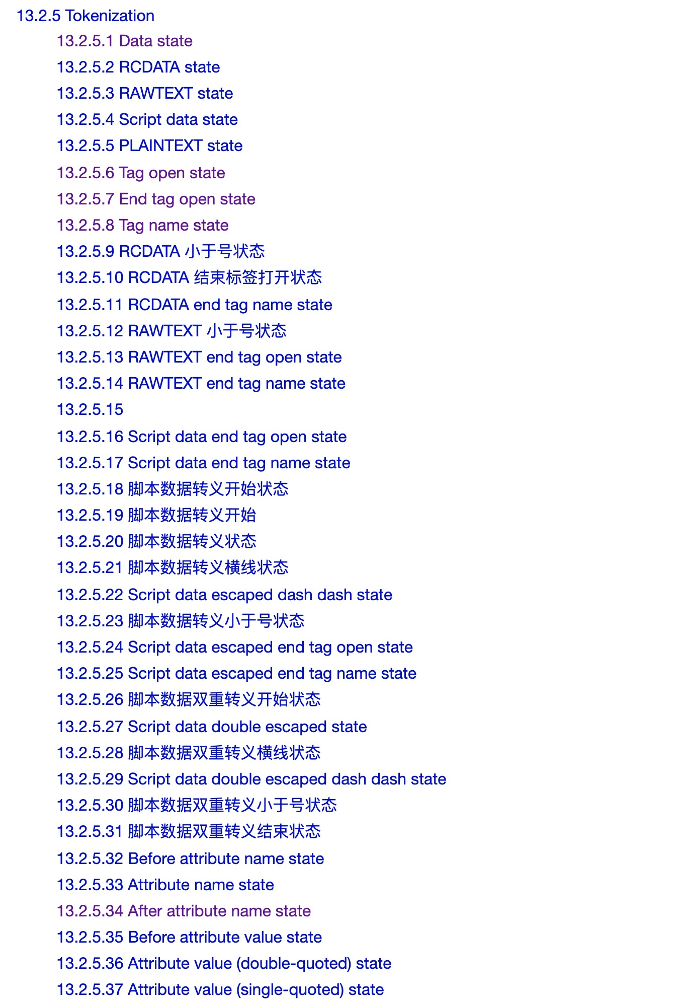
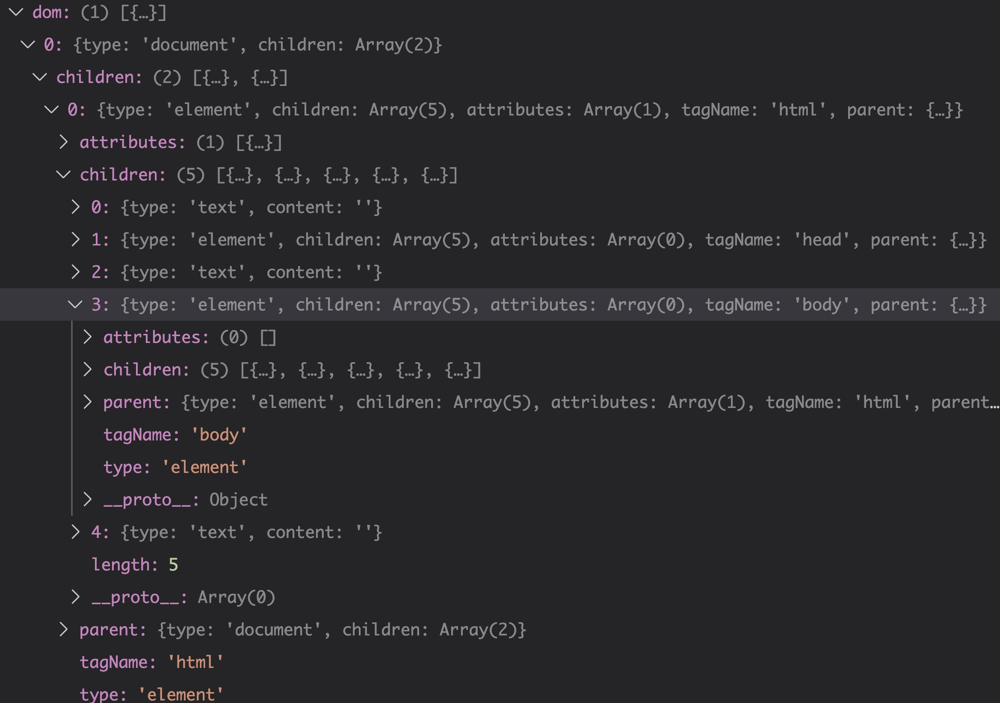
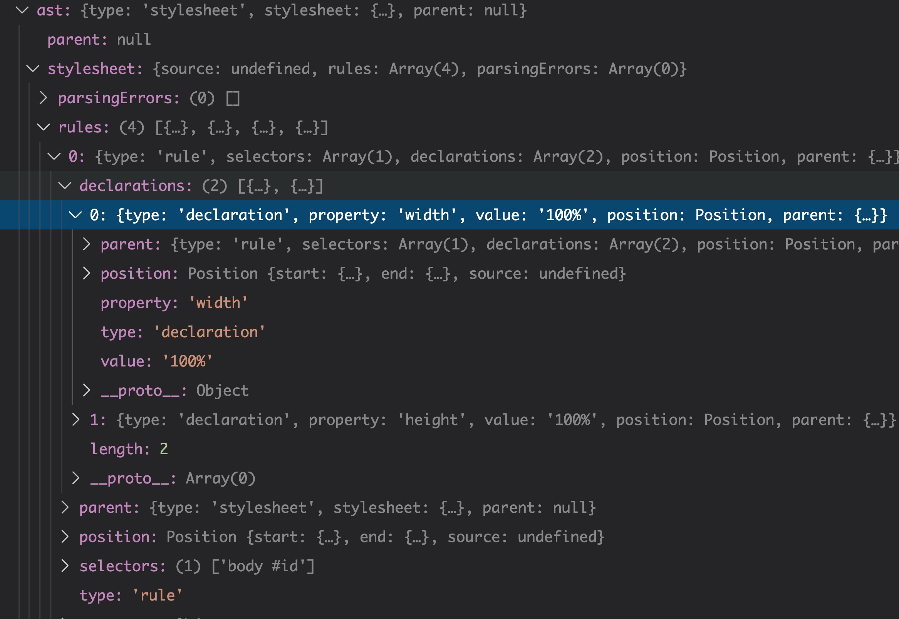
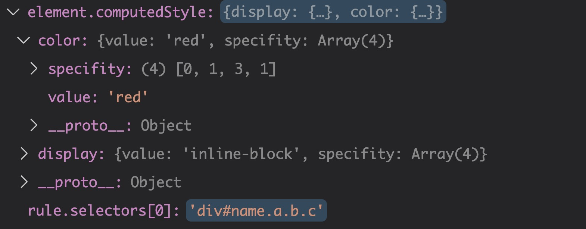
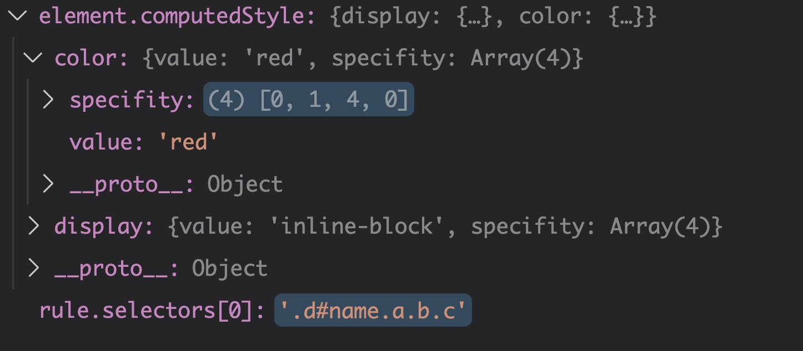

# 浏览器的工作原理（二）

## 浏览器原理总论

浏览器在前端中是很重要的，因此了解浏览器的工作原理是很有必要的。总的来说，我们打开浏览器，最终经过一系列步骤我们会看到一张图片，专业点的说法叫做Bitmap（位图），然后经过显卡转换为我们可以识别的光信号。

而这些转换步骤为：

* 输入url，发送HTTP请求，解析HTTP回应，得到Html文本
* 获取Html，对文本Html进行parse（文本分析，编译初级技术），得到DOM树结构
* 获取DOM树结构，进行css  computing(dom上对应了哪些css规则，哪些css会叠加，哪些会覆盖，将最终结构计算出来)，最后得到了，带css属性的DOM树（带样式的DOM）
* layout（布局、排版），通过这个步骤将DOM树上所有元素产生的盒的位置给计算出来。（获得位置的不是DOM元素本身而是css最后生成的盒）
* render（渲染），将元素画到一个图片上，最后根据操作系统和硬件驱动提供的API接口，最终展示给用户。

了解了以上步骤之后，我们接下来就跟着这样的步骤，做一个微型模拟浏览器——Toy - Broswer，来帮助我们更好的理解浏览器的工作原理。

## Toy - Broswer——HTML解析

这里我们进入了浏览器工作原理一系列步骤的第二步HTML解析阶段，这里我们包含以下几个步骤

### 1. HTML parse模块的文件拆分

* 为了方便文件管理，我们要单独将parser拆分到文件中
* parser接受HTML字符串作为参数，返回一个DOM树的对象

### 2. 用FSM（状态机）实现HTML的分析

* 我们用FSM（状态机）实现HTML分析
* HTML标准中，已经规定了HTML的状态
* 这里我们挑其中重要的部分来实现一个简化的分析

下图是HTML标准中列出的状态，具体可参见[【HTML Standard 】](https://whatwg-cn.github.io/html/)



### 3. 解析标签

* 主要的标签有：开始标签、结束标签、自封闭标签
* 这一步我们暂时忽略属性

```js
// parser.js
const EOF = Symbol('EOF')
const currentToken = {}

function data (c) {
  if (c === '<') {
    return tagOpen
  } else if (c === EOF) {
    return
  } else {
    // 文本
    return data
  }
}

function tagOpen (c) {
  if (c === '/') {
    return endTagOpen
  } else if (c.match(/^[a-zA-Z]$/)) {
    return tagName(c)
  } else {
    return
  }
}
function endTagOpen (c) {
  if (c.match(/^[a-zA-Z]$/)) {
    return tagName(c)
  } else if (c === '>') {
    // 错误
  } else if (c === EOF) {
    // 错误
  } else {
    // 错误。
    return
  }
}
function tagName (c) {
  if (c.match(/^[\t\n\f ]$/)) {
    return beforeAttributeName
  } else if (c === '/') {
    return selfClosingStartTag
  } else if (c.match(/^[a-zA-Z]$/)) {
    return tagName
  } else if (c === '>') {
    return data
  } else {
    return tagName
  }
}

function beforeAttributeName (c) {
  if (c.match(/^[\r\n\f ]$/)) {
    return beforeAttributeName
  } else if (c === '>') {
    return data
  } else if (c === '=') {
    return beforeAttributeName
  } else {
    return beforeAttributeName
  }
}

function selfClosingStartTag (c) {
  if (c === '>') {
    currentToken.isSelfClosing = true
    return data
  } else if (c === EOF) {

  } else {

  }
}

module.exports.parseHTML = function parseHTML (html) {
  let state = data
  for (let c of html) {
    state = state(c)
  }
  state = state(EOF)
}
```


### 4. 创建元素

* 在状态机中除了状态的迁移，我们还会加入业务逻辑
* 我们在标签结束状态添加结束标签token

```js
// parser.js
const EOF = Symbol('EOF')
let currentToken = null

function emit(token) {
  console.log(token)
}

function data (c) {
  if (c === '<') {
    return tagOpen
  } else if (c === EOF) {
    emit({
      type: 'EOF'
    })
    return
  } else {
    emit({
      type: 'text'
    })
    // 文本
    return data
  }
}

function tagOpen (c) {
  if (c === '/') {
    return endTagOpen
  } else if (c.match(/^[a-zA-Z]$/)) {
    currentToken = {
      type: 'startTag',
      tagName: ''
    }
    return tagName(c)
  } else {
    return
  }
}
function endTagOpen (c) {
  if (c.match(/^[a-zA-Z]$/)) {
    currentToken = {
      type: 'endTag',
      tagName: ''
    }
    return tagName(c)
  } else if (c === '>') {
    // 错误
  } else if (c === EOF) {
    // 错误
  } else {
    // 错误。
    return
  }
}
function tagName (c) {
  if (c.match(/^[\t\n\f ]$/)) {
    return beforeAttributeName
  } else if (c === '/') {
    return selfClosingStartTag
  } else if (c.match(/^[a-zA-Z]$/)) {
    currentToken.tagName += c
    return tagName
  } else if (c === '>') {
    emit(currentToken)
    return data
  } else {
    return tagName
  }
}

function beforeAttributeName (c) {
  if (c.match(/^[\r\n\f ]$/)) {
    return beforeAttributeName
  } else if (c === '>') {
    return data
  } else if (c === '=') {
    return beforeAttributeName
  } else {
    return beforeAttributeName
  }
}

function selfClosingStartTag (c) {
  if (c === '>') {
    currentToken.isSelfClosing = true
    return data
  } else if (c === EOF) {

  } else {

  }
}

module.exports.parseHTML = function parseHTML (html) {
  let state = data
  for (let c of html) {
    state = state(c)
  }
  state = state(EOF)
}
```


### 5. 处理属性

* 属性分为单引号、双引号、无引号三种写法，因此需要较多状态处理
* 处理方式跟处理标签类似
* 属性结束时，我们把属性添加到标签token上

```js
// parser.js
const EOF = Symbol('EOF')
let currentToken = null
let currentAttribute = null

function emit(token) {
  console.log(token)
}

function data (c) {
  if (c === '<') {
    return tagOpen
  } else if (c === EOF) {
    emit({
      type: 'EOF'
    })
    return
  } else {
    // emit({
    //   type: 'text'
    // })
    // 文本
    return data
  }
}

function tagOpen (c) {
  if (c === '/') {
    return endTagOpen
  } else if (c.match(/^[a-zA-Z]$/)) {
    currentToken = {
      type: 'startTag',
      tagName: ''
    }
    return tagName(c)
  } else {
    return
  }
}
function endTagOpen (c) {
  if (c.match(/^[a-zA-Z]$/)) {
    currentToken = {
      type: 'endTag',
      tagName: ''
    }
    return tagName(c)
  } else if (c === '>') {
    // 错误
  } else if (c === EOF) {
    // 错误
  } else {
    // 错误。
    return
  }
}
function tagName (c) {
  if (c.match(/^[\t\n\f ]$/)) {
    return beforeAttributeName
  } else if (c === '/') {
    return selfClosingStartTag
  } else if (c.match(/^[a-zA-Z]$/)) {
    currentToken.tagName += c
    return tagName
  } else if (c === '>') {
    emit(currentToken)
    return data
  } else {
    return tagName
  }
}

function beforeAttributeName (c) {
  if (c.match(/^[\r\n\f ]$/)) {
    return beforeAttributeName
  } else if (c === '>') {
    return data
  } else if (c === '=') {
    return beforeAttributeName
  } else {
    currentAttribute = {
      name: '',
      value: ''
    }
    return attributeName(c)
  }
}

function afterAttributeName (c) {
  if (c.match(/^[\r\n\f ]$/)) {
    return afterAttributeName
  } else if (c === '/') {
    return selfClosingStartTag
  } else if (c === '>') {
    currentToken[currentAttribute.name] = currentAttribute.value
    emit(currentToken)
    return data
  } else if (c === '=') {
    return beforeAttributeValue
  } else {
    currentToken[currentAttribute.name] = currentAttribute.value
    currentAttribute = {
      name: '',
      value: ''
    }
    return attributeName(c)
  }
}

function attributeName (c) {
  if (c.match(/^[\t\n\f ]$/) || c === '/' || c === '>' || c === EOF) {
    return afterAttributeName(c)
  } else if (c === '=') {
    return beforeAttributeValue
  } else if (c ==='\u0000') {
    // 错误
  } else if (c === '\"' || c === '\'' || c === '<') {
    // 错误
  } else {
    currentAttribute.name += c
    return attributeName
  }
}

function beforeAttributeValue (c) {
  if (c.match(/^[\t\n\f ]$/) || c === '/' || c === '>' || c === EOF) {
    return beforeAttributeValue
  } else if (c === '\"') {
    // 双引号
    return doubleQuotedAttributeValue
  } else if (c === '\'') {
    // 单引号
    return singleQuotedAttributeValue
  } else if (c === '>') {
    // 错误
    return data
  } else {
    return unquotedAttributeValue(c)
  }
}

function doubleQuotedAttributeValue (c) {
  if (c === '\"') {
    currentToken[currentAttribute.name] = currentAttribute.value
    return afterQuotedAttributeValue
  } else if (c === '\u0000') {
    // 这是一个意外的空字符解析错误。将U + FFFD替换字符添加到当前属性的值。
  } else if (c === EOF) {
    // 这是eof-in-tag解析错误。发出文件结束令牌。
  } else {
    currentAttribute.value += c
    return doubleQuotedAttributeValue
  }
}

function singleQuotedAttributeValue (c) {
  if (c === '\'') {
    currentToken[currentAttribute.name] = currentAttribute.value
    return afterQuotedAttributeValue
  } else if (c === '\u0000') {
    // 这是一个意外的空字符解析错误。将U + FFFD替换字符添加到当前属性的值。
  } else if (c === EOF) {
    // 这是eof-in-tag解析错误。发出文件结束令牌。
  } else {
    currentAttribute.value += c
    return singleQuotedAttributeValue
  }
}

function unquotedAttributeValue (c) {
  if (c.match(/^[\t\n\f ]$/)) {
    currentToken[currentAttribute.name] = currentAttribute.value
    return afterQuotedAttributeValue
  } else if (c === '/') {
    currentToken[currentAttribute.name] = currentAttribute.value
    return selfClosingStartTag
  } else if (c === '>') {
    currentToken[currentAttribute.name] = currentAttribute.value
    emit(currentToken)
    return data
  } else if (c === '\"' || c === '\'' || c === '<' || c === '`' || c === '=') {
    // 这是一个意外的未加引号的字符属性值解析错误。请按照下面的“其他”条目进行处理。
  } else if (c === EOF) {
    // 这是eof-in-tag解析错误。发出文件结束令牌。
  } else {
    currentAttribute.value += c
    return unquotedAttributeValue
  }
}

function afterQuotedAttributeValue (c) {
  if (c.match(/^[\t\n\f ]$/)) {
    return beforeAttributeName
  } else if (c === '/') {
    return selfClosingStartTag
  } else if (c === '>') {
    currentToken[currentAttribute.name] = currentAttribute.value
    emit(currentToken)
    return data
  } else if (c === EOF) {
    // 这是eof-in-tag解析错误。发出文件结束令牌。
  } else {
    // 这是缺少空白属性之间的解析错误。重新before attribute name state.
    return beforeAttributeName
  } 
}

function selfClosingStartTag (c) {
  if (c === '>') {
    emit(currentToken)
    currentToken.isSelfClosing = true
    return data
  } else if (c === EOF) {

  } else {

  }
}

module.exports.parseHTML = function parseHTML (html) {
  let state = data
  for (let c of html) {
    state = state(c)
  }
  state = state(EOF)
}
```


### 6.用token构建DOM树（语法分析阶段）

* 从标签创建DOM树的基本技巧是使用栈
* 遇到开始标签时创建元素并入栈，遇到结束标签时出栈
* 自封闭标签可以入栈后立即出栈
* 任何元素的父元素是他入栈前的栈顶元素

```js
// parser.js
const EOF = Symbol('EOF')
let currentToken = null
let currentAttribute = null

let stack = [{type: 'document', children: []}]

function emit(token) {
  if (token.text === 'text')
    return
  let top = stack[stack.length - 1]
  if (token.type === 'startTag') {
    let element = {
      type: 'element',
      children: [],
      attributes: []
    }
    element.tagName = token.tagName
    for (const p in token) {
      if (p !== 'type' && p !== 'tagName') {
        element.attributes.push({
          name: p,
          value: token[p]
        })
      }
    }
    top.children.push(element)
    element.parent = top
    if (!token.isSelfClosing)
      stack.push(element)
    currentTextNode = null
  } else if (token.type === 'endTag') {
    if (top.tagName !== token.tagName) {
      throw new Error("Tag start end doesn't match!")
    } else {
      stack.pop()
    }
    currentTextNode = null
  }
}

function data (c) {
  if (c === '<') {
    return tagOpen
  } else if (c === EOF) {
    emit({
      type: 'EOF'
    })
    return
  } else {
    emit({
      type: 'text',
      content: c
    })
    文本
    return data
  }
}

function tagOpen (c) {
  if (c === '/') {
    return endTagOpen
  } else if (c.match(/^[a-zA-Z]$/)) {
    currentToken = {
      type: 'startTag',
      tagName: ''
    }
    return tagName(c)
  } else {
    return
  }
}
function endTagOpen (c) {
  if (c.match(/^[a-zA-Z]$/)) {
    currentToken = {
      type: 'endTag',
      tagName: ''
    }
    return tagName(c)
  } else if (c === '>') {
    // 错误
  } else if (c === EOF) {
    // 错误
  } else {
    // 错误。
    return
  }
}
function tagName (c) {
  if (c.match(/^[\t\n\f ]$/)) {
    return beforeAttributeName
  } else if (c === '/') {
    return selfClosingStartTag
  } else if (c.match(/^[a-zA-Z]$/)) {
    currentToken.tagName += c
    return tagName
  } else if (c === '>') {
    emit(currentToken)
    return data
  } else {
    return tagName
  }
}

function beforeAttributeName (c) {
  if (c.match(/^[\r\n\f ]$/)) {
    return beforeAttributeName
  } else if (c === '>') {
    return data
  } else if (c === '=') {
    return beforeAttributeName
  } else {
    currentAttribute = {
      name: '',
      value: ''
    }
    return attributeName(c)
  }
}

function afterAttributeName (c) {
  if (c.match(/^[\r\n\f ]$/)) {
    return afterAttributeName
  } else if (c === '/') {
    return selfClosingStartTag
  } else if (c === '>') {
    currentToken[currentAttribute.name] = currentAttribute.value
    emit(currentToken)
    return data
  } else if (c === '=') {
    return beforeAttributeValue
  } else {
    currentToken[currentAttribute.name] = currentAttribute.value
    currentAttribute = {
      name: '',
      value: ''
    }
    return attributeName(c)
  }
}

function attributeName (c) {
  if (c.match(/^[\t\n\f ]$/) || c === '/' || c === '>' || c === EOF) {
    return afterAttributeName(c)
  } else if (c === '=') {
    return beforeAttributeValue
  } else if (c ==='\u0000') {
    // 错误
  } else if (c === '\"' || c === '\'' || c === '<') {
    // 错误
  } else {
    currentAttribute.name += c
    return attributeName
  }
}

function beforeAttributeValue (c) {
  if (c.match(/^[\t\n\f ]$/) || c === '/' || c === '>' || c === EOF) {
    return beforeAttributeValue
  } else if (c === '\"') {
    // 双引号
    return doubleQuotedAttributeValue
  } else if (c === '\'') {
    // 单引号
    return singleQuotedAttributeValue
  } else if (c === '>') {
    // 错误
    return data
  } else {
    return unquotedAttributeValue(c)
  }
}

function doubleQuotedAttributeValue (c) {
  if (c === '\"') {
    currentToken[currentAttribute.name] = currentAttribute.value
    return afterQuotedAttributeValue
  } else if (c === '\u0000') {
    // 这是一个意外的空字符解析错误。将U + FFFD替换字符添加到当前属性的值。
  } else if (c === EOF) {
    // 这是eof-in-tag解析错误。发出文件结束令牌。
  } else {
    currentAttribute.value += c
    return doubleQuotedAttributeValue
  }
}

function singleQuotedAttributeValue (c) {
  if (c === '\'') {
    currentToken[currentAttribute.name] = currentAttribute.value
    return afterQuotedAttributeValue
  } else if (c === '\u0000') {
    // 这是一个意外的空字符解析错误。将U + FFFD替换字符添加到当前属性的值。
  } else if (c === EOF) {
    // 这是eof-in-tag解析错误。发出文件结束令牌。
  } else {
    currentAttribute.value += c
    return singleQuotedAttributeValue
  }
}

function unquotedAttributeValue (c) {
  if (c.match(/^[\t\n\f ]$/)) {
    currentToken[currentAttribute.name] = currentAttribute.value
    return afterQuotedAttributeValue
  } else if (c === '/') {
    currentToken[currentAttribute.name] = currentAttribute.value
    return selfClosingStartTag
  } else if (c === '>') {
    currentToken[currentAttribute.name] = currentAttribute.value
    emit(currentToken)
    return data
  } else if (c === '\"' || c === '\'' || c === '<' || c === '`' || c === '=') {
    // 这是一个意外的未加引号的字符属性值解析错误。请按照下面的“其他”条目进行处理。
  } else if (c === EOF) {
    // 这是eof-in-tag解析错误。发出文件结束令牌。
  } else {
    currentAttribute.value += c
    return unquotedAttributeValue
  }
}

function afterQuotedAttributeValue (c) {
  if (c.match(/^[\t\n\f ]$/)) {
    return beforeAttributeName
  } else if (c === '/') {
    return selfClosingStartTag
  } else if (c === '>') {
    currentToken[currentAttribute.name] = currentAttribute.value
    emit(currentToken)
    return data
  } else if (c === EOF) {
    // 这是eof-in-tag解析错误。发出文件结束令牌。
  } else {
    // 这是缺少空白属性之间的解析错误。重新before attribute name state.
    return beforeAttributeName
  } 
}

function selfClosingStartTag (c) {
  if (c === '>') {
    emit(currentToken)
    currentToken.isSelfClosing = true
    return data
  } else if (c === EOF) {

  } else {

  }
}

module.exports.parseHTML = function parseHTML (html) {
  let state = data
  for (let c of html) {
    state = state(c)
  }
  state = state(EOF)
  console.log(stack)
  return stack
}
```

### 7. 将文本节点加到DOM树

* 文本节点与自封闭标签处理类似
* 多个文本节点需要合并处理

```js
// parser.js
const EOF = Symbol('EOF')
let currentToken = null
let currentAttribute = null

let stack = [{type: 'document', children: []}]
let currentTextNode = null

function emit(token) {
  let top = stack[stack.length - 1]
  if (token.type === 'startTag') {
    let element = {
      type: 'element',
      children: [],
      attributes: []
    }
    element.tagName = token.tagName
    for (const p in token) {
      if (p !== 'type' && p !== 'tagName') {
        element.attributes.push({
          name: p,
          value: token[p]
        })
      }
    }
    top.children.push(element)
    element.parent = top
    if (!token.isSelfClosing)
      stack.push(element)
    currentTextNode = null
  } else if (token.type === 'endTag') {
    if (top.tagName !== token.tagName) {
      throw new Error("Tag start end doesn't match!")
    } else {
      stack.pop()
    }
    currentTextNode = null
  } else if (token.type === 'text') {
    if (currentTextNode === null) {
      currentTextNode = {
        type: 'text',
        content: ''
      }
      top.children.push(currentTextNode)
    }
    currentTextNode += token.content
  }
}

function data (c) {
  if (c === '<') {
    return tagOpen
  } else if (c === EOF) {
    emit({
      type: 'EOF'
    })
    return
  } else {
    emit({
      type: 'text',
      content: c
    })
    文本
    return data
  }
}

function tagOpen (c) {
  if (c === '/') {
    return endTagOpen
  } else if (c.match(/^[a-zA-Z]$/)) {
    currentToken = {
      type: 'startTag',
      tagName: ''
    }
    return tagName(c)
  } else {
    return
  }
}
function endTagOpen (c) {
  if (c.match(/^[a-zA-Z]$/)) {
    currentToken = {
      type: 'endTag',
      tagName: ''
    }
    return tagName(c)
  } else if (c === '>') {
    // 错误
  } else if (c === EOF) {
    // 错误
  } else {
    // 错误。
    return
  }
}
function tagName (c) {
  if (c.match(/^[\t\n\f ]$/)) {
    return beforeAttributeName
  } else if (c === '/') {
    return selfClosingStartTag
  } else if (c.match(/^[a-zA-Z]$/)) {
    currentToken.tagName += c
    return tagName
  } else if (c === '>') {
    emit(currentToken)
    return data
  } else {
    return tagName
  }
}

function beforeAttributeName (c) {
  if (c.match(/^[\r\n\f ]$/)) {
    return beforeAttributeName
  } else if (c === '>') {
    return data
  } else if (c === '=') {
    return beforeAttributeName
  } else {
    currentAttribute = {
      name: '',
      value: ''
    }
    return attributeName(c)
  }
}

function afterAttributeName (c) {
  if (c.match(/^[\r\n\f ]$/)) {
    return afterAttributeName
  } else if (c === '/') {
    return selfClosingStartTag
  } else if (c === '>') {
    currentToken[currentAttribute.name] = currentAttribute.value
    emit(currentToken)
    return data
  } else if (c === '=') {
    return beforeAttributeValue
  } else {
    currentToken[currentAttribute.name] = currentAttribute.value
    currentAttribute = {
      name: '',
      value: ''
    }
    return attributeName(c)
  }
}

function attributeName (c) {
  if (c.match(/^[\t\n\f ]$/) || c === '/' || c === '>' || c === EOF) {
    return afterAttributeName(c)
  } else if (c === '=') {
    return beforeAttributeValue
  } else if (c ==='\u0000') {
    // 错误
  } else if (c === '\"' || c === '\'' || c === '<') {
    // 错误
  } else {
    currentAttribute.name += c
    return attributeName
  }
}

function beforeAttributeValue (c) {
  if (c.match(/^[\t\n\f ]$/) || c === '/' || c === '>' || c === EOF) {
    return beforeAttributeValue
  } else if (c === '\"') {
    // 双引号
    return doubleQuotedAttributeValue
  } else if (c === '\'') {
    // 单引号
    return singleQuotedAttributeValue
  } else if (c === '>') {
    // 错误
    return data
  } else {
    return unquotedAttributeValue(c)
  }
}

function doubleQuotedAttributeValue (c) {
  if (c === '\"') {
    currentToken[currentAttribute.name] = currentAttribute.value
    return afterQuotedAttributeValue
  } else if (c === '\u0000') {
    // 这是一个意外的空字符解析错误。将U + FFFD替换字符添加到当前属性的值。
  } else if (c === EOF) {
    // 这是eof-in-tag解析错误。发出文件结束令牌。
  } else {
    currentAttribute.value += c
    return doubleQuotedAttributeValue
  }
}

function singleQuotedAttributeValue (c) {
  if (c === '\'') {
    currentToken[currentAttribute.name] = currentAttribute.value
    return afterQuotedAttributeValue
  } else if (c === '\u0000') {
    // 这是一个意外的空字符解析错误。将U + FFFD替换字符添加到当前属性的值。
  } else if (c === EOF) {
    // 这是eof-in-tag解析错误。发出文件结束令牌。
  } else {
    currentAttribute.value += c
    return singleQuotedAttributeValue
  }
}

function unquotedAttributeValue (c) {
  if (c.match(/^[\t\n\f ]$/)) {
    currentToken[currentAttribute.name] = currentAttribute.value
    return afterQuotedAttributeValue
  } else if (c === '/') {
    currentToken[currentAttribute.name] = currentAttribute.value
    return selfClosingStartTag
  } else if (c === '>') {
    currentToken[currentAttribute.name] = currentAttribute.value
    emit(currentToken)
    return data
  } else if (c === '\"' || c === '\'' || c === '<' || c === '`' || c === '=') {
    // 这是一个意外的未加引号的字符属性值解析错误。请按照下面的“其他”条目进行处理。
  } else if (c === EOF) {
    // 这是eof-in-tag解析错误。发出文件结束令牌。
  } else {
    currentAttribute.value += c
    return unquotedAttributeValue
  }
}

function afterQuotedAttributeValue (c) {
  if (c.match(/^[\t\n\f ]$/)) {
    return beforeAttributeName
  } else if (c === '/') {
    return selfClosingStartTag
  } else if (c === '>') {
    currentToken[currentAttribute.name] = currentAttribute.value
    emit(currentToken)
    return data
  } else if (c === EOF) {
    // 这是eof-in-tag解析错误。发出文件结束令牌。
  } else {
    // 这是缺少空白属性之间的解析错误。重新before attribute name state.
    return beforeAttributeName
  } 
}

function selfClosingStartTag (c) {
  if (c === '>') {
    emit(currentToken)
    currentToken.isSelfClosing = true
    return data
  } else if (c === EOF) {

  } else {

  }
}

module.exports.parseHTML = function parseHTML (html) {
  let state = data
  for (let c of html) {
    state = state(c)
  }
  state = state(EOF)
  console.log(stack)
  return stack
}
```

### 最终执行结果



## Toy - Broswer——CSS计算

接下来的一步是进行CSS计算，这里我们实现Toy - Broswer要借助一个npm包css，它是一个CSS parser，可实现将css变成AST抽象语法树的过程，可以帮我们简化这部分的实现过程。我们将根据生成的抽象语法树，抽取出各种CSS规则,应用于我们的HTML元素上。

而这里的CSS computing 的过程，其实是发生在DOM树构建的过程中的，具体包括以下步骤：

### 1. 收集CSS规则

* 当遇到style标签时，我们把CSS规则保存起来
* 调用CSS parser 来分析CSS规则
* 这里我们必须要仔细研究此库分析的CSS规则格式



ast里的stylesheet中的rules就是我们要收集的规则。rules是一个数组，每一项的对象中：

* selectors表示一个选择器列表，每一项代表一个选择器
* declarations表示的这条规则所包含的属性以及属性对应的值和信息

### 2. 添加调用

* 当我们创建一个元素后，立即计算CSS
* 理论上，当我们分析一个元素时，所有CSS规则已经收集完毕
* 在真实浏览器中，可能遇到写在body的style标签，需要重新CSS计算的情况，这里我们忽略

```js
// parser.js
// ... 省略部分代码
// 新函数，CSS规则暂存数组中
let rules = []
function addCSSRules (text) {
  var ast = css.parse(text)
  rules.push(...ast.stylesheet.rules)
}

function computeCSS (element) {
  console.log(rules)
  console.log('compute CSS for Element', element)
}
function emit(token) {
  let top = stack[stack.length - 1]
  if (token.type === 'startTag') {
    let element = {
      type: 'element',
      children: [],
      attributes: []
    }
    element.tagName = token.tagName
    for (const p in token) {
      if (p !== 'type' && p !== 'tagName') {
        element.attributes.push({
          name: p,
          value: token[p]
        })
      }
    }
    computeCSS(element)
    top.children.push(element)
    element.parent = top
    if (!token.isSelfClosing)
      stack.push(element)
    currentTextNode = null
  } else if (token.type === 'endTag') {
    if (top.tagName !== token.tagName) {
      throw new Error("Tag start end doesn't match!")
    } else {
      /***********************遇到style标签的时候，执行添加css规则的操作**************************/
      if (top.tagName === 'style') {
        addCSSRules(top.children[0].content)
      }
      stack.pop()
    }
    currentTextNode = null
  } else if (token.type === 'text') {
    if (currentTextNode === null) {
      currentTextNode = {
        type: 'text',
        content: ''
      }
      top.children.push(currentTextNode)
    }
    currentTextNode.content += token.content
  }
}
// ... 省略部分代码
```

### 3. 获取父元素序列

* 在ComputedCSS函数中，我们必须知道元素的所有父元素才能判断元素是否与我们的规则匹配
* 我们从上一步的Stack，可以获得本元素所有的父元素
* 因为我们首先要获取的是当前元素，所以我们获得和计算父元素匹配的顺序是从内向外的

```js
// parser.js
// ... 省略部分代码
// 新函数，CSS规则暂存数组中
let rules = []
function addCSSRules (text) {
  var ast = css.parse(text)
  rules.push(...ast.stylesheet.rules)
}

function computeCSS (element) {
  // jiang
  var elements = stack.slice().reverse()
}
// ... 省略部分代码
```

* 用栈来构建整个dom树的过程中，整个stack就存储了当前元素的父元素，在这里进行一次slice，是因为这个栈是变化的，元素会变化，可能被污染。用一个不带参数的slice函数可以完全复制一个stack。
* 这里会把父元素的序列进行一次reverse。原因是标签匹配，会从当前元素逐级的往外匹配。我们首先获取到当前元素，如果我们想去检查一个选择器是否匹配当前元素，是需要一级一级的要去往它的父元素去找的。

### 4. 选择器与元素的匹配

* 选择器也要从当前元素向外排列
* 复杂选择器拆成单个元素的选择器，用循环匹配父元素队列

```js
// parser.js
// ... 省略部分代码
// 新函数，CSS规则暂存数组中
let stack = [{type: 'document', children: []}]
let currentTextNode = null

// 新函数，CSS规则暂存数组中
let rules = []
function addCSSRules (text) {
  var ast = css.parse(text)
  rules.push(...ast.stylesheet.rules)
}
function matchSelector (element, selector) {
  return true
}
function computeCSS (element) {
  var elements = stack.slice().reverse()
  if (!element.computedStyle) {
    element.computedStyle = {}
  }

  for (const rule of rules) {
    var selectParts = rule.selectors[0].split(' ').reverse()

    if (!matchSelector(element, selectParts[0]))
      continue
    let matched = false
    let j = 1
    for (let i = 0; i < elements.length; i++) {
      if (matchSelector(elements[i], selectParts[j]))
        j++
    }
    if (j >= selectParts.length)
      matched = true
    
    if (matched) {
      // 如果匹配我们就要加入
      console.log('Element:', element, 'matched rule:', rule)
    }
  }

}
// ... 省略部分代码
```

### 5. 计算选择器与元素匹配

* 根据选择器的类型和元素属性，计算是否匹配当前元素
* 这里仅仅实现了三种简单选择器：id选择器、class选择器、tagName选择器，实际浏览器中还需要实现复合选择器

```js
// parser.js
// ... 省略部分代码
// 新函数，CSS规则暂存数组中
let stack = [{type: 'document', children: []}]
let currentTextNode = null

// 新函数，CSS规则暂存数组中
let rules = []
function addCSSRules (text) {
  var ast = css.parse(text)
  rules.push(...ast.stylesheet.rules)
}
function matchSelector (element, selector) {
  if (!selector || !element.attributes) {
    return false
  }
  if (selector.charAt(0) === '#') {
    var attr = element.attributes.filter(attr => attr.name === 'id')[0]
    if (attr && attr.value === selector.replace('#', ''))
      return true
  } else if (selector.charAt(0) === '.') {
    var attr = element.attributes.filter(attr => attr.name === 'class')[0]
    if (attr && attr.value.includes(selector.replace('.', '')))
      return true
  } else {
    if (element.tagName === selector) {
      return true
    }
  }
  return false
}
function computeCSS (element) {
  var elements = stack.slice().reverse()
  if (!element.computedStyle) {
    element.computedStyle = {}
  }

  for (const rule of rules) {
    var selectParts = rule.selectors[0].split(' ').reverse()

    if (!matchSelector(element, selectParts[0]))
      continue
    let matched = false
    let j = 1
    for (let i = 0; i < elements.length; i++) {
      if (matchSelector(elements[i], selectParts[j]))
        j++
    }
    if (j >= selectParts.length)
      matched = true
    
    if (matched) {
      // 如果匹配我们就要加入
      console.log('Element:', element, 'matched rule:', rule)
    }
  }

}
// ... 省略部分代码
```


### 6. 生成computed属性

* 一旦选择匹配，就应用选择器到元素上，形成computedStyle

```js
// parser.js
// ... 省略部分代码
// 新函数，CSS规则暂存数组中
let stack = [{type: 'document', children: []}]
let currentTextNode = null

// 新函数，CSS规则暂存数组中
let rules = []
function addCSSRules (text) {
  var ast = css.parse(text)
  rules.push(...ast.stylesheet.rules)
}
function matchSelector (element, selector) {
  if (!selector || !element.attributes) {
    return false
  }
  if (selector.charAt(0) === '#') {
    var attr = element.attributes.filter(attr => attr.name === 'id')[0]
    if (attr && attr.value === selector.replace('#', ''))
      return true
  } else if (selector.charAt(0) === '.') {
    var attr = element.attributes.filter(attr => attr.name === 'class')[0]
    if (attr && attr.value.includes(selector.replace('.', '')))
      return true
  } else {
    if (element.tagName === selector) {
      return true
    }
  }
  return false
}
function computeCSS (element) {
  var elements = stack.slice().reverse()
  if (!element.computedStyle) {
    element.computedStyle = {}
  }

  for (const rule of rules) {
    var selectParts = rule.selectors[0].split(' ').reverse()

    if (!matchSelector(element, selectParts[0]))
      continue
    let matched = false
    let j = 1
    for (let i = 0; i < elements.length; i++) {
      if (matchSelector(elements[i], selectParts[j]))
        j++
    }
    if (j >= selectParts.length)
      matched = true
    
    if (matched) {
      // 如果匹配我们就要加入
      var computedStyle = element.computedStyle
      for (const declaration of rule.declarations) {
        if (!computedStyle[declaration.property])
          computedStyle[declaration.property] = {}
        computedStyle[declaration.property].value = declaration.value
      }
      console.log(element.computedStyle)
    }
  }

}
// ... 省略部分代码
```

### 7. specificity的计算逻辑

* CSS规则根据specificity和后来优先规则覆盖
* specificity是个四元组，越左边的权重越高
* 一个CSS规则的specificity根据包含的简单选择器相加而成

#### specificity是个四元组

```
列如选择器： div #id .name | a #my #id
四元组：[0, 1, 1, 1] | [0, 2, 0, 1]
四元组意义：[inline 样式, id选择器, class选择器, tagName选择器]
```

```js
// parser.js
// ... 省略部分代码
// 新函数，CSS规则暂存数组中
let stack = [{type: 'document', children: []}]
let currentTextNode = null

// 新函数，CSS规则暂存数组中
let rules = []
function addCSSRules (text) {
  var ast = css.parse(text)
  rules.push(...ast.stylesheet.rules)
}
function matchSelector (element, selector) {
  if (!selector || !element.attributes) {
    return false
  }
  if (selector.charAt(0) === '#') {
    var attr = element.attributes.filter(attr => attr.name === 'id')[0]
    if (attr && attr.value === selector.replace('#', ''))
      return true
  } else if (selector.charAt(0) === '.') {
    var attr = element.attributes.filter(attr => attr.name === 'class')[0]
    if (attr && attr.value.includes(selector.replace('.', '')))
      return true
  } else {
    if (element.tagName === selector) {
      return true
    }
  }
  return false
}
function computeCSS (element) {
  var elements = stack.slice().reverse()
  if (!element.computedStyle) {
    element.computedStyle = {}
  }

  for (const rule of rules) {
    var selectParts = rule.selectors[0].split(' ').reverse()

    if (!matchSelector(element, selectParts[0]))
      continue
    let matched = false
    let j = 1
    for (let i = 0; i < elements.length; i++) {
      if (matchSelector(elements[i], selectParts[j]))
        j++
    }
    if (j >= selectParts.length)
      matched = true
    
    if (matched) {
      var sp = specifity(rule.selectors[0])
      var computedStyle = element.computedStyle
      for (const declaration of rule.declarations) {
        if (!computedStyle[declaration.property])
          computedStyle[declaration.property] = {}
        if (!computedStyle[declaration.property].specifity) {
          computedStyle[declaration.property].value = declaration.value
          computedStyle[declaration.property].specifity = sp
        } else if (compare(computedStyle[declaration.declaration.property].specifity, sp) < 0) {
          computedStyle[declaration.property].value = declaration.value
          computedStyle[declaration.property].specifity = sp
        }
      }    
      console.log(element.computedStyle)
    }
  }

}
// ... 省略部分代码
```

### 8. 复合选择的器分析功能（额外作业）

1. 实现复合选择器，实现支持空格的 Class 选择器

2. 在 selectorParts 里面去解析复合选择器

```js
// parser.js
// ... 省略部分代码
// 新函数，CSS规则暂存数组中
let stack = [{type: 'document', children: []}]
let currentTextNode = null

// 新函数，CSS规则暂存数组中
let rules = []
function addCSSRules (text) {
  var ast = css.parse(text)
  rules.push(...ast.stylesheet.rules)
}

// 额外作业1：实现复合选择器，实现支持空格的 Class 选择器
function matchSelector (element, selector) {
  if (!selector || !element.attributes) {
    return false
  }
  /**复合选择器:
   * 复合选择器表示简单选择器中“且”的关系,tagName必须在第一位
   */
  let regNotSimple = new RegExp(/^(([.#][a-zA-Z][a-zA-Z\d]*)|([a-zA-Z][a-zA-Z\d]*))([.#][a-zA-Z][a-zA-Z\d]*)+/)
  if (regNotSimple.test(selector)) {
    let regNotTagName = new RegExp(/^[.#]/)
    let selectorArr = selector.match(/[.#]/g)
    let selectorVal = selector.split(/[.#]/g)
    if (!regNotTagName.test(selector)) {
      if (selectorVal[0] !== element.tagName)
        return false
    }
    for (let i = 0; i < selectorArr.length; i++) {
      if (selectorArr[i] === '#') {
        var attr = element.attributes.filter(attr => attr.name === 'id')[0]
        if (!attr || attr.value !== selectorVal[i + 1])
          return false
      } else {
        var attr = element.attributes.filter(attr => attr.name === 'class')[0]
        if (!attr || !attr.value.includes(selectorVal[i + 1]))
          return false         
      }
    }
    return true
  }
  // 简单选择器
  if (selector.charAt(0) === '#') {
    var attr = element.attributes.filter(attr => attr.name === 'id')[0]
    if (attr && attr.value === selector.replace('#', ''))
      return true
  } else if (selector.charAt(0) === '.') {
    var attr = element.attributes.filter(attr => attr.name === 'class')[0]
    if (attr && attr.value.includes(selector.replace('.', '')))
      return true
  } else {
    if (element.tagName === selector) {
      return true
    }
  }
  return false
}
// ... 省略部分代码
```

#### 实现效果






