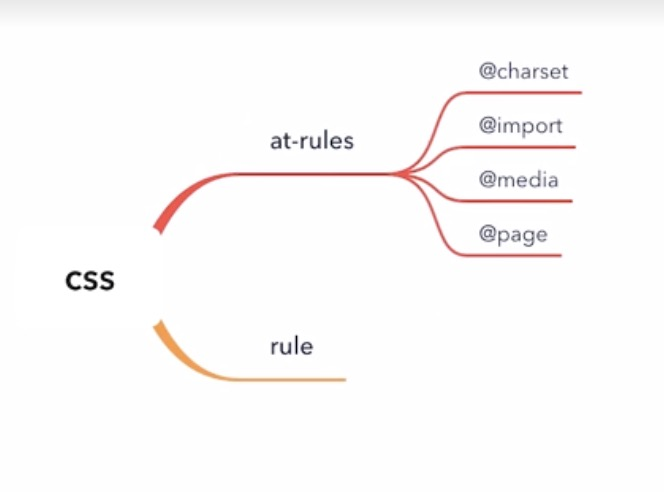
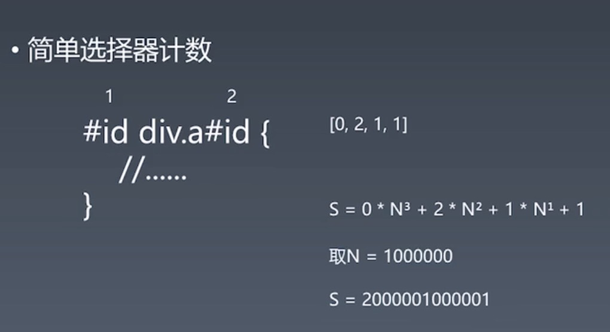
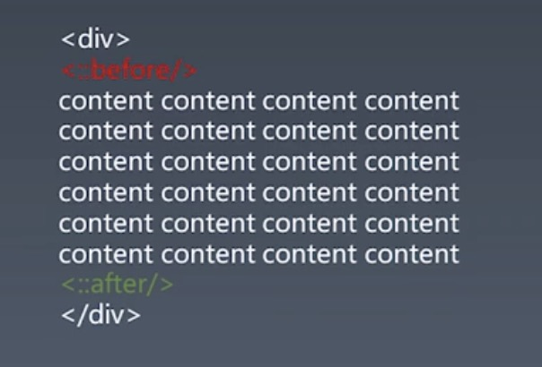
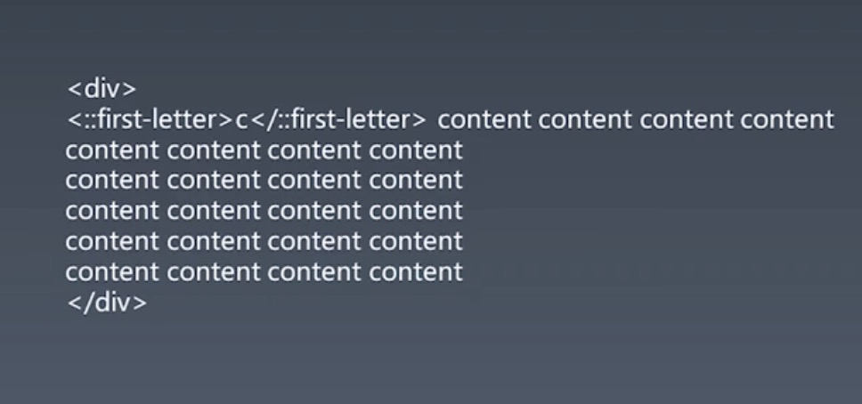
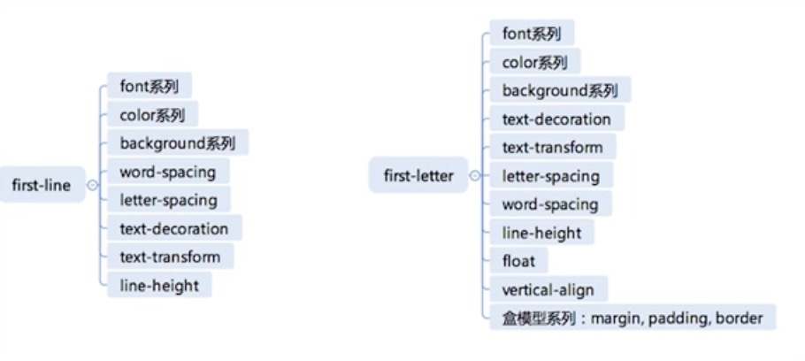

# CSS

## CSS总论

### 1. CSS语法研究

学习一门语言的很好的切入点就是从它的语法入手去理解它。

#### CSS2.1语法

与Javascript和HTML不同的是，CSS的语法定义分散于不同的标准中，而这里我们找到了[CSS2.1的标准](https://www.w3.org/TR/CSS21/grammar.html#q25.0)，它完整的定义了CSS2.1的语法。

下面是从标准中截取的一部分CSS语法产生式：

其中：

- *****: 表示0或者更多个
- **+**: 表示1或者更多个
- **?**: 存在或不存在
- **|**: 或的关系
- **[ ]**: 组

```
stylesheet
  : [ CHARSET_SYM STRING ';' ]?
    [S|CDO|CDC]* [ import [ CDO S* | CDC S* ]* ]*
    [ [ ruleset | media | page ] [ CDO S* | CDC S* ]* ]*
  ;

```

* 在这里CDO、CDC是HTML注释的起点和终点，在这里存在一个历史包袱，早年的浏览器为了不将css文本显示出来，所以允许在其中将css文本标HTML注释。
* [ ruleset | media | page ]为可重复的规则，分为三种：
  * ruleset 为普通CSS规则。
  * media CSS 媒体类型。在2.1版本的CSS中就已经存在，在现在CSS以及更高的版本中已经有了media query,高版本标准中media与2.1版本中的定义要更为复杂
  * page 用于打印相关的信息

综上我们可以总结出一个关于CSS2.1的总体结构：

#### CSS(2.1)总体结构

* @charset
* @import
* rules
  * @media
  * @page
  * rule

所以由此我们可以总结出一个关于CSS的骨架脑图



### 2. CSS @规则的研究

关于CSS的@规则定义的标准一共有100多份，这里我们整理出了以下的规则：

* [@charset]( https://www.w3.org/TR/css-syntax-3/): @charset 用于提示 CSS 文件使用的字符编码方式，它如果被使用，必须出现在最前面

* [@import](https://www.w3.org/TR/css-cascade-4/): @import 用于引入一个 CSS 文件，除了 @charset 规则不会被引入，@import 可以引入另一个文件的全部内容。

* [@media](https://www.w3.org/TR/css3-conditional/) :media 就是大名鼎鼎的 media query 使用的规则了，它能够对设备的类型进行一些判断。在 media 的区块内，是普通规则列表。

* [@page](https://www.w3.org/TR/css-page-3/): page 用于分页媒体访问网页时的表现设置，页面是一种特殊的盒模型结构，除了页面本身，还可以设置它周围的盒。

* [@counter-style](https://www.w3.org/TR/css-counter-styles-3): counter-style 产生一种数据，用于定义列表项的表现。

* [@keyframes](https://www.w3.org/TR/css-animations-1/): keyframes 产生一种数据，用于定义动画关键帧。

* [@fontface](https://www.w3.org/TR/css-fonts-3/): fontface 用于定义一种字体，icon font 技术就是利用这个特性来实现的。

* [@supports](https://www.w3.org/TR/css3-conditional/): support 检查环境的特性，它与 media 比较类似。

* [@namespace](https://www.w3.org/TR/css-namespaces-3/): 用于跟 XML 命名空间配合的一个规则，表示内部的 CSS 选择器全都带上特定命名空间。

### 3. CSS规则结构

这里我们先来看一段css代码

```css
.a {
  background-color: red
}
```

上面是一段很常见简单的css代码，这里我们可以总结出CSS规则结构：

*  Selector
  * https://www.w3.org/TR/selectors-3/
  *  https://www.w3.org/TR/selectors-4/
* 声明
  * Key
    * Properties
    * Variables: https://www.w3.org/TR/css-variables/ 
  * Value
    * https://www.w3.org/TR/css-values-4/


#### Variables

在上述的Variables标准是一个自定义属性的一个功能，例如

```css
/*自定义属性定义了以var（）表示法引用的变量，这些变量可用于多种用途。例如，在设计中始终使用少量颜色的页面可以将颜色存储在自定义属性中，并将其与变量一起使用：*/
:root {
  --main-color: #06c;
  --accent-color: #006;
}
#foo h1 {
  color: var(--main-color);
}
/*此外该功能可以作用在任何局部，可以和calc共用，与其他函数进行嵌套*/
:root {
  --one: calc(var(--two) + 20px);
  --two: calc(var(--one) - 20px);
}
/*使用的时候是可以给一个默认值的*/
.component .header {
  color: var(--header-color, blue);
}
.component .text {
  color: var(--text-color, black);
}
/*变量除了用作value还可以用作key*/
.foo {
  --side: margin-top;
  var(--side): 20px;
}
```

####  Value

数值数据类型包括<整数>，<数字>，<百分比>，以及各种尺寸，包括<长度>，<角度>，<时间>，<频率>和<分辨率>。

具体可参见标准：[https://www.w3.org/TR/css-values-4/](https://www.w3.org/TR/css-values-4/)

### 4. 收集规则小工具

这边通过js代码我们可以爬取W3C上的一些关于CSS的标准，有助于我们收集资料。

具体参见：[代码](./作业代码/规则收集.js)

## CSS选择器

### 1. 选择器语法

#### 简单选择器

* ```*``` 全体选择器:选择所有元素
* 标签选择器 : 根据元素标签名来选择元素
* ```.``` class选择器: 针对特定属性的选择器，```.``` 后面跟随class名
* ```#``` id选择器: 针对特定属性的选择器，```#``` 后面跟随id名
* ```[]``` 属性选择器: 
  * E[att~="val"] { sRules }：选择具有att属性且属性值为一用空格分隔的字词列表，其中一个等于val的E元素（包含只有一个值且该值等于val的情况）。
  * E[att^="val"] { sRules }：选择具有att属性且属性值为以val开头的字符串的E元素。
  * E[att$="val"] { sRules }：选择具有att属性且属性值为以val结尾的字符串的E元素。
  * E[att*="val"] { sRules }：选择具有att属性且属性值为包含val的字符串的E元素。
* 伪类选择器
* 伪元素选择器

##### `svg 和 html` 中的 `a` 元素：

```css
/*svg 和 html 中都有 a 元素，若要想区分选择 svg 中的 a 和 html 中的 a，就必须用带命名空间的类型选择器。*/ 
@namespace svg url(http://www.w3.org/2000/svg);
@namespace html url(http://www.w3.org/1999/xhtml);

svg|a {
  stroke: hotpink;
  stroke-width: 1;
}

html|a {
  font-size: 40px;
  color: green;
}
```

#### 复合选择器

* <简单选择器><简单选择器><简单选择器>
* ```*```或```div``` 必须写在前面

* 复合选择器表示简单选择器与简单选择器之间实现“且”的关系。

#### 复杂选择器

* <复合选择器><SP><复合选择器>：包含选择器
* <复合选择器>“>”<复合选择器>：子选择器
* <复合选择器>“~”<复合选择器>：兄弟选择器
* <复合选择器>“+”<复合选择器>：相邻选择器
* <复合选择器>“||”<复合选择器>：(selector level 4)做表格的时候，可以选中其中一例

此外还有选择器列表用```，```逗号链接

### 2. 选择器优先级

下面有一个案例，所谓选择器优先级就是对一个选择器中的包含的所有简单选择器进行计数。



在这里的计数方法中我们会采用N进制来表示，老版本的ie选择了N=255，以节省内存。现在的大部分浏览器都选择了N=65536.这里N取的值足够大就可以，一般标准里面都会因为要节省内存占用，所以不会选10进制整数，而会取16进制，一般是256的整次幂。

综上所述：CSS优先级：是由四个级别和各级别出现次数决定

```
四个级别：行内样式，ID选择器，Class选择器，标签

每个规则对应一个初始值0,0,0,0

若是 行内选择符，则加1、0、0、0

若是 ID选择符，则加0、1、0、0

若是 类选择符/属性选择符/伪类选择符，则分别加0、0、1、0

若是 元素选择符/伪元素选择符，则分别加0、0、0、1

算法：将每条规则中，选择符对应的数相加后得到的”四位数“，从左到右进行比较，大的优先级越高。
```

### 3. 伪类

#### 链接行为

伪类在最初的设计是与链接和行为相关：

- `:any-link`：表示任意的链接，包括 `a、area 和 link`标签都可能匹配到这个伪类。
- `:link`：表示未访问过的链接。
- `:visited`：表示已经访问过的链接。
- `:hover`：表示鼠标悬停在上的元素。
- `:active`：表示正在激活这个元素。
- `:focus`：表示焦点落在这个元素之上。
- `:target`：用于选中浏览器 `URL 的 hash` 部分所指示的元素。

#### 树结构

- `:empty`：伪类表示没有子节点的元素。
- `:nth-child（N）`：选择所有某元素的父元素的第N个子元素
- `nth-last-child(N)`：与```:nth-child（N）```的区别仅仅是从后往前数。
- `:first-child() :last-child()`：分别表示第一个和最后一个元素。
- `:only-child`：选中唯一一个子元素

#### 逻辑型

* ```:not```伪类:匹配不含有s选择符的某元素。(只能在选择器里写简单选择器序列)

### 4. 伪元素

* ```::before``` :伪元素可以在元素的内容前面插入新内容。
* ```::after``` : 伪元素可以在元素的内容之后插入新内容。



* ```::first-line``` :伪元素用于向文本的首行设置特殊样式。实际是针对排版之后的line，跟我们实际源码里的first line没有关系，假如浏览器提供的渲染的宽度不同，有可能first-line在不同的环境里括充的元素数量是不一致的。
* ```::first-letter```:伪元素用于向文本的首字母设置特殊样式。(相当于有一个元素将文本内容里的第一个字母括了起来，可修改元素除了content以外的任意属性)



##### first-line 、 first-letter 的可用属性



##### 思考题：为什么 first-letter 可以设置 float 之类的，而 first-line 不行呢？

因为first-line发生在排版阶段，在元素排版过后，浏览器会挑出其中文本内容排版计算后的第一行，对这里面的内容进行一定的文字相关的样式修改。而其他关于盒的样式都已经排版计算完毕，所以设置一些关于盒相关的属性，是不会起作用的，因为在这个阶段并不会再去计算排版，这里能做的只有对它的文本内容相关的样式进行修改，这个修改发生在正常元素排版之后。

而对于 first-letter 来说，则是在排版计算之前将文本内容的第一个元素用<first-letter></first-letter>这一个伪元素扩充了起来，这个伪元素相当于文本首字母的父元素，是一个行内块级元素，所以我们可以设置它的一些 float 之类的属性，相当于给这个首字母的父元素添加属性，这是发生在排版计算之中的。


