# CSS

这里将要讲的是CSS中的文字与排版。

## Css排版

### 盒

排版和渲染的基本单位是盒，下面是关于标签、元素、盒的一些概念：

- HTML代码中可以书写开始标签，结束标签，和自封闭标签。
- 一对起止标签，表示一个元素。
- DOM树中存储的是元素和其它类型的节点（Node）。
- CSS选择器选中的是元素。
- CSS选择器选中的元素，在排版时可能产生多个盒。

#### 盒模型

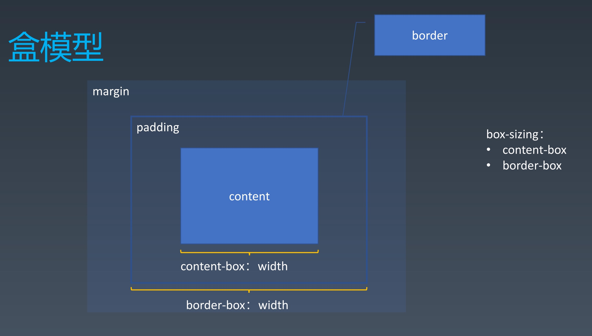

- 排版和渲染的基本单位是盒。
  - 盒模型首先是一个多层的结构，最内层的为content就是它的内容。
  - 在content和border之间，有一圈空白，为padding——俗称内边距，它主要影响盒内部的排版，决定着盒内部可以排版的区域的大小。
  - 在border外边又有一圈空白，为margin——俗称外边距，主要影响盒本身的排版，决定着这个盒外部主要存在的空白区域的大小。

在盒模型中它的width以及height的大小与box-sizing的设置有关：

* box-sizing:content-box，width就为content
* box-sizing:border-box，width就为content + padding

### 正常流

CSS的排版可以分成三代，第一代为基于正常流排版；第二代为基于flex排版；第三代则是基于grid的排版。而正常流排版在这些技术里面是最复杂。

要了解正常流排版，我们首先要了解印刷领域的排版：


在印刷两种，工人将字放入正确的版面，由此我们可知所谓排版就是将可见的元素放到正确的位置上去。在CSS排版中，只会排布两样东西的位置，一个是盒，另一个则是文字。而所谓位置，在不考虑盒模型的情况下，就是位置和尺寸。

在了解正常流排布之前，我们先思考一个问题：

- 我们如何写字？

  - 从左往右
  - 同一行文字是对齐
  - 换行
- 做法：

  - 收集盒进行
  -  计算盒在行中的排布
  -  计算行的排布

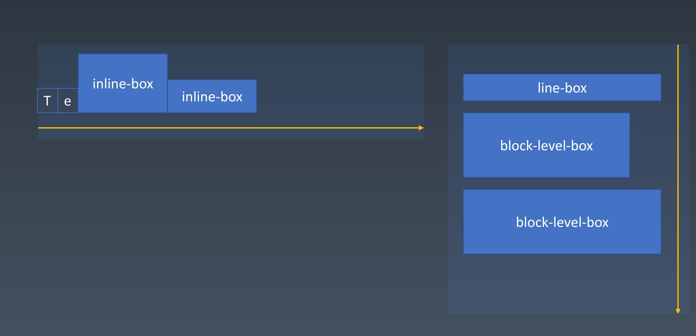

而对比与写字，在正常流的排版中，行中还会有图片、以及display:inline-box的行级盒。

#### 正常流的行级排布

- Baseline

下面的例子是英语书写的四线本，英文单词example的字母下缘紧贴着红色线，就是所谓的基线。而不同的文字基线相对于英文来说会不尽相同，比如中文如果与之混排则会在基线的基础上产生一个偏移。中文叫做方块字，会以文字的上缘和下缘去作为基准线进行对齐。


- Text

一个字的字形是如何定义的如下图所示:

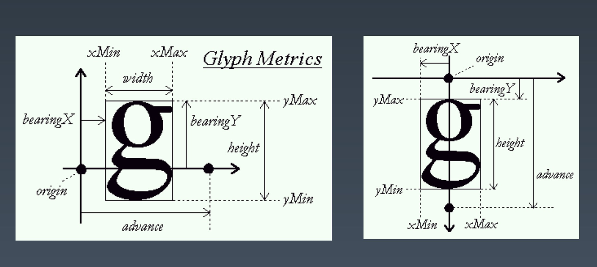

- 行模型

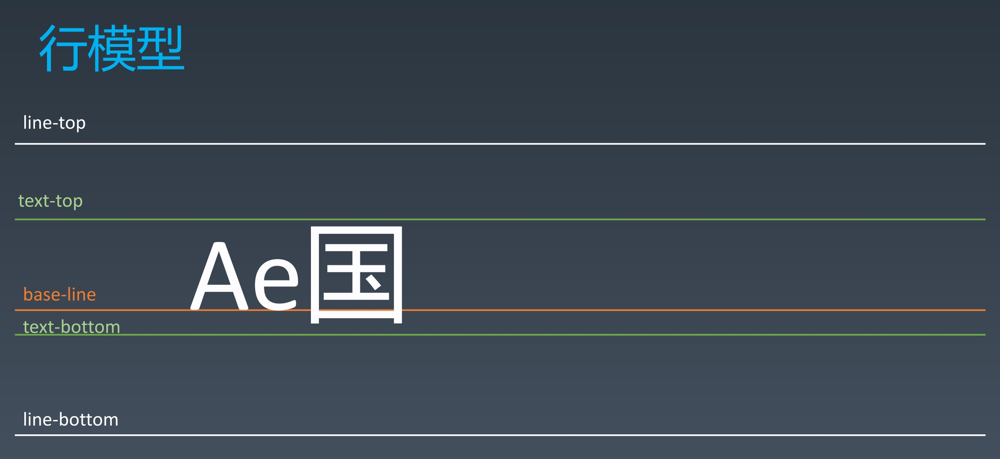

在行模型里这里主要讲5条线，一条是用于对齐的基线base-line。而text-top为字体的顶端，text-bottom为字体的底端，位置只会随字体大小改变，如果是由不同字体混排，那text-top和text-bottom则是有font-size最大的字体决定。

同时当行高大于文字高度时，还会有line-top以及line-bottom两条线。

另外，如果涉及行内盒混排的情况，则会出现下面这种line-top从虚线位置偏移到白线位置的情况：

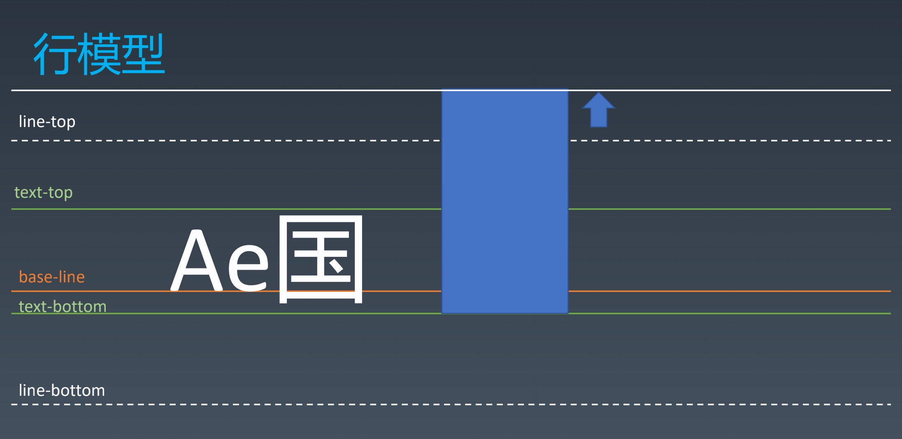

#### 正常流的块级排布

- float

**```float```** CSS属性指定一个元素应沿其容器的左侧或右侧放置，允许文本和内联元素环绕它。该元素从网页的正常流动(文档流)中移除，尽管仍然保持部分的流动性。

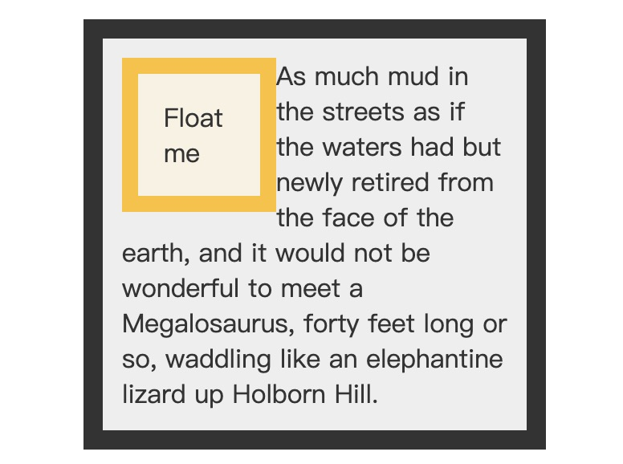

- clear

 **`clear`** CSS属性指定一个元素是否必须移动(清除浮动后)到在它之前的浮动元素下面。`clear` 属性适用于浮动和非浮动元素。

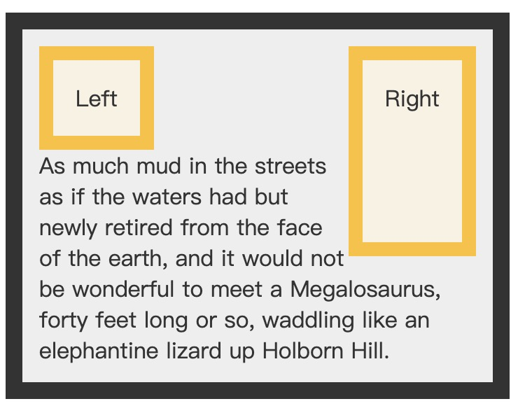

- marigin折叠

  - 这个是属于排版里面的一个要求，因为正常的盒模型生成的时候，margin只是要求周围有这么大尺寸的留白。而不是要求和别的盒的边距也要产生这么大的空白。
  - 只会发生在BFC中

#### BFC合并

所谓BFC叫做块级格式上下文（Block Formatting Context），下面我们在介绍一些概念术语：

- Block

  • Block Container：里面有BFC ：

  ​	• 能容纳正常流的盒，里面就有BFC。

  • Block-level Box：外面有BFC的 。

  • Block Box = Block Container + Block-level Box：

  ​	里外都有BFC的。

- Block Container主要包含以下几种：
  - block
  -  inline-block
  - table-cell
  - flex item
  - grid cell
  - table-caption

- Block-level Box

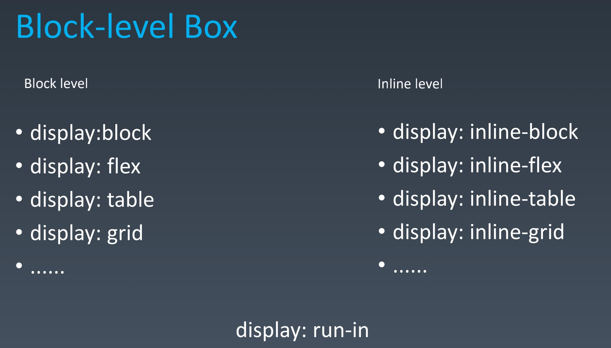

其中比较特殊的则是display:run-in，它的具体属性则与上一个元素有关，可能为Inline level或者是Block level。

- 设立BFC
  -  floats
  -  absolutely positioned elements
  -  block containers (such as inline-blocks, table-cells, and table-captions) that are not block boxes：

     -  flex items
     -  grid cell
     -  ......

  -  and block boxes with 'overflow' other than 'visible'
- BFC合并

  - block box && overflow:visible
  -  BFC合并与float
  -  BFC合并与边距折叠

这里我们来看一段代码示例：

```html
<body style="height: 500px;background-color: greenyellow;">
  <div style="width: 100px;height: 100px;background-color: aqua;margin: 20px;float: right;"></div>
  <div style="background-color: pink;overflow:hidden;margin: 30px;">
    文字 文字 文字 文字 文字
    文字 文字 文字 文字 文字
    文字 文字 文字 文字 文字
    文字 文字 文字 文字 文字
    文字 文字 文字 文字 文字
    文字 文字 文字 文字 文字
    文字 文字 文字 文字 文字
    文字 文字 文字 文字 文字
    文字 文字 文字 文字 文字
    文字 文字 文字 文字 文字............
    </div>
```

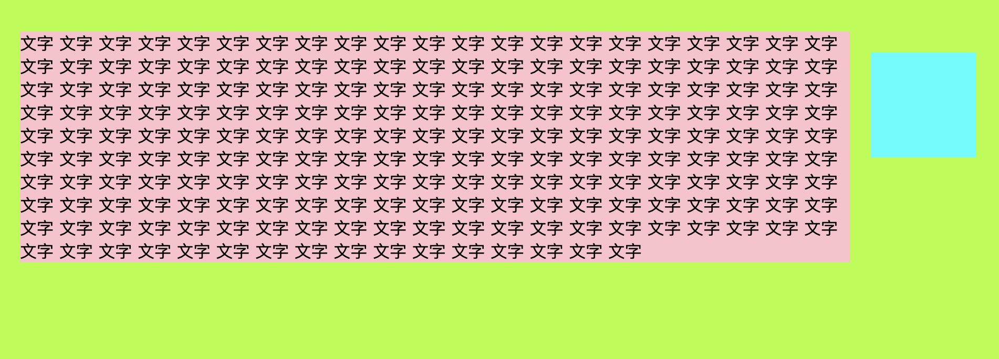

如果我们将overflow:visible变为visible效果则如下：

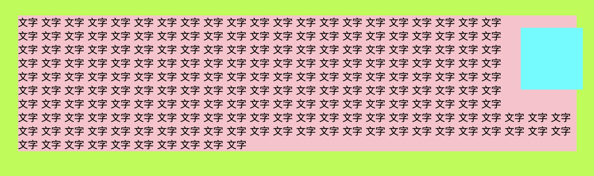

由此可见当block box && overflow:visible的情况出现时，上述例子中颜色为粉色的快级容器就像不存在一样，文字就环绕这外面的这个float为right的元素进行排布。

```html
<body>
  <div style="width: 100px;height: 100px;background-color: aqua;margin: 20px;"></div>
  <div style="background-color: pink;overflow:hidden;margin: 30px 20px;">
    <div style="width: 100px;height: 100px;background-color: aqua;margin: 20px;"></div>
  </div>
</body>
```

上述代码效果如下：

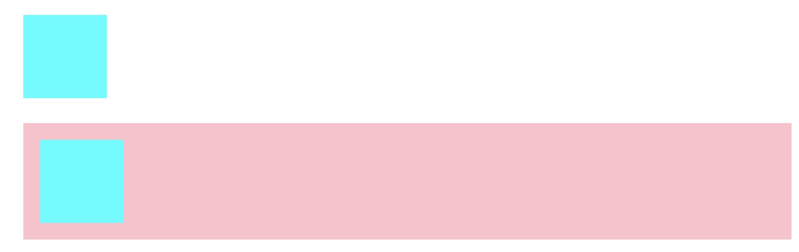

如果我们将overflow:visible变为visible，则会发生三个边距折叠在一起的效果，如下：

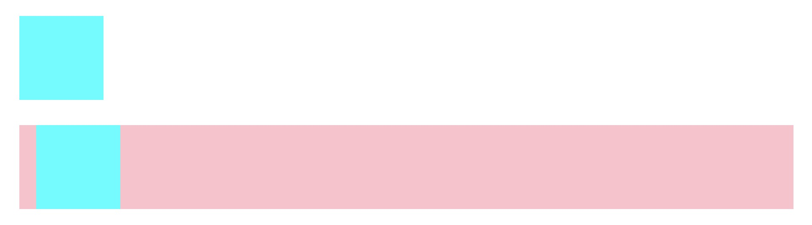

#### flex排版

flex排版更接近人的自然思维。在flex排版中有的时候要纵排，有的时候要横排，会受到flex属性的限制。以至于我们需要在宽高体系上做一次抽象。

当元素表现为 flex 框时，它们沿着两个轴来布局：

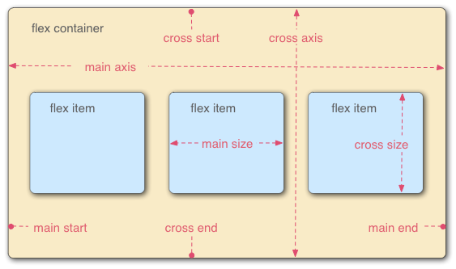

* **主轴（main axis）**是沿着 flex 元素放置的方向延伸的轴（比如页面上的横向的行、纵向的列）。该轴的开始和结束被称为 **main start** 和 **main end**。

- **交叉轴（cross axis）**是垂直于 flex 元素放置方向的轴。该轴的开始和结束被称为 **cross start** 和 **cross end**。
- 设置了 `display: flex` 的父元素，被称之为 **flex 容器（flex container）。**
- 在 flex 容器中表现为柔性的盒子的元素被称之为 **flex 项**（**flex item**）。

##### 做法

- 收集盒进行
- 计算盒在主轴方向的排布
- 计算盒在交叉轴方向的排布

## 动画与绘制

### 前言：Css所谓控制表现在于

- 控制元素的位置
- 控制元素的绘制以及最后显示的渲染显示的效果
- 控制元素的动画以及交互

### 动画

#### Animation

语法：

​	• @keyframes定义

​	• animation: 使用

```css
@keyframes mykf
{
from {background: red;}
to {background: yellow;}
}
div
{
animation:mykf 5s infinite; }
```

-  animation-name 时间曲线
-  animation-duration 动画的时长；
-  animation-timing-function 动画的时间曲线；
-  animation-delay 动画开始前的延迟；
-  animation-iteration-count 动画的播放次数；
- animation-direction 动画的方向。

#### Transition

- transition-property 要变换的属性；
- transition-duration 变换的时长；
-  transition-timing-function 时间曲线；
-  transition-delay 延迟。

```css
div {
  width: 100px;
  height: 100px;
  background: red;
  transition: width 2s;
  transition-timing-function: cubic-bezier(0.1, 0.7, 1.0, 0.1);
}
```

#### cubic-bezier

cubic-bezier() 函数定义了一个贝塞尔曲线(Cubic Bezier)。

贝塞尔曲线曲线由四个点 P0，P1，P2 和 P3 定义。P0 和 P3 是曲线的起点和终点。P0是（0,0）并且表示初始时间和初始状态，P3是（1,1）并且表示最终时间和最终状态。

cubic-bezier() 可用于 **animation-timing-function**和**transition-timing-function**属性。

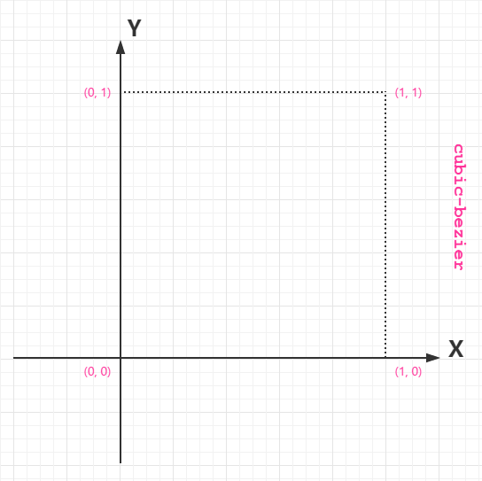


从上图我们需要知道的是 cubic-bezier 的取值范围:

```
P0：默认值 (0, 0)
P1：动态取值 (x1, y1)
P2：动态取值 (x2, y2)
P3：默认值 (1, 1)
```

我们需要关注的是 P1 和 P2 两点的取值，而其中 X 轴的取值范围是 0 到 1，当取值超出范围时 cubic-bezier 将失效；Y 轴的取值没有规定，当然也毋须过大。

最直接的理解是，将以一条直线放在范围只有 1 的坐标轴中，并从中间拿出两个点来拉扯（X 轴的取值区间是 [0, 1]，Y 轴任意），最后形成的曲线就是动画的速度曲线。

### 颜色

#### CMYK与RGB

##### RGB

颜色可以使用红-绿-蓝（red-green-blue (RGB)）模式：

RGB颜色可以通过以`#`为前缀的十六进制字符```#RRGGBB[AA]```，``#RGB[A]``和函数（`rgb()`、`rgba()`）标记表示。

##### CMYK

**印刷四分色模式**（CMYK）是彩色印刷时采用的一种套色模式，利用色料的三原色混色原理，加上黑色油墨，共计四种颜色混合叠加，形成所谓“全彩印刷”。四种标准颜色是：

* C：Cyan ＝ 青色，常被误称为“天蓝色”或“湛蓝”
* M：Magenta ＝ 洋红色，又称为“品红色”
* Y：Yellow ＝ 黄色
* K：blacK ＝ 黑色

##### HSL

颜色也可以使用 `hsl()` 函数符被定义为色相-饱和度-亮度（Hue-saturation-lightness）模式。HSL 相比 RGB 的优点是更加直观：你可以估算你想要的颜色，然后微调。它也更易于创建相称的颜色集合。（通过保持相同的色相并改变亮度/暗度和饱和度）。

##### HSV

HSV即色相、饱和度、明度。

* 色相（H）是色彩的基本属性，就是平常所说的颜色名称，如红色、黄色等。
* 饱和度（S）是指色彩的纯度，越高色彩越纯，低则逐渐变灰，取0-100%的数值。
* 明度（V），亮度（L），取0-100%。

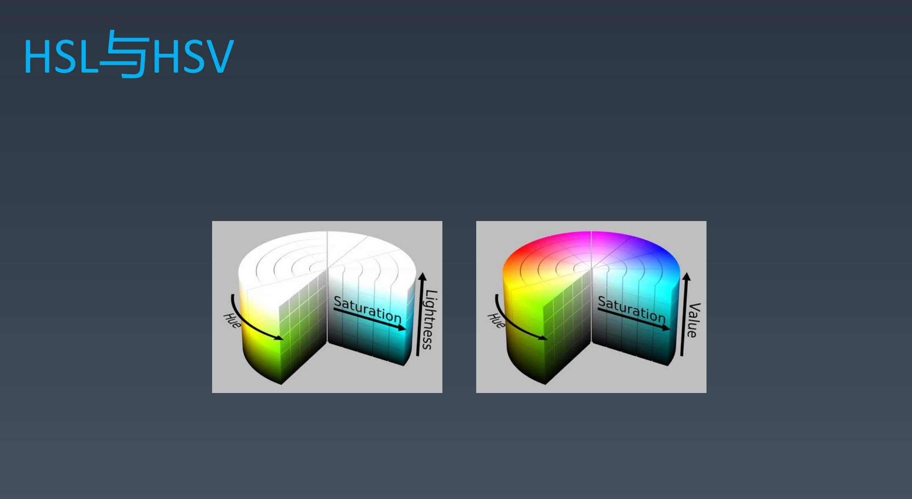

#### 例子一个按钮的颜色

```html
<style>
  .button{
    display: inline-block;
    outline: none;
    text-align: center;
    text-decoration: none;
    cursor: pointer;
    font: 14px/100% Arial, Helvetica, sans-serif;
    padding: .5em 2em .55em;
    text-shadow: 0 1px 1px rgba(0, 0, 0, .3);
    border-radius: .5em;
    color: white;
    border: 1px solid;
  }
</style>
<div class="organe button">123</div>
<script>
  var btn = document.querySelector(".button")
  var h = 25
  setInterval(function () {
    h ++
    h = h % 360
    btn.style.borderColor = `hsl(${h}, 95%, 45%)`
    btn.style.background = `linear-gradient(to bottom, hsl(${h}, 95%, 54.1%), hsl(${h}, 95%, 84.1%))`
  }, 100)
</script>

```

### 绘制

-  几何图形

   - border
   - box-shadow
   - border-radius

-  文字

   - font
   - text-decoration

-  位图

   - background-image

* 小技巧用inline SVG去描绘一些图片

