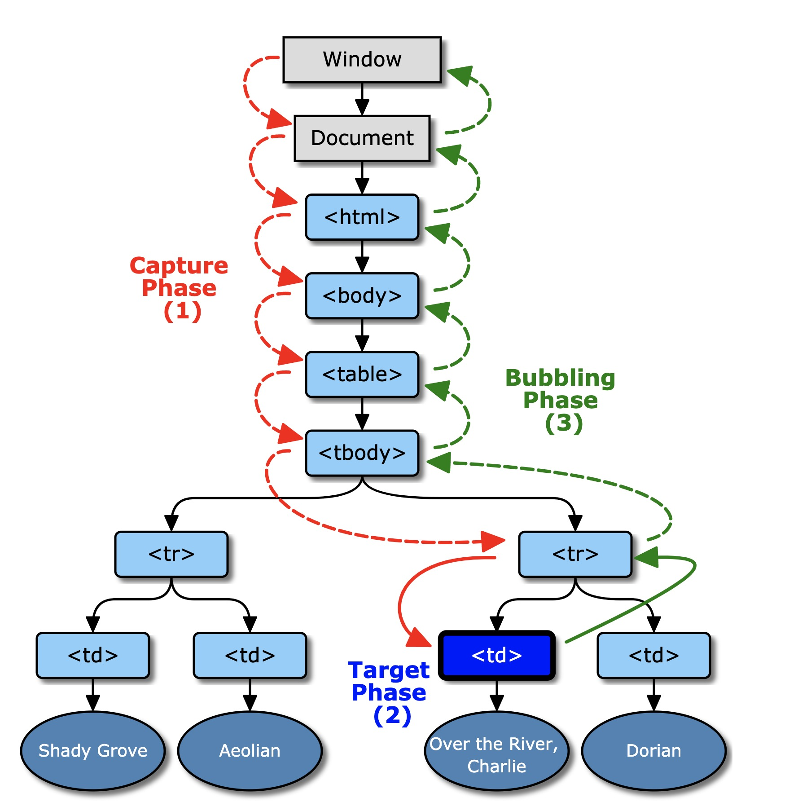

# 重学HTML，浏览器API

## HTML

### HTML的定义：XML与SGML

早期的HTML源于XML与SGML，当发展到HTML5的时代乃至以后，HTML与XML和SGML的关系就有些模糊了，它逐渐变为了接受XML和SGML灵感而生的独立的语言。

#### SGML

SGML，标准通用标记语言（Standard Generalized Markup Language，SGML）是现时常用的超文本格式的最高层次标准，是可以定义标记语言的元语言，甚至可以定义不必采用< >的常规方式。由于它的复杂，因而难以普及。

SGML是上世纪60年代末产生的，最早由IBM使用的一种数据描述语言。

#### XML

可扩展标记语言（英语：Extensible Markup Language，简称：XML）是一种标记语言。

XML是从标准通用标记语言（SGML）中简化修改出来的。它主要用到的有可扩展标记语言、可扩展样式语言（XSL）、XBRL和XPath等。

#### HTML

超文本标记语言（英语：HyperText Markup Language，简称：HTML）是一种用于创建网页的标准标记语言。HTML是一种基础技术，常与CSS、JavaScript一起被众多网站用于设计网页、网页应用程序以及移动应用程序的用户界面。

HTML则使用的是SGML的子集的这样的一种定义方式。有符合SGML的DTD。后期W3C对它做了XML的尝试，所以也有XHTML的版本。后来XHTML2出现，但它严格的要求，使致它不被接受，最终流产。后来随着HTML5的出现，它重新定义了HTML和XML、SGML的关系，最终得到我们今天的HTML。

所以我们先要了解一些HTML的一些较为古典的定义方式:

- SGML中的DTD：http://www.w3.org/TR/xhtml1/DTD/xhtml1-strict.dtd

  * 文档类型定义（DTD，Document Type Definition）是一种特殊文档，它规定、约束符合标准通用标示语言（SGML）或SGML子集可扩展标示语言（XML）规则的定义和陈述。
  * 字符助记符实体：& 符号后面连接一系列字符串最后为;
    * nbsp可以代替空格，但是会存在问题，因为，它定义是叫做no-break space，在它连接之后不会将单词分开，两个词会连成一个词，排版的时候会出现分词的问题。
    * quot: 双引号、amp：&符、lt：小于号、gt：大于号

- 与XML namespace ：http://www.w3.org/1999/xhtml

  - XML 命名空间提供避免元素命名冲突的方法。

  - HTML有HTMLnamespace，还有MathML以及SVG

    

### HTML标签语义

语义化wiki页面

|        标签        |                             说明                             |
| :----------------: | :----------------------------------------------------------: |
|       aside        |                      导航性质的工具内容                      |
|      article       |                         文章主体部分                         |
|   hgroup, h1, h2   |                  标题组、一级标题、二级标题                  |
|        abbr        |            缩写（如WWW，为World Wide Web的缩写）             |
|         hr         |           横向分隔线，故事走向的转变或者话题的转变           |
|         p          |                             段落                             |
|       strong       |                           重要词句                           |
| figure, figcaption | figure表示与主文章相关的图像、照片等流内容，figcaption 表示内容的标题 |
|        dfn         |                     用来包裹被定义的名词                     |
|    nav, ol, ul     |   nav表示目录链接到文章的各个章节，ol有序列表、ul无序列表    |
|        pre         |      表示这部分内容是预先排版过的，不需要浏览器进行排版      |
|        samp        |               表示这是一段计算机程序的示例输出               |
|        code        |                           表示代码                           |
|        main        |      整个页面只出现一个，页面主页内容，可作为特殊的div       |

- strong 和 em 的区别

  - strong表示的是词在整个文章中的重要性，而strong表示的不是语义层面的突出，只单单是表示词很重要。
  - em表示这个词在句子中的重音是什么，表示语气的突出，来区分意思。em是一种突出的语气表示。

    * ``我吃了<em>一个</em>苹果``

    - ```我吃了一个<em>苹果</em>```


### HTML语法

这里借着对前面的内容做一个总结，来讲一下HTML语法:

- 合法元素

  - 标签元素 Element: <tagname>...</tagname> 
  - 文本元素 Text: text
  - 注释元素 Comment: <!-- comments -->  
  - DocumentType: <!Doctype html>
  -  ProcessingInstruction: <?a 1?>

  	- 理论上为预处理语法，问号后的内容留给一些预处理程序使用，但效果不成功。
  -  CDATA:<![CDATA[ ]]>

  	- 是文本的另一种语法的表达，产生的也是文本节点，CDATA中的文本节点不需要考虑转义的问题。

- 字符引用(DTD)

	- ```&#161;```
	- ```&amp;```
	- ``` &lt;```
	-  ``` &quot;```

- 属性语法

## 浏览器API

### DOM API

#### DOM节点家族

HTML 中三个常用的 namespace,HTML、SVG、MathML，常用的namespace都会产生一个Element的这样的一个子类。

其中HTMLElement中的标签类中有一个标签类的命名为例外（HTML+标签名+Element），就是```<a>```标签，标签类名为HTMLAnchorElement


##### 节点操作

- **导航类操作**
- 节点的导航，在DOM树上严格来说所有的节点都叫Node（包含文本节点、空格、tab、回车），所以DOM树上一类通用的导航操作如下所示：
	
	- parentNode：父节点
		- childNodes：所有子节点
		- firstChild：第一个子节点
		- lastChild：最后一个子节点
		- nextSibling：下一个邻居，一般为空白
		- previousSibling：上一个邻居，一般为空白
	
- 元素的导航，过滤掉文本节点，只找元素的一类导航类的操作：
	
	- parentElement：父元素，与parentNode一致
		- children：子元素
		- firstElementChild：第一个子元素
		- lastElementChild：最后一个子元素
		- nextElementSibling：下一个子元素
		-  previousElementSibling：上一个子元素
	
- **修改操作**
-  appendChild
	- insertBefore
	- removeChild
	- replaceChild
	
- **高级操作**
- compareDocumentPosition 是一个用于比较两个节点中关系的函数。
	- contains 检查一个节点是否包含另一个节点的函数
	- isEqualNode 检查两个节点是否完全相同。
	- isSameNode 检查两个节点是否是同一个节点，实际上在JavaScript 中可以用“===”。
	- cloneNode 复制一个节点，如果传入参数 true，则会连同子元素做深拷贝。

### 事件 API

想要理解事件，必须要要理解事件的对象模型。

#### addEvenetListener

EventTarget.addEventListener() 方法将指定的监听器注册到 EventTarget 上，当该对象触发指定的事件时，指定的回调函数就会被执行。 事件目标可以是一个文档上的元素 Element,Document和Window或者任何其他支持事件的对象 (比如 XMLHttpRequest)。

##### 语法

```js
target.addEventListener(type, listener, options);
target.addEventListener(type, listener, useCapture);
target.addEventListener(type, listener, useCapture, wantsUntrusted  ); 
```

**Event:冒泡与捕获**

* 捕获
  * 鼠标在某个元素上触发了某个事件，浏览器会通过一个从外到内的计算过程去找到事件到底是作用在哪个元素身上，这个过程称为捕获。
  * useCapture：为true视为捕获触发。

- 冒泡

  - 则是我们已经算出来事件作用在哪个元素身上，而接着由内到外层层地向外触发，让元素去响。应这个事件的过程，就是冒泡。
- 不添加第三个参数默认为冒泡行为。



### Range API

DOM API提供的节点方面的API可以让我们操作很多节点，而当我们需要操作半个节点、或者批量操作节点的时候，我们就需要用到 Range API了。相对了节点类的API，Range API在功能上会更加的强大且细致，但在使用和理解上却也并不简单。

#### [Range](https://developer.mozilla.org/zh-CN/docs/Web/API/Range) 

[Range](https://developer.mozilla.org/zh-CN/docs/Web/API/Range) 接口表示一个包含节点与文本节点的一部分的文档片段。Range API 是对DOM树操作的一个万能的API。

- Range的意思同其英文语义上的意思一致，表示一定的范围。它代表的是一个HTML文档流中有起点和终点的一段范围。Range是连续的范围，一个Range中间是不能跳跃和间断的。
- Range有一个起点和终点，在DOM树中，只要起点的位置先于终点的位置就可以了，无关DOM树中的节点层级关系。
- 起点都是由一个element和一个偏移值决定的。对于element节点来说偏移值就是children，对于文字节点来说偏移值就是文字的个数。
- Range它不一定是一个完整意义上的节点，它可以包含半个节点。

#### Range的使用

- **创建Range**

  -  var range = new Range()
  -  range.setStart(element, 9) 
  - range.setEnd(element, 4)

- **从Selection来创建Range**

  -  var range = document.getSelection().getRangeAt(0);
  - Selection代表鼠标选中的屏幕区域范围

- **Range API的便捷操作**

  因为书写HTML中会带有空格、换行和缩进这类的节点，会导致对于Range创建的偏移范围设置不精确，于是使用下面的range操作的API会使得操作更便捷。

  -  range.setStartBefore
  -  range.setEndBefore
  -  range.setStartAfter
  -  range.setEndAfter
  -  range.selectNode
  -  range.selectNodeContents

- **创建range以后能做什么**

  - 取出range中的内容

    > var fragment = range.extractContents()

    - 这个方法获得的是一个**fragment**对象，为node的子类，**fragment**可以去容纳一些元素。**fragment**对象在执行被append操作的时候，自己并不会被append在DOM树中，而是将其包含的所有子元素append的上去。
    - 在React和Vue3.0中加入了fragment对象，底层也是用fragment对象实现的。

  - 在range中插入新的内容

    > range.insertNode(document.createTextNode("aaaa"))

#### 实例

为了充分的理解Range API 以及了解它的使用功能，以及相对于传统方式操作DOM的优势,我们可以通过下面的一个问题了解:

> 把一个元素所有的子元素逆序

- **考点**

	- 是否了解DOM的colletion是一个living colletion，即操作取出的chirldNodes，取出来的集合值会跟着操作而变化。
	- 是否知道元素的子元素在inser的时候不需要将它从原来的位置挪掉的。
	- 使用Range API进行高效的DOM操作

- **代码实现**

	- 基本代码。问题：4次插入，效率低下、代码冗余、时间复杂度为是O(n)
	
	```html
	<body>
	  <div id="a">
	    <div>1</div>
	    <div>2</div>
	    <div>3</div>
	    <div>4</div>
	  </div>
	  <script>
	    let element = document.getElementById('a')
	    function reverseChildren (element) {
	      let children = Array.prototype.slice.call(element.childNodes)
	      for (const child of children) {
	        element.removeChild(child)
	      }
	      children.reverse()
	      for (const child of children) {
	        element.appendChild(child)
	      }
	    }
	    reverseChildren(element)
	  </script>
	</body>
	```
	
	
	
	- 升级代码。问题至少三次插入，产生重排，性能影响很大。
	
	```html
	<body>
	  <div id="a">
	    <span>1</span>
	    <p>2</p>
	    <a>3</a>
	    <div>4</div>
	  </div>
	  <script>
	    let element = document.getElementById('a')
	    function reverseChildren (element) {
	      let l = element.childNodes.length
	      while(l -- > 0) {
	        element.appendChild(element.childNodes[l])
	      }
	    }
	    reverseChildren(element)
	  </script>
	</body>
	```
	
	
	
	- range实现。两次操作，最多发生两次重排。
	
	```html
	<body>
	  <div id="a">
	    <span>1</span>
	    <p>2</p>
	    <a>3</a>
	    <div>4</div>
	  </div>
	  <script>
	    let element = document.getElementById('a')
	    function reverseChildren (element) {
	      let range = new Range()
	      range.selectNodeContents(element)
	
	      let fragment = range.extractContents()
	      var l = fragment.childNodes.length
	      while(l -- > 0) {
	        fragment.appendChild(fragment.childNodes[l])
	      }
	      element.appendChild(fragment)
	    }
	    reverseChildren(element)
	  </script>
	</body>
	```

### CSSOM

浏览器API 不等于DOMAPI，DOM API 是HTML语言的一个对象化。比如HTML有哪些标签，DOM API中就对应着哪些class。DOM是对于HTML所描述的一个文档的抽象。而对CSS文档的抽象，就是CSSOM。

由于CSS代码是嵌入在HTML代码中的，CSSOM的访问需要从DOM API去切入，CSS 一切的API需要通过document.stylesheets去访问。

##### document.stylesheets

[CSSStyleSheet](https://developer.mozilla.org/zh-CN/docs/Web/API/CSSStyleSheet) 接口代表一个 CSS 样式表，并允许检查和编辑样式表中的规则列表。它从父类型 StyleSheet 继承属性和方法。一个样式表最多与一个Document链接，即所应用的那个Document（除非disabled）。一个特定文档的 CSSStyleSheet 对象列表可用 [document.styleSheets](https://developer.mozilla.org/zh-CN/docs/Web/API/Document/styleSheets) 属性获取。它是一个 [`StyleSheet`](https://developer.mozilla.org/zh-CN/docs/Web/API/StyleSheet) 对象的有序集合。

- Rules

	- document.styleSheets[0].cssRules
	- document.styleSheets[0].insertRule("p { color:pink; }", 0)
	- document.styleSheets[0].removeRule(0)

- [Rule](https://drafts.csswg.org/cssom/#css-rule)
- CSSStyleRule
	
	- selectorText String
		- style K-V结构
	
- CSSCharsetRule
	- CSSImportRule
	- CSSMediaRule
	- CSSFontFaceRule
	- CSSPageRule
	- CSSNamespaceRule
	- CSSKeyframesRule
	- CSSKeyframeRule
	- CSSSupportsRule
	- ......

通过修改CSSOM，实现元素样式更改的批量操作，以及伪元素样式修改，也可以借助CSSOM完成。

##### getComputedStyle

- window.getComputedStyle(elt, pseudoElt);

	-  elt 想要获取的元素
- pseudoElt 可选，伪元素
- getComputedStyle是一个非常有用的属性，它能获取到页面上元素最终真实渲染时候，所需要的CSS属性。同时可以访问到伪元素上。
- 可以getComputedStyle获取一些元素像是transform，拖拽的属性。
- 同时像是动画播放的中间态，比如需要在某些时候暂停某个动画，此时我们无法通过DOM API和CSS属性、CSSRules去判断它播到哪了，这时我们就可以使用getComputedStyle来处理。

### CSSOM View

CSSOM View API与浏览渲染与排版之后的视图相关。

##### window

- 在浏览器顶层的窗口之上会有一些很重要的属性

	- window.innerHeight,

		- 浏览器窗口的视口（viewport）高度（以像素为单位）；如果有水平滚动条，也包括滚动条高度。

	-  window.innerWidth

		- 只读的 Window 属性 innerWidth 返回以像素为单位的窗口的内部宽度。如果垂直滚动条存在，则这个属性将包括它的宽度。

	- window.outerWidth, window.outerHeight
	- window.devicePixelRatio

		- 屏幕的物理像素与代码中的px逻辑像素之间的比值，正常设备是1：1，Retina屏上的像素是1：2，有些安卓机是1：3
		- DPR对我们去实现代码的布局是非常相关的。

	- window.screen

		- window.screen.width
		-  window.screen.height
		-  window.screen.availWidth
		-  window.screen.availHeight

- Window API

	- 当我们去打开一个新的浏览器窗口的时候可以使用以下API

		- window.open("about:blank", "_blank" ,"width=100,height=100,left=100,right=100" )
		- moveTo(x, y)
		-  moveBy(x, y)
		-  resizeTo(x, y)
		-  resizeBy(x, y)

##### scroll：滚动相关API，抽象了overflow是srcoll这样的元素和顶层的window，只有在由滚动条的时候这些API才会生效

- scrollTop
- scrollLeft
-  scrollWidth
-  scrollHeight
-  scroll(x, y)
-  scrollBy(x, y)
-  scrollIntoView()
-  window

  -  scrollX 
  -  scrollY
  -   scroll(x, y)
  -  scrollBy(x, y)

##### layout : 获取浏览器layout之后的结果的API

- [getClientRects()](https://developer.mozilla.org/zh-CN/docs/Web/API/Element/getClientRects)：方法返回一个指向客户端中每一个盒子的边界矩形的矩形集合。
- [getBoundingClientRect()](https://developer.mozilla.org/zh-CN/docs/Web/API/Element/getBoundingClientRect)：方法返回元素的大小及其相对于视口的位置。

```html
<style>
  .x::before {
    content: '额外 额外 额外 额外 额外';
    background-color: pink;
  }
</style>
<div style="width: 100px;height: 400px;overflow: scroll;">
  文字<span class="x" style="background-color: lightblue;">
  文字 文字 文字 文字 文字 文字 文字
  </span>

</div>
<script>
  var x = document.getElementsByClassName('x')[0]
  
</script>

```

效果：


### 标准化组织

-  khronos

	- 科纳斯组织（Khronos Group）是一个由成员资助的，专注于制定开放标准（Open standard）的行业协会，重点制定免费的API，使在各种平台和设备上创作或播放的多媒体可以得到硬件加速。
	- WebGL

		- 任意平台上浏览器中的JavaScript绑定到OpenGL ES，支持OpenGL或OpenGL ES图形标准。

	- OpenCL

		- 跨平台计算机图形API。

- ECMA

	- 是一家国际性会员制度的信息和电信标准组织。
	- ECMAScript

- WHATWG

	- 网页超文本应用技术工作小组。是一个以推动网络HTML标准为目的而成立的组织。在2004年，由Apple公司、Mozilla基金会和Opera软件公司所组成。
	-  HTML

- W3C

	-  webaudio
	-  CG/WG