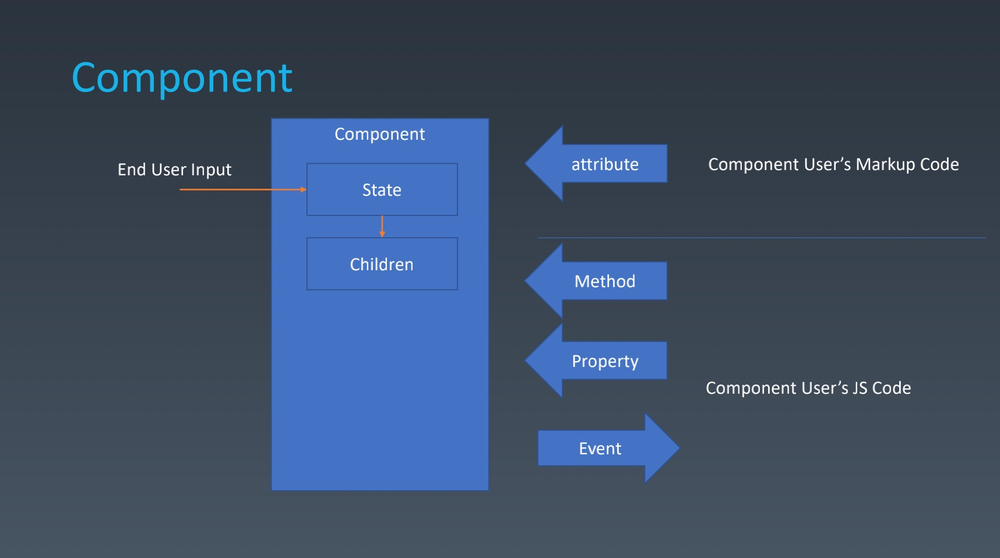
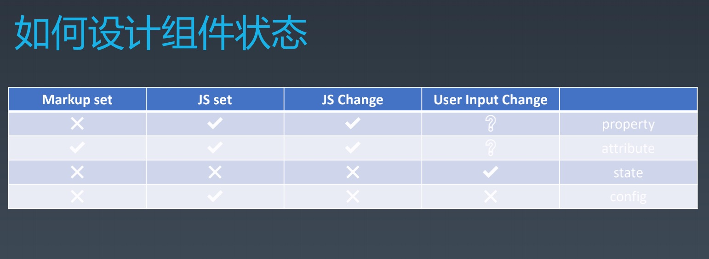
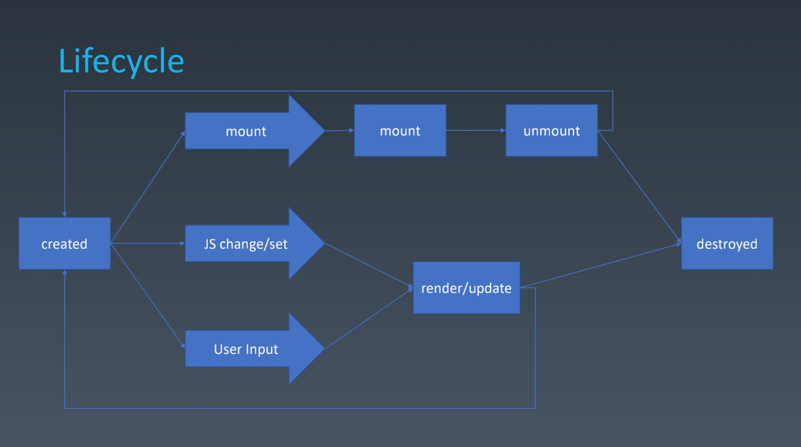

# 组件化（一）

## 1. 组件化的概念与基本组成

### 什么是组件？

组件一般来说组件是和**UI强相关**的东西，某种意义上可以认为它是一种**特殊模块**或一种**特殊对象**。它在组合架构上呈现一种**树形结构**。并且组件有一定的**模板化的配置**能力。

了解组件之前我们可以先了解一下与之有类似之处的对象，对象包含以下三种要素：

* **属性** properties
  * **属性**是描述对象事物共同的性质和特点，例如：一个对象的颜色和形式，人的能力，身份，以及社会的基础关系等等。
* **方法** methods
  * 指的是[类别](https://zh.wikipedia.org/wiki/类_(计算机科学))（所谓的**类方法**、**静态方法**或**工厂方法**）、或者是[对象](https://zh.wikipedia.org/wiki/物件_(電腦科學))（所谓的**实例方法**）两者其中之一的一种[子程序](https://zh.wikipedia.org/wiki/子程式)。方法的目的是提供一个机制，以访问（对于读和写）对象或类别的私有属性。
* **继承关系** Inherit
  * 继承可以使得子类具有父类的属性和方法或者重新定义、追加属性和方法等。

对于组件来说，一般由以下几个要素组成：

* **属性** Properties
* **方法** Methods
* **继承关系** Inherit
* **特性** Attribute
  * 组件的 Attribute和Properties其实都可以翻译成属性，下面会详细的展开介绍两者之间的不同之处。
* **配置&状态 **Config & State
  * Config是对组件的配置，如：对象构造函数中传递的参数;
  * State是随着组件的使用用户调用以及一些方法的响应，而产生的组件状态的改变
* **事件** Event
  * 组件往组件外部传递信息的媒介。
* **生命周期** Lifecycle
* **后代** Children
  * Children是树形结构的必要性，没有Children组件无法形成树形结构，描述界面的能力就相对较弱。
  * 比如：一些基于拖拽的系统，可以在界面上将组件一个一个拖过去，但互相之间没有形成树形结构，对于简单应用来说是可以满足需求的，但复杂应用来说，对界面语义要求高，同时又涉及自动排版，以至于拖拽形式不能满足复杂应用的需求。

对象与组件的区别在于，组件在对象的基础上增加了上述许多与语义相关的要素，使得组件更加适合描述UI。

关于理解组件的这些要素，我们可以看下图所示：



组件的使用者一般有三种身份，最终在组件注入的系统中操作组件的使用用户、将组件编排入自己系统的使用组件的程序员、以及组件的设计、编写者。

从上图我们可以得知：

* 使用用户在界面上进行了一系列的输入操作，信息传递给了组件，进而改变了组件**状态State**
* 于此同时,当组件的State发生改变的时候,可能会进而影响组件**子组件Children**
* 而程序员可以通过Attribute去更改组件的一些特性。同时也可以通过Property去改变组件的属性。Attribute与Property主要的区别在于，Attribute主要用makeup language(声明性语言)。Attribute与Property 是否一致取决于组件体系的设计者
* 而Methods 和Property 差不多，但Methods所描述的过程相对较为复杂。Methods和Property是使用组件的程序员向开发组件的程序员传递消息。
* 而**事件Evnet**是由开发组件的程序员向使用组件的程序员传递消息。

这张图组件的各个要素的作用，以及在组件系统中信息流转的方向。

## 2. 组件的组成元素详解

上面我们对组件已经有了一个初步基本的认识，下面我们将详细的说明一些组件要素的概念：

#### Attribute与Property

Attribute强调的是描述性。可能是事物本身的特性。如黄色的头发

Property强调的是从属关系。比如有一个对象有一个Property是一个对象，则它们之间是有从属关系的。

Attribute与Property在HTML中的示例：

```
Attribute:

<my-component attribute=“v” />
myComponent.getAttribute(“a”)
myComponent.setAttribute(“a”,“value”);

Property:

myComponent.a = “value”;

------------------------------------------

<div class="cls1 cls2"></div>
<script>
var div = document.getElementByTagName(‘div’);
div.className // cls1 cls2 
</script>
------------------------------------------

<div class="cls1 cls2" style="color:blue" ></div>
<script>
var div = document.getElementByTagName('div');
div.style // 对象
</script>

------------------------------------------

<a href="//m.taobao.com" ></div>
<script>
var a = document.getElementByTagName('a’); 
a.href // “http://m.taobao.com”，这个 URL 是 resolve 过的结果
a.getAttribute(‘href’) // “//m.taobao.com”，跟 HTML 代码中完全一致
</script>

------------------------------------------

<input value = "cute" />
<script>
var input = document.getElementByTagName(‘input’); // 若 property 没有设置，则结果是 attribute 
input.value // cute 
input.getAttribute(‘value’); // cute 
input.value = ‘hello’; // 若 value 属性已经设置，则 attribute 不变，property 变化，元素上实际的效果是 property 优先
input.value // hello 
input.getAttribute(‘value’); // cute 
</script>

```

#### 如何设计组件状态？



四个场景：

* Markup set —— 标签声明设置
* JS set —— JavaScript 设置
* JS Change —— JavaScript 改变
* User Input Change —— 终端用户去改变

四个要素：

* Property： 不可被标签声明设置，可以被JS代码设置和改变，一般来说用户输入是不会改变Property的，但具体还是要看业务逻辑是否需要让用户输入改变Property。
* Attribute：可以被标签声明设置，可以被JS代码设置和改变，跟Property类似，一般来说用户输入是不会改变Attribute。
* State：只能从组件的内部去改变，不能从外部获得改变，一般来说设计创造组件的开发者是不会提供给使用组件的开发者接口去改变组件State的，因为在设计程序员无法知道State何时被改变的情况下，State无法保持一致性和可控性。但用户输入是可以改变组件的State的。比如：用户点击tab组件，那个tab被激活了，这是需要通过State去控制的。
* Config：是一个一次性构造的结构，只有在组件构造的时候会触发，它是一次性被传入是不可更改的。也因为Config的不可更改性，我们通常会把Config留给全局。一般情况下一个页面的每个组件都会特定一份的Config。

#### 生命周期

任何组件的生命周期都是从Created开始，然后从destroyed结束。这点延伸出万事万物是一致都有的。那在这两者之间，对于组件来说还会有什么阶段呢？



* 挂载/卸载
  * mount：代表的是组件创建了之后，有没有被实际构造并显示出来。
  * mount和unmount是可以循环重复发生的，以至于unmount之后可以重回Created的一个状态。
* 更新
  * 组件的使用程序员，可以改变组件属性，接而触发更新渲染update。
  * 组件的使用用户，可以改变组件状态，接而触发更新渲染update。

上述所有就组成了一个组件基本完整生命周期，而我们平时所看到的什么willmount、didmount...诸如此类，其实都是组件基本完整生命周期中更细节的位置。组件基本完整的生命周期是从本质从面最贴近人类思维抽象的描述。

#### Chirldren

Chirldren是构建组件树中最重要的组件特性。Chirldren的分为两种一种是Content型，一种是Template 型。

* Content 型: 有几个Chirldren最终就显示几个。这种情况下的组件树是比较简单的。
* Template 型：Chirldren代表的是模板的作用。例如：list组件的渲染。

## 3. 实例：轮播组件

### 3.1 JSX环境构建

轮播组件的构建，我们要构建一个JSX的环境。步骤如下：

1. npm -init
2. 安装 webpack、webpack-cli
3. 安装@babel/core、@babel/preset-env、babel-loader、@babel/plugin-transform-react-jsx

如下配置webpack.config.js

```js
module.exports = {
  entry: './main.js',
  module: {
    rules: [
      {
        test: /\.js$/,
        use: {
          loader: 'babel-loader',
          options: {
            presets: ['@babel/preset-env'],
            plugins: [
              ['@babel/plugin-transform-react-jsx', {
                pragma: 'createElement'
              }]
            ]
          }
        }
      }
    ]
  },
  mode: 'development'
}
```

我们修改插件```@babel/plugin-transform-react-jsx```的第二个参数为createElement，插件会去文件中找createElement这个函数，并会将js代码中的标签文法给解析为参数传入该函数,由此可见createElement的函数应该具有以下功能：

* 创建HTML普通标签，为其添加属性和后代节点
* 创建HTML文本节点
* 创建自定义模板类，为其添加属性和后代节点

整理后代码如下：

```js
export function createElement (type, attribute, ...children) {
  let el
  if (typeof type === 'string')
    el = new ElementWrapper(type)
  else
    el = new type
  for (const attr in attribute) {
    el.setAttribute(attr, attribute[attr])
  }
  for (const child of children) {
    if (typeof child === 'string') {
      child = new TextWrapper(child)
    }
    el.appendChild(child)
  }
  return el
}
export class Component {
  constructor () {
  }
  setAttribute (name, val) {
    this.root.setAttribute(name, val)
  }
  appendChild (child) {
    child.mountTo(this.root)
  }
  mountTo (parent) {
    parent.appendChild(this.root)
  }
}
class TextWrapper extends Component{
  constructor (text) {
    super()
    this.root = document.createTextNode(text)
  }
}
class ElementWrapper extends Component {
  constructor (type) {
    super()
    this.root = document.createElement(type)
  }
}

```

### 3.3 轮播插件

这里我们构建一个继承Component的Carousel的类。

```js
// main.js
let carImgs = [...]
let a = <Carousel src={carImgs}/>
a.mountTo(document.body)

class Carousel extends Component {
  constructor () {
    super()
    this.attribute = Object.create(null)
  }
  render () {
    this.root = document.createElement('div')
    this.root.classList.add('carousel')
    for (const src of this.attribute.src) {
      let img = document.createElement('div')
      img.style.backgroundImage = `url(${src})`
      this.root.appendChild(img)
    }
    return this.root
  }
  setAttribute (name, val) {
    this.attribute[name] = val
  }
  mountTo (parent) {
    parent.appendChild(this.render())
  }
}
```

ps: HTML中样式如下：

```css
	.carousel {
    width: 500px;
    height: 280px;
    overflow: hidden;
    white-space: nowrap;
  }
  .carousel>div{
    width: 500px;
    /* 500 / 1142 * 640 = 280 */
    height: 280px;
    background-size: contain;
    background-repeat: no-repeat;
    display: inline-block;
    transition: ease 0.5s;
  }
```

### 3.3 轮播插件——自动轮播功能

要实现自动轮播我们首先可以先为每一张图片添加一个，transform的横向变换。

```js
  render () {
    this.root = document.createElement('div')
    this.root.classList.add('carousel')
    for (const src of this.attribute.src) {
      let img = document.createElement('div')
      img.style.backgroundImage = `url(${src})`
      this.root.appendChild(img)
    }
    let current = 0
    setInterval(() => {
      let children = this.root.children
      ++current
      current = current % children.length
      for (const child of children) {
        child.style.transform = `translateX(-${current * 100}%)`
      }
    }, 3000)
    return this.root
  }
```

但上述效果实现功能不完善，无法实现循环播放。于是我们做了以下改进：

```js
  render () {
    this.root = document.createElement('div')
    this.root.classList.add('carousel')
    for (const src of this.attribute.src) {
      let img = document.createElement('div')
      img.style.backgroundImage = `url(${src})`
      this.root.appendChild(img)
    }
    let currentIndex = 0
    setInterval(() => {
      let children = this.root.children
      let nextIndex = (currentIndex + 1) % children.length
      let current = children[currentIndex]
      let next = children[nextIndex]

      // 是当前显示的下一张图片移动到当前位置下一个位置（即比当前图片横向多偏移1个100%x长度的位置）
      next.style.transition = 'none'
      next.style.transform = `translateX(${ - nextIndex * 100 + 100 }%)`
      // 下一帧时执行移动，即滚动变换的过程（16毫秒为浏览器的一帧）
      setTimeout(() => {
        next.style.transition = ''
        // 当前图片向左移动比当前偏移多1个图片100%x长度的偏移量
        current.style.transform = `translateX(${ - 100 - currentIndex * 100}%)`
        // 下一张图片偏移到当前图片位置
        next.style.transform = `translateX(${ - nextIndex * 100}%)`
        // 当前索引为下一张索引
        currentIndex = nextIndex
      }, 16)
    }, 3000)
    return this.root
  }
```

### 3.4 轮播插件——手动轮播功能

实现手动播放要在三个鼠标事件中进行, 事件架构如下：

```js
render () {
   // ...部分代码省略
  
  this.root.addEventLisener('mousedown',(e) => {
    let startX = e.clientX, startY = e.clientY
    let move = e => {
      let x = e.clientX - startX
      let y = e.clientY - startY
    }
    let up = e => {
      let x = e.clientX - startX
      let y = e.clientY - startY
      document.removeEventListener('mousemove', move)
      document.removeEventListener('mouseup', up)
    }
    document.addEventListener('mousemove', move)
    document.addEventListener('mouseup', up)
  })
  
  return this.root
}
```

这里参考第一种自动播放的方式，在move和up中给每一张图片添加，transform的横向变换。

```js
// 部分代码省略
		/**鼠标操作手动轮播*/
    let position = 0// 记录当前滚动的索引
    this.root.addEventListener('mousedown', (e) => {
      // console.log('mousedown')
      let children = this.root.children
      let startX = e.clientX
      let move = e => {
        let x = e.clientX - startX
        for (const child of children) {
          child.style.transition = 'none'
          child.style.transform = `translateX(${ - position * 500 + x}px)`
        }
        // console.log('mousemove')
      }
      let up = e => {
        let x = e.clientX - startX
        position = position - Math.round(x / 500) // 移动量大于250为则变换下一张/上一张
        for (const child of children) {
          child.style.transition = ''
          child.style.transform = `translateX(${ - position * 500 }px)`
        }
        document.removeEventListener('mousemove', move)
        document.removeEventListener('mouseup', up)
      }
      document.addEventListener('mousemove',move)
      document.addEventListener('mouseup', up)
    })
```

上述代码同样也有无法循环的问题。改进如下：

```js

    /**鼠标操作手动轮播*/
    let position = 0
    this.root.addEventListener('mousedown', (e) => {
      // console.log('mousedown')
      let children = this.root.children
      let startX = e.clientX
      let move = e => {
        let x = e.clientX - startX
        let current = position - ((x - x % 500) / 500) // 整数效果，保留x符号，且绝对值较小的一边
        // move的过程中将 当前图片和它的左右两张移动到正确的位置
        for (const offset of [-1, 0, 1]) {
          let pos = current + offset
          // 图片索引，保证为正数，如：-1 % 4= -1，（-1 + 4）% 4 = 3
          pos = (pos + children.length) % children.length // 图片索引
          children[pos].style.transition = 'none'
          // - pos * 500 + offset * 500 + x % 500 ：自己的位置长度 + 偏移位置长度 + 不够图片长度的距离
          children[pos].style.transform = `translateX(${ - pos * 500 + offset * 500 + x % 500 }px)`
        }
        // console.log('mousemove')
      }
      let up = e => {
        let x = e.clientX - startX
        position = position - Math.round(x / 500)
        // up的时候，则根据最终移动的x长度，计算移动图片（当前显示、下一张显示图片）即将移动的偏移度（左/右）
        for (const offset of [0, -Math.sign(Math.round(x / 500) - x + 250 * Math.sign(x))]) {
          let pos = position + offset
          // 图片索引，保证为正数，如：-1 % 4= -1，（-1 + 4）% 4 = 3
          pos = (pos + children.length) % children.length 
          children[pos].style.transition = ''
          // - pos * 500 + offset * 500 + x % 500 ：自己的位置长度 + 偏移位置长度
          children[pos].style.transform = `translateX(${ - pos * 500 + offset * 500 }px)`
        }
        document.removeEventListener('mousemove', move)
        document.removeEventListener('mouseup', up)
      }
      document.addEventListener('mousemove',move)
      document.addEventListener('mouseup', up)
    })
```


