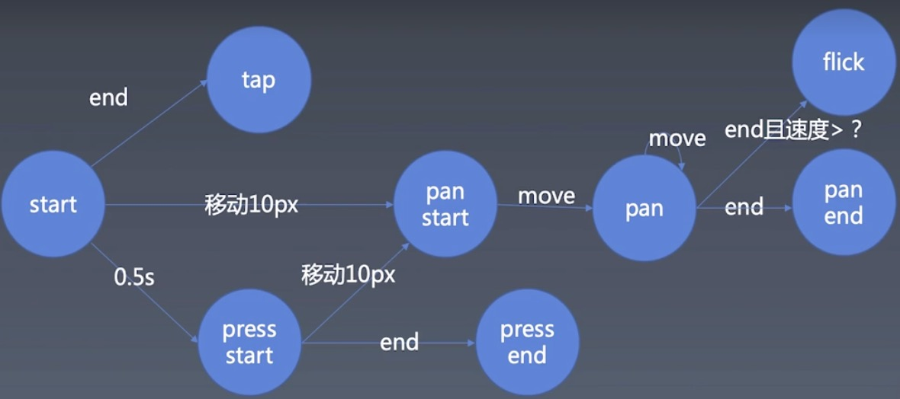

# 组件化（二）轮播组件的手势与动画

# 动画

### 1. 初步建立动画和时间线

#### 1. 1 帧

在建立动画和时间线和时间线的初步我们要先了解一下**帧**。在前端Javascript中实现帧的方式有三种：

* setInterval

* setTimeout
* requestAnimationFrame

```js
setInterval(()=> {}, 16)
let tick = () => {
  setTimeout(()=> {}, 16)
}
let tick1 = () => {
  requestAnimationFrame(tick1)
}
```

这里推荐使用requestAnimationFrame或者setTimeout，因为setInterval不可控，无法确定浏览器是否会正确执行，同时tick函数写的不好容易发生积压。

#### 1.2 时间线 LineTime Class

这边我们将实现tick()函数功能的过程包装为一个timeline Class，主要是包括以下结构：

**timeline Class**：

* 属性
  * Animation Set
  * Tick Fun
* 方法
  * start
  * pause
  * remuse
  * reset
  * set rate
  * get rate

#### 1.3 动画 Animation Class

这里我们实现的动画，可以描述为属性动画，意思为将对象的某个属性从一个值，改为另一个值。与之对应的还有帧动画，类似于迪士尼动画片，每秒为图片组成。浏览器中存在的动画一般都是帧动画，有一个起始值，一个终止值。所以我们的**Animation Class**主要包括以下结构：

**Animation Class**：

* 属性
  * object： 动画发生的对象
  * property： 发生具体变化的动画的某个属性名
  * startVal： 属性的动画起始值
  * endVal： 属性的动画结束值
  * duation：动画持续的时间
  * timingFun： 动画变化的函数，描述在这段时间里属性值的变化朝着一个什么样的函数模型变化。如：匀速变化、加速变化、减速变化等。
* 方法
  * receiveTime: 接收每次变化的时间点，并对属性做出改变

#### 1.4 代码

```js
// animation.js
const TICK = Symbol('tick')
const TICK_HANDLER = Symbol('tick_handler')
const ANIMATION = Symbol('animation')
export class TimeLine {
  constructor () {
    this[ANIMATION] = new Set()
  }
  start () {
    let startTime = Date.now()
    this[TICK] = () => {
      let t = Date.now() - startTime
      for (const animation of this[ANIMATION]) {
        let t0 = t
        if (animation.duration < t) {
          this[ANIMATION].delete(animation)
          t0 = animation.duration
        }
        animation.receiveTime(t0)
      }
      requestAnimationFrame(this[TICK])
    }
    this[TICK]()
  }
  pause () {}
  resume () {}
  reset () {}
  addAnimation (animation) {
    this[ANIMATION].add(animation)
  }
}
export class Animation {
  constructor (object, property, startVal, endVal, duration, timingFun) {
    this.object = object
    this.property = property
    this.startVal = startVal
    this.endVal = endVal
    this.duration = duration
    this.timingFun = timingFun
  }
  receiveTime (time) {
    let range = this.endVal - this.startVal
    this.object[this.property] = this.startVal + time * range / this.duration
  }
}
```

### 2. 设计时间线更新

这里我们重新设计一种新的时间线更新的方式，在addAnimation的方法中，我们添加一个传入的开始时间作为参数，使得动画开始为可变化量，以提供控制动画开始的接口。

代码:

```js
// animation.js
const TICK = Symbol('tick')
const TICK_HANDLER = Symbol('tick_handler')
const ANIMATION = Symbol('animation')
const START_TIME = Symbol('start_time')
export class TimeLine {
  constructor () {
    this[ANIMATION] = new Set()
    this[START_TIME] = new Map()
  }
  start () {
    let startTime = Date.now()
    this[TICK] = () => {
      let now = Date.now()
      for (const animation of this[ANIMATION]) {
        let t
        if (this[START_TIME].get(animation) < startTime)
          t = now - startTime
        else
          t = now - this[START_TIME].get(animation)
        if (animation.duration < t) {
          this[ANIMATION].delete(animation)
          t = animation.duration
        }
        animation.receiveTime(t)
      }
      requestAnimationFrame(this[TICK])
    }
    this[TICK]()
  }
  pause () {}
  resume () {}
  reset () {}
  addAnimation (animation, startTime) {
    if (arguments.length < 2) {
      startTime = Date.now()
    }
    this[START_TIME].set(animation, startTime)
    this[ANIMATION].add(animation)
  }
}
// 部分代码省略
```

### 3. 给动画添加暂停和重启功能

代码如下：

```js
// animation.js
// 部分代码省略
export class TimeLine {
  // .....
	start () {
    let startTime = Date.now()
    this[TICK] = () => {
      let now = Date.now()
      for (const animation of this[ANIMATION]) {
        let t
        if (this[START_TIME].get(animation) < startTime)
          t = now - startTime - this[PAUSE_TIME] // 在start中的计算t 要减去上次暂停的时间段
        else
          t = now - this[START_TIME].get(animation) - this[PAUSE_TIME] // 在start中的计算t要减去上次暂停的时间段
        if (animation.duration < t) {
          this[ANIMATION].delete(animation)
          t = animation.duration
        }
        console.log(t)
        animation.receiveTime(t)
      }
      this[TICK_HANDLER] = requestAnimationFrame(this[TICK])
    }
    this[TICK]()
  }
	pause () {
    // 暂停的时候记录，暂停开始的时间点
    this[PAUSE_START] = Date.now()
    // 用 cancelAnimationFrame 停止动画
    cancelAnimationFrame(this[TICK_HANDLER])
  }
  resume () {
    // 重启的时候，用当前时间减去暂停开始的时间，为暂停的时间段
    this[PAUSE_TIME] = Date.now() - this[PAUSE_START]
    this[TICK]() // 重新执行tick
  }
// 部分代码省略
}
```

### 4. 完善动画的其他功能

#### delay

这里在动画接受时间点之前的t变量中减去animation.delay。

```js
// animation.js
// 部分代码省略  
export class TimeLine {
  // .....
start () {
    let startTime = Date.now()
    this[TICK] = () => {
      let now = Date.now()
      for (const animation of this[ANIMATION]) {
        let t
        if (this[START_TIME].get(animation) < startTime)
          t = now - startTime - this[PAUSE_TIME] - animation.delay
        else
          t = now - this[START_TIME].get(animation) - this[PAUSE_TIME] - animation.delay
        if (animation.duration < t) {
          this[ANIMATION].delete(animation)
          t = animation.duration
        }
        if (t > 0)
          animation.receiveTime(t)
      }
      this[TICK_HANDLER] = requestAnimationFrame(this[TICK])
    }
    this[TICK]()
  }
}
```

#### timingFun

这里我们需要传入一个cubic-bezier的三次贝塞尔曲线构成的运动函数。这里我们直接从浏览器实现的C++源码中获得，将其改写成Javascript版本。

```js
// UnitBezier.js

export let linear = v => v
export function UnitBezier(p1x, p1y, p2x, p2y) {
  const ZERO_LIMIT = 1e-6

  // Calculate the polynomial coefficients, implicit first and last control points are (0,0) and (1,1).
  const cx = 3 * p1x;
  const bx = 3 * (p2x - p1x) - cx;
  const ax = 1 - cx -bx;
    
  const cy = 3 * p1y;
  const by = 3 * (p2y - p1y) - cy;
  const ay = 1 - cy - by;
      
  function sampleCurveX(t)
  {
    // `ax t^3 + bx t^2 + cx t' expanded using Horner's rule.
    return ((ax * t + bx) * t + cx) * t;
  }
      
  function sampleCurveY(t)
  {
    return ((ay * t + by) * t + cy) * t;
  }
      
  function sampleCurveDerivativeX(t)
  {
    return (3 * ax * t + 2 * bx) * t + cx;
  }
      
  // Given an x value, find a parametric value it came from.
  function solveCurveX(x) {
    var t2 = x;
    var derivative;
    var x2;
    // let t0;
    // let t1;
    // let t2;
    // let x2;
    // let d2;
    // let i;

    // First try a few iterations of Newton's method -- normally very fast.
    for (let i = 0; i < 8; i++) {
      // f(t) - x = 0
        x2 = sampleCurveX(t2) - x;
        if (Math.abs(x2) < ZERO_LIMIT)
            return t2;
        derivative = sampleCurveDerivativeX(t2);
        if (Math.abs(derivative) < ZERO_LIMIT)
            break;
        t2 = t2 - x2 / derivative;
    }

    // Fall back to the bisection method for reliability.
    // wiki/Bisection_method
    t0 = 0;
    t1 = 1;
    t2 = x;

    if (t2 < t0)
        return t0;
    if (t2 > t1)
        return t1;

    while (t0 < t1) {
        x2 = sampleCurveX(t2) - x;
        if (Math.abs(x2 - x) < ZERO_LIMIT)
            return t2;
        if (x2 > 0)
            t1 = t2;
        else
            t0 = t2;
        t2 = (t1 - t0) / 2
    }

    // Failure.
    return t2;
  }

  function solve (x)
  {
    return sampleCurveY(solveCurveX(x));
  }
  return solve
}
export let ease = UnitBezier(.25,.1,.25,1)
export let easeIn = UnitBezier(.42,0,1,1)
export let easeOut = UnitBezier(0,0,.58,1)
export let easeInOut = UnitBezier(.42,0,.58,1)

```

#### reset

这里我们需要一个重置函数, 将时间线中管理动画的变量重置：

```js
// animation.js
// 部分代码省略  
export class TimeLine {
  // .....
  reset () {
      this.pause()
      this[PAUSE_TIME] = 0
      this[ANIMATION] = new Set()
      this[START_TIME] = new Map()
      this[PAUSE_START] = 0
      this[TICK_HANDLER] = null
    }
}
```

### 5. 对时间线进行状态管理

对时间线的状态记录，使用一个state变量进行管理。state的状态

* inited ：初始状态
* started： 开始状态
* paused：暂停状态

在这三种状态之间的切换，保证时间线的操作可控。

## 手势

触屏上的手势和鼠标点击的操作还是有一定的区别的，比如鼠标单做点击不移动是不会发生变动的，但是对于手机触屏来说一样会发生微小的位移，一样也会触发down、move、up类似的事件序列，这里我们来学习一下手势相关的知识。在代码中能统一触屏和鼠标的体验。

### 1. 手势的基本知识

在触屏上基本的单指手势事件，可以用touch start、move、end事件来抽象。



从上图看：

一切事件从**start**开始

* 开始之后之间结束，就是一种类似与点击的事件**tap**
* 开始之后移动了屏幕上的10px的距离(Retina屏的10px，具体根据设备决定)，则会触发**pan star**事件
  * **pan**事件类似于摄影机缓慢像焦点移动的场景，表示比较缓慢的触碰的推移
  * 如果持续移动则会在**pan->move**事件之间循环往复
    * 如果接下来end了，就会进入 **pan end**状态
    * 如果end的时候达到了一定的速度，就可以认为这是一次清扫事件（**flick**，或者swipe）
* 如果开始之后停顿有0.5s的时间，则会触发**press start**(长按判定)，比如长按弹出菜单，多数press监听的都是**press start**事件
  * 如果移动了屏幕上的10px距离，则会进入**pan start**事件
  * 如果end 则判定 **press end**


### 2.实现鼠标操作

这里我们将操作分成两类:

* 鼠标事件: mousedown、mousemove、mouseup；
* 手势事件：touchstart、touchmove、touchend、touchcancel
  * touch事件序列被其他事件打断后，就会自动变成touchcancel

这里我们将这两类事件做一个统一的抽象，用start、move、end、cancel的函数去替代。

代码如下：

```js
// gesture.js
// 鼠标事件
let element = document.documentElement
element.addEventListener('mousedown', (event) => {
  start(event)
  let move = (event) => {
    move(event)
  }
  let up = (event) => {
    end(event)
    element.removeEventListener('mousemove', move)
    element.removeEventListener('mouseup', up)
  }
  element.addEventListener('mousemove', move)
  element.addEventListener('mouseup', up)
})
// 手势事件
element.addEventListener('touchstart', event=> {
  for (const touch of event.changedTouches) {
    start(touch)
  }
})
element.addEventListener('touchmove', event=> {
  for (const touch of event.changedTouches) {
    move(touch)
  }
})
element.addEventListener('touchend', event=> {
  for (const touch of event.changedTouches) {
    end(touch)
  }
})
element.addEventListener('touchcancel', event=> {
  for (const touch of event.changedTouches) {
    cancel(touch)
  }
})
// 统一抽象
let start = (point) => {
  console.log('start', point.clientX, point.clientY);
}
let move = (point) => {
  console.log('move', point.clientX, point.clientY);
}
let end = (point) => {
  console.log('end', point.clientX, point.clientY);
}
let cancel = (point) => {
  console.log('cancel', point.clientX, point.clientY);
}
```

### 3. 实现手势的逻辑

这里我们根据手势的逻辑变化流程图，在统一抽象函数中完成代码逻辑。

具体逻辑分为三种情况，这里我们用三个变量去判断它：

* isTap，是否为点按
* isPress，是否为按压
* isPan，是否为移动10px

代码如下：

```js
// gesture.js
// 部分代码省略
let startX, startY
let handler
let isPan = false, isPress = false, istap = true 
// 统一抽象
let start = (point) => {
  startX = point.clientX
  startY = point.clientY
  isPan = false
  isPress = false
  istap = true
  handler = setTimeout(()=> {
    console.log('press')
    isPan = false
    istap = false
    isPress = true
    handler = null
  }, 500)
}
let move = (point) => {
  let dx = (point.clientX - startX) ** 2 , dy = (point.clientY - startY) ** 2
  let distance = dx + dy
  if (!isPan && distance > 100) {
    isPress = false
    istap = false
    isPan = true
    console.log('pan start')
    clearTimeout(handler)
  }
  if (isPan) {
    console.log(dx, dy)
    console.log('pan')
  }
}
let end = (point) => {
  if (istap) {
    console.log('tap')
    clearTimeout(handler)
  }
  if (isPan) {
    console.log('pan end')
  }
  if (isPress) {
    console.log('press end')
  }
}
let cancel = (point) => {
  console.log('cancel', point.clientX, point.clientY)
  clearTimeout(handler)
}
```

### 4. 处理鼠标事件

如果从触屏的角度去考虑，也许同时会出现两个或以上的触屏点，从鼠标的角度考虑又有可能有左右键之分。这个时候变量isTap、isPress、isPan、startX、startY、handler这些变量就不应该是全局的。这里我们在每个函数了传一个参数context保存这些变量，并且用一个Map去保存这些context集合。

```js
// 鼠标事件
let contexts = new Map()
let isListeningMouse = false
let element = document.documentElement
element.addEventListener('mousedown', (event) => {
  let context = Object.create(null)
  contexts.set('mouse' + (1 << event.button), context)
  start(event, context)
  let mousemove = (event) => {
    let button = 1
    while (button <= event.buttons) {
      if (button & event.buttons) {
        let key
        if (button === 2)
          key = 4
        else if (button === 4)
          key = 2
        else
          key = button
        let context = contexts.get('mouse' + key)
        move(event, context)
      }
      button = button << 1
    }
  }
  let mouseup = (event) => {
    let context = contexts.get('mouse' + (1 << event.button))
    end(event, context)
    contexts.delete('mouse' + (1 << event.button))
    if (event.buttons === 0) {
      element.removeEventListener('mousemove', mousemove)
      element.removeEventListener('mouseup', mouseup)
      isListeningMouse = false
    }
  }
  if (!isListeningMouse) {
    element.addEventListener('mousemove', mousemove)
    element.addEventListener('mouseup', mouseup)
    isListeningMouse = true
  }
})

// 手势事件
element.addEventListener('touchstart', event=> {
  for (const touch of event.changedTouches) {
    let context = Object.create(null)
    contexts.set(touch.identifier, context)
    start(touch, context)
  }
})
element.addEventListener('touchmove', event=> {
  for (const touch of event.changedTouches) {
    let context = contexts.get(touch.identifier)
    move(touch, context)
  }
})
element.addEventListener('touchend', event=> {
  for (const touch of event.changedTouches) {
    let context = contexts.get(touch.identifier)
    end(touch, context)
  }
})
element.addEventListener('touchcancel', event=> {
  for (const touch of event.changedTouches) {
    let context = contexts.get(touch.identifier)
    cancel(touch, context)
  }
})
// 统一抽象
let start = (point, context) => {
  context.startX = point.clientX
  context.startY = point.clientY
  context.isPan = false
  context.isPress = false
  context.istap = true
  context.handler = setTimeout(()=> {
    console.log('press')
    context.isPan = false
    context.istap = false
    context.isPress = true
    context.handler = null
  }, 500)
}
let move = (point, context) => {
  let dx = (point.clientX - context.startX) ** 2 , dy = (point.clientY - context.startY) ** 2
  let distance = dx + dy
  if (!contexts.isPan && distance > 100) {
    context.isPress = false
    context.istap = false
    context.isPan = true
    console.log('pan start')
    clearTimeout(context.handler)
  }
  if (context.isPan) {
    console.log(dx, dy)
    console.log('pan')
  }
}
let end = (point, context) => {
  if (context.istap) {
    console.log('tap')
    clearTimeout(context.handler)
  }
  if (context.isPan) {
    console.log('pan end')
  }
  if (context.isPress) {
    console.log('press end')
  }
}
let cancel = (point, context) => {
  console.log('cancel', point.clientX, point.clientY)
  clearTimeout(context.handler)
}
```

### 5. 派发事件

```js
// gesture.js
// 部分代码省略
function dispatch (type, properties) {
  let event = new Event(type)
  for (const name in properties) {
    event[name] = properties[name]
  }
  element.dispatchEvent(event)
}
```


### 6. 实现一个flick事件

flick事件比较特殊，需要判断速度。如何判断速度？我们可以在move的时候，可得到当前这一次move的速度。但这个速度并不能帮我们去进行处理，因为浏览器实现的不同，两个点之间的速度会有较大的误差。

所以对速度的判断应该是取无数个点，对它进行一个平均。这里我们会存储一段时间之内的点，来做速度的平均计算。

```js
// gesture.js
// 部分代码省略
let move = (point, context) => {
  let dx = (point.clientX - context.startX) ** 2 , dy = (point.clientY - context.startY) ** 2
  let distance = dx + dy

  if (!contexts.isPan && distance > 100) {
    context.isPress = false
    context.istap = false
    context.isPan = true
    console.log('pan start')
    clearTimeout(context.handler)
  }
  if (context.isPan) {
    console.log(dx, dy)
    console.log('pan')
  }
  contexts.points = context.points.filter(point => Date.now() - point.t < 500)
  context.points.push({
    t: Date.now(),
    x: point.clientX,
    y: point.clientY
  })
}
let end = (point, context) => {
  if (context.istap) {
    console.log('tap')
    dispatch('tap')
    clearTimeout(context.handler)
  }
  if (context.isPan) {
    console.log('pan end')
  }
  if (context.isPress) {
    console.log('press end')
  }
  contexts.points = context.points.filter(point => Date.now() - point.t < 500)
  let d, v
  if (!context.points.length) {
    v = 0
  } else {
    d = Math.sqrt((point.clientX - context.points[0].x) **2 + (point.clientY - context.points[0].y) **2)
    v = d / (Date.now() - context.points[0].t)
  }
  if (v > 1.5) {
    console.log('flick')
    context.isFlick = true
  } else {
    context.isFlick = false
  }
}
```

### 7. 封装

代码到这里已经完成了差不多了，但元素还是写死的元素，这里解耦化处理可以分成三个部分：

* lisen :监听
* recognize：识别
* dispatch：分发

信息的流向是，监听->识别->分发的过程

```js
// gesture.js
// 监听
export class Linsener {
  constructor (element, recognizer) {
    let contexts = new Map()
    let isListeningMouse = false
    element.addEventListener('mousedown', (event) => {
      let context = Object.create(null)
      contexts.set('mouse' + (1 << event.button), context)
      recognizer.start(event, context)
      let mousemove = (event) => {
        let button = 1
        while (button <= event.buttons) {
          if (button & event.buttons) {
            let key
            if (button === 2)
              key = 4
            else if (button === 4)
              key = 2
            else
              key = button
            let context = contexts.get('mouse' + key)
            recognizer.move(event, context)
          }
          button = button << 1
        }
      }
      let mouseup = (event) => {
        let context = contexts.get('mouse' + (1 << event.button))
        recognizer.end(event, context)
        contexts.delete('mouse' + (1 << event.button))
        if (event.buttons === 0) {
          document.removeEventListener('mousemove', mousemove)
          document.removeEventListener('mouseup', mouseup)
          isListeningMouse = false
        }
      }
      if (!isListeningMouse) {
        document.addEventListener('mousemove', mousemove)
        document.addEventListener('mouseup', mouseup)
        isListeningMouse = true
      }
    })
    
    // 手势事件
    element.addEventListener('touchstart', event=> {
      for (const touch of event.changedTouches) {
        let context = Object.create(null)
        contexts.set(touch.identifier, context)
        recognizer.start(touch, context)
      }
    })
    element.addEventListener('touchmove', event=> {
      for (const touch of event.changedTouches) {
        let context = contexts.get(touch.identifier)
        recognizer.move(touch, context)
      }
    })
    element.addEventListener('touchend', event=> {
      for (const touch of event.changedTouches) {
        let context = contexts.get(touch.identifier)
        recognizer.end(touch, context)
      }
    })
    element.addEventListener('touchcancel', event=> {
      for (const touch of event.changedTouches) {
        let context = contexts.get(touch.identifier)
        recognizer.cancel(touch, context)
      }
    })
  }
}
// 识别
export class Recognizer {
  constructor (dispatcher) {
    this.dispatcher = dispatcher
  }
  start (point, context) {
    context.startX = point.clientX
    context.startY = point.clientY
  
    context.points = [{
      t: Date.now(),
      x: point.clientX,
      y: point.clientY
    }]
  
    context.isPan = false
    context.isPress = false
    context.istap = true
    context.handler = setTimeout(()=> {
      this.dispatcher.dispatch('press', {})
      context.isPan = false
      context.istap = false
      context.isPress = true
      context.handler = null
    }, 500)
  }
  move (point, context) {
    let dx = (point.clientX - context.startX) ** 2 , dy = (point.clientY - context.startY) ** 2
    let distance = dx + dy
  
    if (!context.isPan && distance > 100) {
      context.isPress = false
      context.istap = false
      context.isPan = true
      context.isVertical = Math.abs(dx) < Math.abs(dy)
      this.dispatcher.dispatch('panstart', {
        startX: context.startX,
        startY: context.startY,
        clientX: point.clientX,
        clientY: point.clientY,
        isVertical: context.isVertical
      })
      clearTimeout(context.handler)
    }
    if (context.isPan) {
      this.dispatcher.dispatch('pan', {
        startX: context.startX,
        startY: context.startY,
        clientX: point.clientX,
        clientY: point.clientY,
        isVertical: context.isVertical
      })
    }
    context.points = context.points.filter(point => Date.now() - point.t < 500)
    context.points.push({
      t: Date.now(),
      x: point.clientX,
      y: point.clientY
    })
  }
  end (point, context) {
    if (context.istap) {
      this.dispatcher.dispatch('tap', {})
      clearTimeout(context.handler)
    }
    if (context.isPress) {
      this.dispatcher.dispatch('pressend', {})
    }
    context.points = context.points.filter(point => Date.now() - point.t < 500)
    let d, v
    if (!context.points.length) {
      v = 0
    } else {
      d = Math.sqrt((point.clientX - context.points[0].x) **2 + (point.clientY - context.points[0].y) **2)
      v = d / (Date.now() - context.points[0].t)
    }
    if (v > 1.5) {
      context.isFlick = true
      this.dispatcher.dispatch('flick', {
        startX: context.startX,
        startY: context.startY,
        clientX: point.clientX,
        clientY: point.clientY,
        isVertical: context.isVertical,
        isFlick: context.isFlick,
        velocity: v // 速度
      })
    } else {
      context.isFlick = false
    }

    if (context.isPan) {
      this.dispatcher.dispatch('panend', {
        startX: context.startX,
        startY: context.startY,
        clientX: point.clientX,
        clientY: point.clientY,
        isVertical: context.isVertical,
        isFlick: context.isFlick
      })
    }
  }
  cancel (point, context) {
    this.dispatcher.dispatch('cancel', {})
    clearTimeout(context.handler)
  }
}
// 分发
export class Dispatcher {
  constructor (element) {
    this.element = element
  }
  dispatch (type, properties) {
    let event = new Event(type)
    for (const name in properties) {
      event[name] = properties[name]
    }
    this.element.dispatchEvent(event)
  }
}
export function enableGesture (element) {
  new Linsener(element, new Recognizer(new Dispatcher(element)))
}

```

