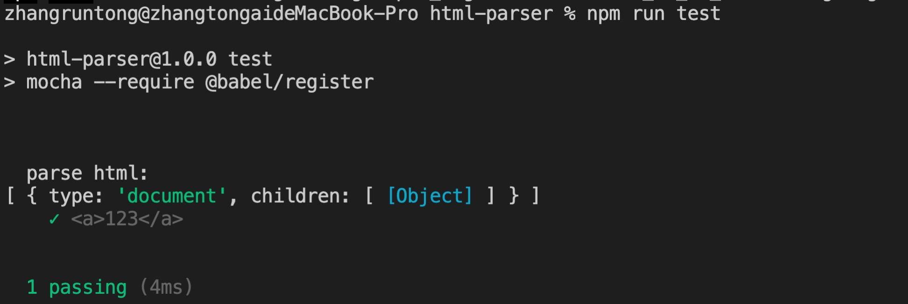
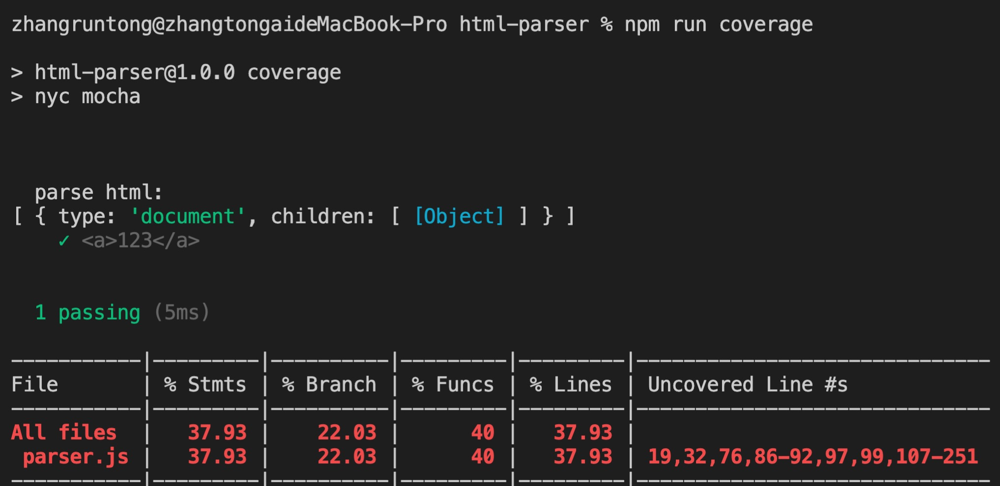
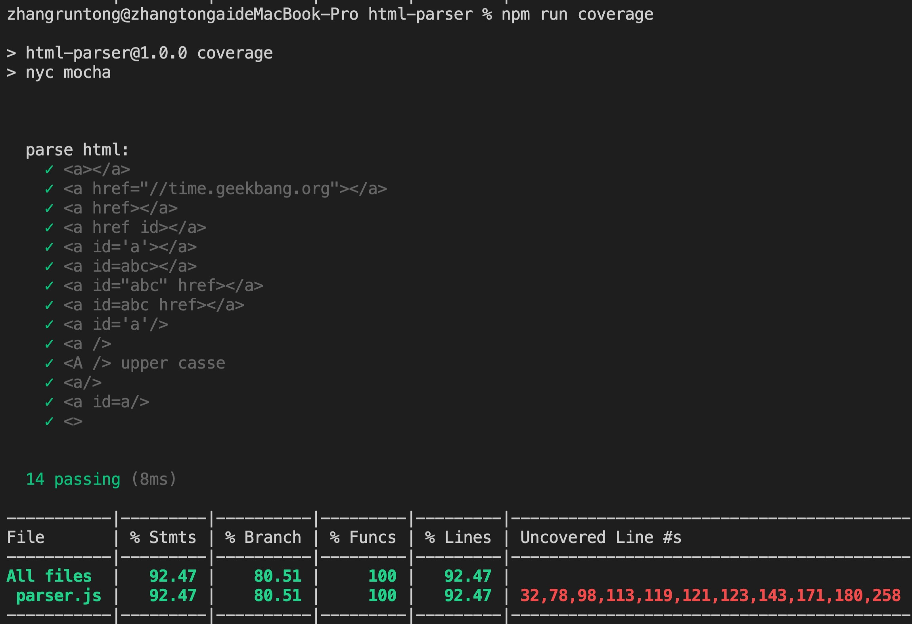

# 工具链

## 单元测试工具

测试工具是前端工具链里非常重要的一环，对于大部分的开源项目来说，测试都是一个必需品。如果我们某个项目是一个被高度复用的东西，那测试的收益也是很高的，所以除非是一次性使用的代码，我们还都是要使用单元测试 。

下面介绍一些当前最流行的测试工具和一些配套设施：

这里有流行的两个库一个是**Mocha**一个是**Jest**

### Mocha

Mocha最早是一个针对Node.js的一个测试框架，它默认在使用Webpoack之前，它都是不支持import export的，这里我们例子里使用的是require。

##### 1. 安装

```shell
npm install -g mocha
npm install --save-dev mocha
```

##### 2.基本使用

```js
//test/test.js
var assert = require('assert');
var add = require('../add.js')

describe('add function testing', function () {
  it('1 + 2 shuold be 3', function() {
    assert.equal(add(1, 2), 3);
  });
  it('-5 + 2 shuold be -3', function() {
    assert.equal(add(-5, 2), -3);
  });
})

```

```js
// add.js
function add (a, b) {
  return a + b
}
module.exports = add
```

##### 3.引入babel

这里我们引入babel来解决一下add.js必须用node的方式module.exports的问题。而简单的方法，我们可以用webpack项目，然后在dist里面去做单元测试，但从理论上考虑，测试这个环节依赖于build这个环节，是一件不太好的做法。另外，这对后面做code coverage话以上面这种方式的话，会带来不必要的麻烦。

所以我们这里用babel给我们提供一个方案，去解决。

这个方案是babel register。

###### 安装

```shell
npm install --save-dev @babel/core @babel/register
npm install --save-dev @babel/preset-env
```

然后配置一下babel。

###### 命令

```shell
./node_moudules/.bin/mocha --require @babel/register
```

###### 4. code coverage

code coverage表示我们的测试到底覆盖了源文件的哪些代码。这里我们介绍一个新的工具叫做nyc，它可以在一个复杂的文件中，测试它最终测试的覆盖比例。

* 安装

```shell
npm install --save-dev nyc
```

* 命令

```shell
nyc ./node_modules/.bin/mocha
```

这里我们加入babel使用：

* 安装两个插件

```shell
npm install --save-dev @istanbuljs/nys-config-babel
npm install --save-dev babel-plugin-istanbul
```

* 在package.json中添加两个script项

```json
  "scripts": {
    "test": "mocha --require @babel/register",
    "coverage": "nyc mocha"
  },
```


* 我们写测试用例的时候用```npm run coverage```,写业务代码的时候用的是```npm run test```


### 对html-parser进行单元测试

这里我们要完成的是对我们之前写的toy-browser中的一个html-parser添加单元测试。

这里我们将之前的代码拷贝，新建一个目录然后重复完成上述操作。

然后我们执行命令，将单元测试跑起来。

**结果**





由上图可知，测试用例覆盖率是30%多，下面我们将通过修改用例实现100%覆盖。

```js
// parser-test.js
var assert = require('assert');
import {parseHTML} from '../src/parser'

describe('parse html:', function () {
  it('<a></a>', function() {
    let tree = parseHTML('<a></a>')
    assert.equal(tree.children[0].tagName, 'a');
    assert.equal(tree.children.length, 1);
  });
  it('<a href="//time.geekbang.org"></a>', function() {
    let tree = parseHTML('<a href="//time.geekbang.org"></a>')
    assert.equal(tree.children[0].tagName, 'a');
    assert.equal(tree.children.length, 1);
  });
  it('<a href></a>', function() {
    // 127-135
    let tree = parseHTML('<a href></a>')
    assert.equal(tree.children[0].tagName, 'a');
    assert.equal(tree.children.length, 1);
  });
  it('<a href id></a>', function() {
    // 135-143
    let tree = parseHTML('<a href id></a>')
    assert.equal(tree.children[0].tagName, 'a');
    assert.equal(tree.children.length, 1);
  });
  it('<a id=\'a\'></a>', function() {
    // 168-171
    let tree = parseHTML('<a id=\'a\'></a>')
    assert.equal(tree.children[0].tagName, 'a');
    assert.equal(tree.children.length, 1);
  });
  it('<a id=abc></a>', function() {
    // 171-175
    let tree = parseHTML('<a id=abc></a>')
    assert.equal(tree.children[0].tagName, 'a');
    assert.equal(tree.children.length, 1);
  });
  it('<a id="abc" href></a>', function() {
    // 230
    let tree = parseHTML('<a id="abc" href></a>')
    assert.equal(tree.children[0].tagName, 'a');
    assert.equal(tree.children.length, 1);
  });
  it('<a id=abc href></a>', function() {
    // 209-210
    let tree = parseHTML('<a id=abc href></a>')
    assert.equal(tree.children[0].tagName, 'a');
    assert.equal(tree.children.length, 1);
  });
  it('<a id=\'a\'/>', function() {
    // 
    let tree = parseHTML('<a id=\'a\'/>')
    assert.equal(tree.children[0].tagName, 'a');
    assert.equal(tree.children.length, 1);
  });

  it('<a />', function() {
    // 130
    let tree = parseHTML('<a />')
    assert.equal(tree.children[0].tagName, 'a');
    assert.equal(tree.children.length, 1);
  });
  it('<A /> upper casse', function() {
    // 100
    let tree = parseHTML('<A />')
    assert.equal(tree.children[0].tagName, 'A');
    assert.equal(tree.children.length, 1);
  });
  it('<a/>', function() {
    // 98
    let tree = parseHTML('<a/>')
    assert.equal(tree.children[0].tagName, 'a');
    assert.equal(tree.children.length, 1);
  });
  it('<a id=a/>', function() {
    let tree = parseHTML('<a id=a/>')
    assert.equal(tree.children[0].tagName, 'a');
    assert.equal(tree.children.length, 1);
  });
  it('<>', function() {
    let tree = parseHTML('<>')
    assert.equal(tree.children[0].type, 'text');
    assert.equal(tree.children[0].content, '<>');
  });
})


```

* 结果



**Vscode:调试配置示例**

```json
{
  // 使用 IntelliSense 了解相关属性。 
  // 悬停以查看现有属性的描述。
  // 欲了解更多信息，请访问: https://go.microsoft.com/fwlink/?linkid=830387
  "version": "0.2.0",
  "configurations": [
    {
      "type": "node",
      "request": "launch",
      "name": "启动程序",
      "skipFiles": [
        "<node_internals>/**"
      ],
      "sourceMaps": true,
      "runtimeArgs": [
        "--require", "@babel/register"
      ],
      "args": [],
      "program": "${workspaceFolder}/node_modules/.bin/mocha"
    }
  ]
}
```

### 工具链与generator集成

* generator修改，package.json中需要安装的依赖，将单元测试模块也引入
* generator引入文件.babelrc、.nycrc
* 引入simple-test.js 简单测试用例对文件
* webpack.config中的相关babel配置的引入

```js
// generator/app/index.js
var Generator = require('yeoman-generator');

module.exports = class extends Generator {
    // The name `constructor` is important here
    constructor(args, opts) {
      // Calling the super constructor is important so our generator is correctly set up
      super(args, opts);
    }
    async initPackge () {
      const answers = await this.prompt([
        {
          type: "input",
          name: "name",
          message: "Your project name",
          default: this.appname // Default to current folder name
        },
        {
          type: "input",
          name: "title",
          message: "Your html title",
          default: this.appname // Default to current folder name
        }
      ]);
      const pkgJson = {
        "name": answers.name,
        "version": "1.0.0",
        "description": "",
        "main": "index.js",
        "scripts": {
          "test": "./node_modules/.bin/mocha --require @babel/register",
          "coverage": "nyc ./node_modules/.bin/mocha",
          "build": "./node_modules/.bin/webpack",
        },
        "author": "",
        "license": "ISC",
        "devDependencies": {
        },
        "dependencies": {
        }
      };
      this.fs.extendJSON(this.destinationPath('package.json'), pkgJson);
      this.npmInstall(['vue'], {'save-dev': false});
      this.npmInstall([
        'webpack',
        'babel-loader',
        '@babel/core',
        '@babel/preset-env',
        '@babel/register',
        '@istanbuljs/nyc-config-babel',
        'babel-plugin-istanbul',
        'mocha',
        'nyc',
        'webpack-cli',
        'vue-loader', 
        'vue-template-compiler', 
        'vue-style-loader', 
        'css-loader',
        'copy-webpack-plugin'
      ], {'save-dev': true});
      this.fs.copyTpl(
        this.templatePath('HelloWorld.vue'),
        this.destinationPath('src/HelloWorld.vue'),
        {}
      );
      this.fs.copyTpl(
        this.templatePath('webpack.config.js'),
        this.destinationPath('webpack.config.js'),
        {}
      );
      this.fs.copyTpl(
        this.templatePath('main.js'),
        this.destinationPath('src/main.js'),
        {}
      );
      this.fs.copyTpl(
        this.templatePath('index.html'),
        this.destinationPath('src/index.html'),
        { title: answers.title }
      );
      this.fs.copyTpl(
        this.templatePath('.babelrc'),
        this.destinationPath('.babelrc')
      );
      this.fs.copyTpl(
        this.templatePath('.nycrc'),
        this.destinationPath('.nycrc')
      );
      this.fs.copyTpl(
        this.templatePath('simple-test.js'),
        this.destinationPath('test/simple-test.js')
      );
    }
};
```

