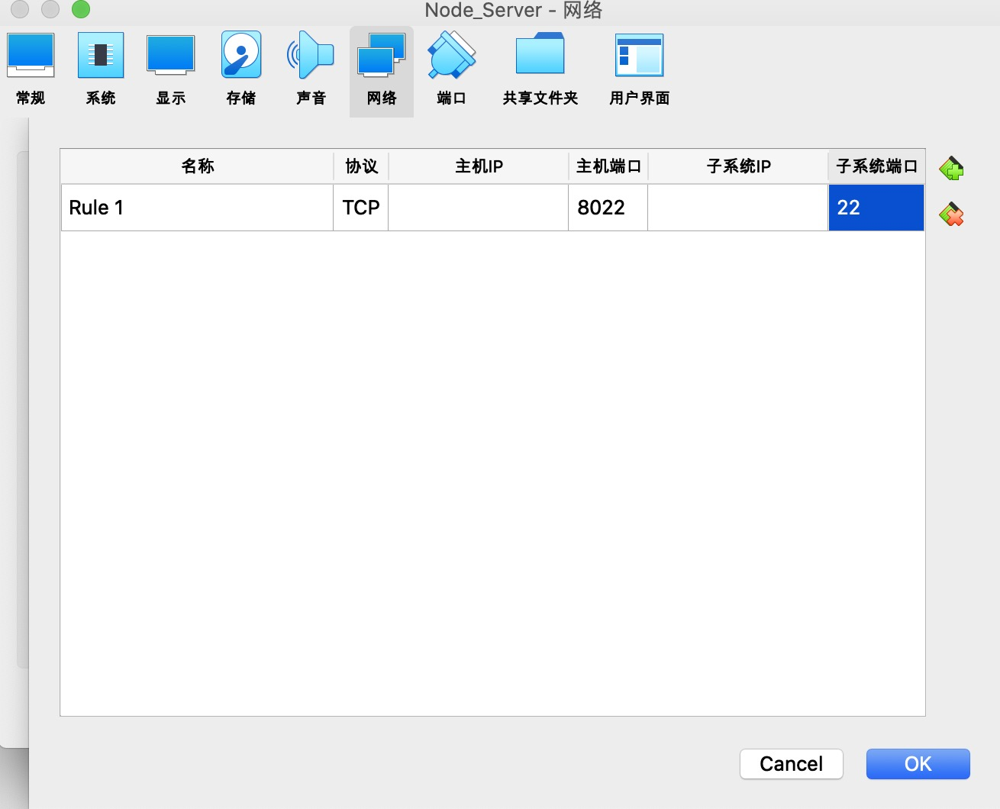

# 发布系统


### 环境准备

我们的发布系统分为三个部分

* **线上服务系统**：用户在线上真正使用的系统
* **发布系统**：程序员向线上发布所需系统的系统。这个系统不可以与线上服务系统是同级部署，也可以跟我们的线上服务系统分属于两个独立的集群。这里我们实现一个简单的模型：即单机，同级部署发布系统
* **发布工具**：命令行工具，与发布系统相连接

### 实现一个线上Web服务

#### 环境准备

可以使用一个真实的服务器，也可以用虚拟机来代替。这里推荐使用：Oracle的VirtualBox虚拟机，完全开源免费的版本。

这里我们基于的是Ubuntu Serve来开发。

* 安装虚拟机时镜像地址要改成，阿里云镜像

```shell
http://mirrors.aliyun.com/ubuntu
```

* 在虚拟机环境安装

```shell
sudo apt install nodejs
sudo apt install npm
sudo npm install -g n // node的版本管理工具
sudo n latest
```

**参考链接**：

- Oracle VM VirtualBox 下载地址：[ https://www.virtualbox.org/](https://www.virtualbox.org/)
- Ubuntu 20.04.1 LTS (Focal Fossa) 下载地址：
  - 官网：[ https://releases.ubuntu.com/20.04/](https://releases.ubuntu.com/20.04/)
  - 网盘：[ https://pan.baidu.com/s/1s8lga6YxuVcOdcAdhGQqoQ](https://pan.baidu.com/s/1s8lga6YxuVcOdcAdhGQqoQ)
    提取码：b8yw

#### 利用Express，编写服务器

**1. 构建项目**

通过 `npx` （包含在 Node.js 8.2.0 及更高版本中）命令来运行 Express 应用程序生成器。

```shell
npx express-generator
```

通过生成器创建的应用一般都有如下目录结构：

```shell
.
├── app.js
├── bin
│   └── www
├── package.json
├── public
│   ├── images
│   ├── javascripts
│   └── stylesheets
│       └── style.css
├── routes
│   ├── index.js
│   └── users.js
└── views
    ├── error.pug
    ├── index.pug
    └── layout.pug

7 directories, 9 files
```

然后我们这边将routes和views中的东西删掉然后，在public新建一个index.html,并尝试将它部署到服务器中。

**2.部署到服务器（虚拟机）**

* 在服务器启动OpenSSH,没加可以在虚拟机```apt install``一下

```shell
service ssh start
```

输入密码后就默认启动好了，默认在22端口监听。这里我们可以利用ssh进行远程登录、传文件

* scp 

  * 虚拟机里设定端口转发，下面例子是宿主机的8022端口会被转发到虚拟机的22端口

  
  * 命令： 从8022端口拷贝本目录下所有资源到虚拟机上

    ```shell
    scp -P 8022 -r ./* tongai@127.0.0.1:/home/tongai/server
    ```

  * 然后输入密码就拷贝成功了

* 启动服务

  * 在虚拟机服务器执行```npm start`` 启动服务

### 实现一个发布系统

发布服务是由一个发布的服务器端和一个发布的工具构成的。这里我们首先会实现最基本的功能，然后在逐步扩展，让它成为工程上一个基本可用的发布系统。

#### **1.用node启动一个简单的server**

```js
// publish-server/server.js
let Http = require('http')

Http.createServer(function (request, respond) {
  console.log(request)
  respond.end('Hello world')
}).listen(8082)
```


#### **2.编写简单的发送请求功能**

```js
// publish-tool/publish.js
let Http = require('http')

let request = Http.request({
  hostname: '127.0.0.1',
  port: 8082
},
  response => {
  console.log(response)
})
request.end()

```

#### **3.简单了解Node.js的流**

##### [Readable Streams](https://nodejs.org/docs/latest-v13.x/api/stream.html#stream_readable_streams)

可读流是从中消费数据的源的抽象。

```js
const readable = getReadableStreamSomehow();
readable.on('data', (chunk) => {
  console.log(`Received ${chunk.length} bytes of data.`);
});
readable.on('end', () => {
  console.log('There will be no more data.');
});
```

##### [Writable Streams](https://nodejs.org/docs/latest-v13.x/api/stream.html#stream_writable_streams)

可写流是数据写入目标的抽象。

```js
// Write 'hello, ' and then end with 'world!'.
const fs = require('fs');
const file = fs.createWriteStream('example.txt');
file.write('hello, ');
file.end('world!');
// Writing more now is not allowed!
```

对public-tool和public-server的改造，让它们实现文件流传输：

```js
// publish-tool/publish.js
let Http = require('http')
let fs = require('fs')

let request = Http.request({
  hostname: '127.0.0.1',
  port: 8082,
  method: 'POST',
  headers: {
    'Content-type': 'application/octet-stream'
  }
},
  response => {
  console.log(response)
})
let file = fs.createReadStream('./package.json')

file.on('data', chunck => {
  console.log(chunck.toString());
  request.write(chunck)
})
file.on('end', chunck => {
  console.log('read finish');
  request.end(chunck)
})


```

##### 4. 改造server

```js
// publish-server/server.js
let Http = require('http')
let fs = require('fs')

Http.createServer(function (request, response) {
  console.log(request.headers)
  let outFile = fs.createWriteStream('../server/public/index.html') // 写入到线上Web服务器的静态文件里面
  request.on('data', chunck => {
    outFile.write(chunck)
    console.log(chunck.toString());
  })
  request.on('end', () => {
    outFile.end()
    response.end('success')
  })
}).listen(8082)
```

* 改造好server以后，我们将发布服务器```publish-server```也上传到虚拟机服务器上。

  ```sh
  scp -r -P 8022 ./* tongai@127.0.0.1:/home/tongai/publish-server
  ```

* 在publish-tool中建立好一个静态文件```simple.html``` 更新``` publish-tool/public.js```中上传的文件

```js
// publish-tool/publish.js
let file = fs.createReadStream('./simple.html')
```

* 添加虚拟机端口映射 8882转发至8082，即为发布服务器

* 更新publish-tool中的内容，执行```node ./publish.js``` 上传至发布服务器，以更新线上服务器中文件内容


###  实现多文件上传

讲到这里我们已经实现了从文件到HTTP再从HTTP到文件的这种流式传输。通过对流式传输的基础学习，我们已经把我们的工具链做成了已经可以单文件上传。

而我们通常在供应链里面发布的环节，都不是发布一个文件，如果我们要发布多个文件那么应该怎么做呢？那么我们就需要用到Node里面一些压缩相关的包。

* [readable.pipe](https://nodejs.org/docs/latest-v13.x/api/stream.html#stream_readable_pipe_destination_options)

如果们想把一个流导入另一个流里面的时候，我们就可以简单的调用pipe方法。

* [fs.stat](https://nodejs.org/docs/latest-v13.x/api/fs.html#fs_class_fs_stats)

  读取文件大小

```js
// publish-tool/public.js
let Http = require('http')
let fs = require('fs')
fs.stat('./simple.html', (err, stats) => {
  let request = Http.request({
    hostname: '127.0.0.1',
    port: 8082,
    method: 'POST',
    headers: {
      'Content-Type': 'application/octet-stream',
      // 'Content-Length': stats.size
    }
  },
    response => {
    console.log(response)
  })
  let file = fs.createReadStream('./simple.html')
  file.pipe(request)
  file.on('end', () => request.end())
})

```

**多文件中文件夹压缩上传**

* 压缩：[Archiver](https://www.npmjs.com/package/archiver)

```js
// publish-tool/public.js
let Http = require('http')
let fs = require('fs')
const archiver = require('archiver');
let request = Http.request({
  hostname: '127.0.0.1',
  port: 8082,
  method: 'POST',
  headers: {
    'Content-Type': 'application/octet-stream'
  }
},
  response => {
  console.log(response)
})

const archive = archiver('zip', {
  zlib: { level: 9 } // Sets the compression level.
});
archive.directory('./simple/', false)
archive.finalize()
archive.pipe(request)
```

* 解压：[unzipper](https://www.npmjs.com/package/unzipper)

```js
// publish-server/server.js
let Http = require('http')
let unzipper  = require('unzipper')
Http.createServer(function (request, response) {
  request.pipe(unzipper.Extract({path: '../server/public/'}))
}).listen(8082)
```

 ### 用GitHub oAuth做一个登录实例

具体步骤可以参考文档：

* [创建一个github APP](https://docs.github.com/en/developers/apps/creating-an-oauth-app)
* [开发实例文档](https://docs.github.com/en/developers/apps/authorizing-oauth-apps)

然后我们在代码中需要做以下步骤：

1. 在```publish-tool/publish.js``` 中，打开 https://github.com/login/oath/authorize
2. 在```publish-server/server.js``` 中，auth路由：接受code,用code+client_id + client_secret换token
3. 在```publish-tool/publish.js``` 中，创建server, 接受token，后点击发布
4. 在```publish-server/server.js``` 中，publish路由：用token获取用户信息，检查权限，接受发布

ps：处理路由的包 **[querystring](https://nodejs.org/api/querystring.html)**

**参考代码**：

```js
// publish-tool/publish.js
let Http = require('http')
let querystring = require('querystring')
let archiver = require('archiver')
let child_process = require('child_process')

/*******************用GitHub oAuth做一个登录实例****************************/
//1. 打开 https://github.com/login/oath/authorize
child_process.exec(`open https://github.com/login/oauth/authorize?client_id=Iv1.7cf0dcf97bc177de`)

//2. 创建server, 接受token，后点击发布
Http.createServer(function (res, req) {
  let query = querystring.parse(res.url.match(/^\/\?([\s\S]+)$/)[1])
  publish(query.access_token, req)
}).listen(8083)
function publish (access_token, req) {
  let archive = archiver('zip', {
    zlib: { level: 9 } // Sets the compression level.
  });
  archive.directory('./simple/', false)
  archive.finalize()
  console.log(archive)
  let request = Http.request({
    hostname: '127.0.0.1',
    path: '/publish?access_token=' + access_token,
    port: 8082,
    method: 'POST',
    headers: {
      'Content-Type': 'application/octet-stream'
    }
  },
    response => {
      console.log(response)
  })
  archive.pipe(request)
}


```


```js
// publish-server/server.js
let Http = require('http')
let Https = require('https')
let fs = require('fs')
let unzipper  = require('unzipper')
let querystring = require('querystring')

// 2. auth路由：接受code,用code+client_id + client_secret换token
function auth (request, response) {
  let query = querystring.parse(request.url.match(/^\/auth\?([\s\S]+)$/)[1])
  getToken(query.code, function (info) {
    console.log(info)
    response.write(`<a
     style="font-size:25px"
     href="http://localhost:8083/?access_token=${info.access_token}">publish</a>`)
    response.end()
  })
}
function getToken (code, callback) {
  let request = Https.request({
    hostname: 'github.com',
    path: `/login/oauth/access_token?code=${code}&client_id=Iv1.7cf0dcf97bc177de&client_secret=70ec8c116fac88816b0e03f0c0f93537be056d91`,
    port: 443,
    method: 'POST'
  }, function (response) {
    let body = ''
    console.log(response)
    response.on('data', chunk => {
      body += chunk.toString()
    })
    response.on('end', () => {
      callback(querystring.parse(body))
    })
  })
  request.end()
}
// 4. publish路由：用token获取用户信息，检查权限，接受发布
function publish (request, response) {
  let query = querystring.parse(request.url.match(/^\/publish\?([\s\S]+)$/)[1])
  getUser(query.access_token, info => {
    if (info.login === 'red0908') {
      request.pipe(unzipper.Extract({path: '../server/public/'}))
      request.on('end', function () {
        console.log('end')
        response.end('success!')
      })
    }
  })
}
function getUser (access_token, callback) {
  let request = Https.request({
    hostname: 'api.github.com',
    path: '/user',
    port: 443,
    method: 'GET',
    headers: {
      'Authorization': `token ${access_token}`,
      'User-Agent': 'tong-toy-publish'
    }
  }, function (response) {
    let body = ''
    response.on('data', chunk => {
      body += chunk.toString()
    })
    response.on('end', () => {
      callback(JSON.parse(body))
    })
  })
  request.end()
}

Http.createServer(function (request, response) {
  /********用GitHub oAuth做一个登录实例***********/ 

  if (request.url.match(/^\/auth\?/))
    return auth(request, response)
  if (request.url.match(/^\/publish\?/))
    return publish(request, response)
  
}).listen(8082)
```


