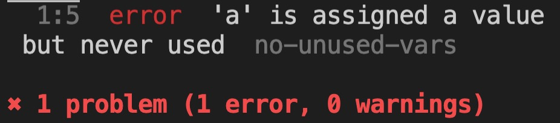

# 持续集成

### 发布前检查的相关知识

* git hooks：完成检查时机。
* ESlint: 轻量级，检查代码风格，进行校验。
* Headless：基于无头浏览器对代码最后生成出的样子进行检验和规则检查。

### Git Hooks基本用法

* 创建一个空目录，添加一个README.md

  ```shell
  git init
  git add .
  git commit -a -m "init"
  ls -a
  open .git
  ```

* 在hooks文件夹中创建一个pre-commit文件，并书写以下代码：

```js
#!/usr/bin/env node
console.log('Hellow hooks!')
```

并且在命令行中执行以下代码，打开pre-commit文件可执行权限：

```shell
chomd +x pre-commit
```

### ESLint基本用法

* 安装配置

```shell
npm install eslint --save-dev
npx eslint --init
```

* 小测试

```shell
npx eslint ./index.js
```

下图检测出了一个错误：



这是eslinst的基本用法

### ESLint API及其高级用法

这里我们要用ESLint中的高级一点的用法，我们要想在git hooks调用ESLint，最好不要使用命令行去调用，所以学习一下ESLintAPI。

请看下面的官网截图：(注意：在我们实际的场景里fix不要写成true)


我们将代码直接拷贝致我们的hooks中的pre-commit中并做以下代码调整：

```js
// pre-commit
#!/usr/bin/env node
let process = require('process')
console.log('Hellow hooks!')

const { ESLint } = require("eslint");

(async function main() {
  // 1. Create an instance with the `fix` option.
  const eslint = new ESLint({ fix: false });

  // 2. Lint files. This doesn't modify target files.
  const results = await eslint.lintFiles(["index.js"]);

  // 4. Format the results.
  const formatter = await eslint.loadFormatter("stylish");
  const resultText = formatter.format(results);

  // 5. Output it.
  console.log(resultText);
  for (const result of results) {
    if (result.errorCount) {
      process.exitCode=1
    }
  }
})().catch((error) => {
  process.exitCode = 1;
  console.error(error);
});
```

然后我们在之前的git-dom中创建一个JS文件书写一些不复合ESLint检查规则的代码，并进行提交，结果是git提交未成功，并且ESLint输出了错误。

#### git机制导致的ESLint检测版本问题

有这样一个问题，我们先修改一次js代码，此代码为符合ESLint检测标准代码,如：

```js
for (let i = 0; i < [1, 2, 3]; i++) {
  console.log(i);
}
```

然后我们执行```git add .```，暂存我们的提交，此时我们在修改JS文件代码：

```js
let a;
for (let i = 0; i < [1, 2, 3]; i++) {
  console.log(i);
}
```

这时我们执行git提交时，ESLint检测的是我们当前为暂存修改的文件。所以我们要用git的机制将当前文件变成我们之前暂存的文件，再进行提交。

执行以下命令：

```shell
git stash push -k
```

然后文件就变成我们之前提交的文件，这时我们再执行git提交命令。

然后我们再执行以下命令将文件变为我们之前最终修改文件：

```shell
git stash pop
```

这样文件就变成了下图所示：


文件因为git的内部机制出现了一些它认为的冲突，我们去解决这些冲突就可以进行接下了的提交了。

下面我们用将这些命令放入我们git hooks中，当然我们也可以选择让用户自己去学习一些关于```git stash```的命令。

```js
// pre-commit
#!/usr/bin/env node
let process = require('process')
console.log('Hellow hooks!')
let child_process = require('child_process')

const { ESLint } = require("eslint");

async function exec(name) {
  return new Promise(function (resolve) {
    child_process.exec(name, resolve)
  })
}

(async function main() {
  // 1. Create an instance with the `fix` option.
  const eslint = new ESLint({ fix: false });
  await exec('git stash push -k')
  // 2. Lint files. This doesn't modify target files.
  const results = await eslint.lintFiles(["index.js"]);
  await exec('git stash pop')
  // 4. Format the results.
  const formatter = await eslint.loadFormatter("stylish");
  const resultText = formatter.format(results);

  // 5. Output it.
  console.log(resultText);
  for (const result of results) {
    if (result.errorCount) {
      process.exitCode=1
    }
  }
})().catch((error) => {
  process.exitCode = 1;
  console.error(error);
});
```

### 使用无头浏览器检查DOM

这里我们使用[Headless Chrome](https://developers.google.com/web/updates/2017/04/headless-chrome?hl=en)做一些无头浏览器的DOM检查。


具体的命令包括以下：

```shell
alias chrome="/Applications/Google\ Chrome.app/Contents/MacOS/Google\ Chrome" // 在命令行工具中加入chrome的快捷方式

chrome // 调起浏览器窗口

chrome --headless // 无头浏览器

chrome --headless --dump-dom $(url)// 将url网页执行后的DOM树代码打印到命令行工具中 

chrome --headless --dump-dom $(url) > $(filename)// 将url网页执行后的DOM树代码存储到文件中


```

当然我们也可以在代码中用node 的```chirld_process```去获取它，当然下面的方式会更加简便一些，即使用chrome推出的库——**Puppeteer**

#### [Puppeteer](https://www.npmjs.com/package/puppeteer)

这是一个很好的工具，可以代替 老旧的PhantomJS和命令行的一种方式。它对命令行进行了系列简单的封装。API也是遵循了最新的async-awai她的风格。

小例子：

* 新建一个项目headless-demo,初始化项目，安装Puppeteer
* 启动之前组件章节写的项目，在http://localhost:8080/main.html
* headless-demo 项目中创建文件main.js书写以下代码

```js
const puppeteer = require('puppeteer');

(async () => {
  const browser = await puppeteer.launch();
  const page = await browser.newPage();
  await page.goto('http://localhost:8080/main.html');
  const a = await page.$('a')
  console.log(await a.asElement().boxMode())
})();
```

执行上述代码我们块就可以获得一定的boxMode()的对象结构，这样我们就可以利用pupeteer的DOM能力进行一些规则检查，如取出页面中的图片、或者其他元素，来进行校验和处理。亦或者，我们也可以进行一些click的操作去编写一些脚本，进而将puppeteer应用于我们的单元测试。

基于eslint和无头浏览器，我们可以构建一个强有力的持续继承的体系，来帮我们保证项目的基本质量。同样我们可以将eslint和无头浏览器器放到服务端去执行，变成一个强制标准，放在客户端就是一个辅助工具。

