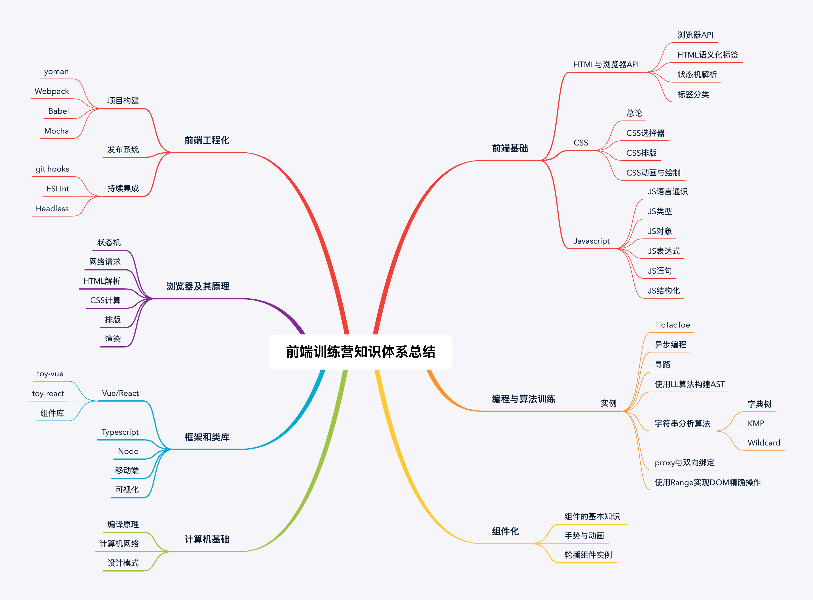

## 【总结】20周前端训练营的总结

时间过得很快，20周的学习很快就过去了，在这20周的学习中，学习到了许多知识，也有不少的收获。总的来讲大概包含这两个方面：

* 知识体系的新认识
* 学习方法的改善

### 从新认识前端知识体系

这20周的学习，让我对前端有了一个新的认识，并从而建立了前端的一个新的知识体系：

#### 改善学习方法

* 多写实例
* 做知识体系的思维导图
* 对一系列相关知识点输出成笔记
* 了解技术背后的故事（历史、发展、产生原因）
* 多与朋友和同事交流
* 多看标准文档、开源项目源码
* 对以前做过的项目结合新了解到的知识，进行阶段性的复盘

#### 对未来

在未来的学习与工作中，要以此为起点继续深入的学习前端知识。